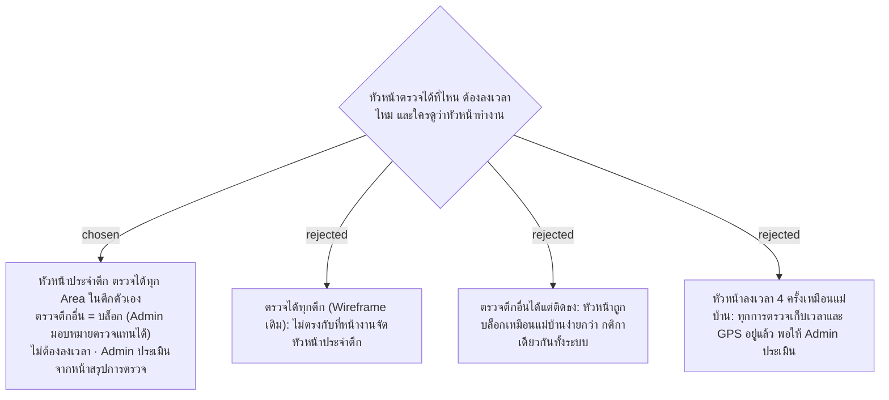

# Supervisor Is Assigned to a Building — Inspects Only There, No Check-In, Admin Reviews an Inspection Summary

- วันที่: 2026-10-07
- ที่มา: คำตอบของหัวหน้า ผ่านเจ้าของโปรเจกต์ 2026-10-07 ("บริษัทมีหัวหน้างาน 6 คน หัวหน้า A ประจำตึก 1 … ต้องตรวจ Area ทั้งหมดภายในตึกนี้ จะตรวจกี่รอบก็ได้ … Admin จะเป็นคนประเมินเอง") ตอบคำถามข้อ 2.4 และข้อ 6
- เกี่ยวข้อง: facility-0029 (การตรวจงาน), facility-0040 (Area อยู่ในตึก), facility-0041 (บล็อก + มอบหมายทำแทน), facility-0047 (ตรวจกี่ครั้งก็ได้)

## Context & Decision

1. **หัวหน้าประจำตึก** Admin ผูก Supervisor Account กับตึก หัวหน้าตรวจได้ทุก Area ในตึกนั้น ตัวเลข 6 คนเป็นตัวอย่าง ไม่ใช่ค่าคงที่
2. **ตรวจจุดในตึกอื่น = บล็อก** ใช้กติกาเดียวกับ facility-0041 แต่นับเป็นตึกแทน Area: ไม่บันทึกผลตรวจ เก็บเป็น Blocked Scan ให้ Admin เห็น ถ้าวันไหนหัวหน้าอีกคนลา Admin มอบหมายให้ตรวจแทนตึกนั้นได้เฉพาะกะนั้น
3. **หัวหน้าไม่ต้องลงเวลา** สแกนตรวจได้เลยโดยไม่ต้องมี Shift Check-In (กติกา facility-0026 ใช้กับแม่บ้านเท่านั้น) ทุกการตรวจยังเก็บเวลาและ GPS ตาม facility-0037
4. **ตรวจกี่ครั้งก็ได้** ไม่มีขั้นต่ำต่อรอบหรือต่อกะ (facility-0047 ข้อ 6)
5. **หน้าสรุปการตรวจ (Admin เท่านั้น)** เป็นแท็บใหม่บน Dashboard เลือกช่วงเวลาได้ (ค่าเริ่มต้น 7 วันล่าสุด) แสดงหัวหน้าทีละคน:
   - ตึกที่ประจำ
   - จำนวนครั้งที่ตรวจ
   - จุดที่ไม่ได้ตรวจเลยในช่วงที่เลือก (เช่น สัปดาห์นี้ตรวจ 9 จาก 12 จุด)
   - งานที่ส่งแล้วแต่ไม่ได้ตรวจ ("ไม่ได้ตรวจ" ใน facility-0047)
   - จำนวนครั้งที่ให้แก้ไข
   - การตรวจที่ติดธง GPS

## Consequences

- ต้องมีตาราง `buildings` และ Area อ้างถึงตึก (facility-0040 ระบุว่า Area อยู่ในตึก 1 ตึกอยู่แล้ว) และ Supervisor Account อ้างถึงตึกที่ประจำ
- หน้าบัญชีผู้ใช้ (facility-0020): บทบาทหัวหน้าเลือกตึกแทน Area และกะ
- ตาราง `cover_assignments` (facility-0041) ต้องรองรับการตรวจแทนตึกด้วย หรือแยกเป็นอีกตาราง
- คำถามข้อ 2.4 และข้อ 6 ของพี่เลี้ยงปิดแล้ว
- ตึกละ 2 คน: กะเช้า 1 คน กะดึก 1 คน และหัวหน้าคนเดียวดูหลายตึกไม่ได้ (ใบคำถามรอบ 2 ข้อ M2) หัวหน้าจึงผูกกับตึก + กะ แบบเดียวกับแม่บ้านที่ผูกกับ Area + กะ

> **แก้ไข 2026-10-07:** หัวหน้าตรวจได้เฉพาะในกะของตัวเอง (ตามนาฬิกา: เช้า 07:00–19:00, ดึก 19:00–07:00) สแกนตรวจนอกกะถูกบล็อกเหมือนสแกนนอกตึก เก็บเป็น Blocked Scan ให้ Admin เห็น ถ้าต้องตรวจแทนกัน Admin มอบหมายทำแทนเฉพาะกะตาม facility-0041 (หัวหน้า ผ่านเจ้าของโปรเจกต์ 2026-10-07)

> **แก้ไข 2026-10-07:** หัวหน้ามีหน้า "ตึกของฉัน" บนมือถือ เห็นจุดที่รอตรวจในตึกตัวเอง (facility-0057)
