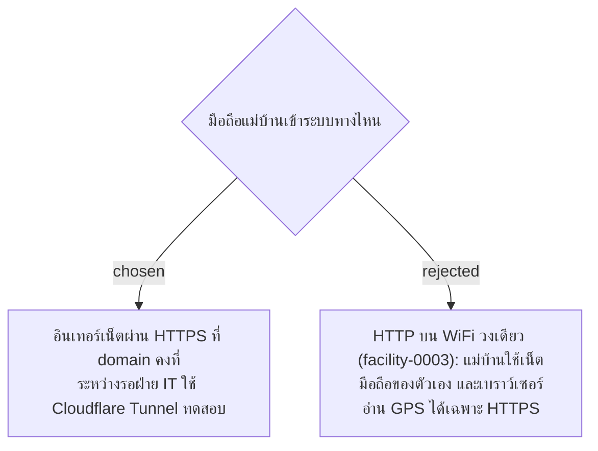

# Server Reachable from the Internet over HTTPS — Replaces Same-WiFi HTTP

- วันที่: 2026-10-07
- ที่มา: คำตอบของพี่เลี้ยงข้อ 3.3 (แม่บ้านใช้เน็ตมือถือของตัวเอง) และเจ้าของโปรเจกต์ตกลงให้บันทึกส่วนที่รู้แล้ว 2026-10-07
- เกี่ยวข้อง: facility-0003 (ถูกแทนที่), facility-0013 (cookie), facility-0037 (GPS ทุกการสแกน), facility-0045 (เก็บพิกัดต้องใช้ HTTPS)

## Context & Decision

facility-0003 ให้มือถือต่อ WiFi วงเดียวกับเครื่องที่รันระบบแล้วเปิดผ่าน HTTP ซึ่งใช้ไม่ได้กับระบบจริงด้วย 2 เหตุผล:

- แม่บ้านใช้เน็ตมือถือของตัวเอง ไม่ได้ต่อ WiFi ของโรงงาน (ข้อ 3.3)
- เบราว์เซอร์อ่าน GPS ได้เฉพาะหน้าเว็บที่เปิดผ่าน HTTPS (facility-0037, 0045)

จึงตัดสินว่า:

1. ระบบจริงต้องเปิดได้จากอินเทอร์เน็ตผ่าน **HTTPS ที่ domain คงที่** URL ในป้าย QR มาจาก `PublicBaseUrl` เหมือนเดิม
2. **เซิร์ฟเวอร์และ domain รอฝ่าย IT** (ข้อ 3.1, 3.2) ADR นี้ยังไม่เลือกว่าเป็นเครื่องในโรงงานหรือ cloud
3. **ระหว่างรอ** ใช้ Cloudflare Tunnel ทดสอบบนมือถือจริงได้ (ได้ HTTPS โดยไม่ต้องเปิด port)

## Consequences

- facility-0003 ถูกแทนที่สำหรับระบบจริง (ยังใช้ได้ตอนพัฒนาบนเครื่องตัวเองถ้าไม่ต้องทดสอบ GPS)
- cookie ของ refresh token ตั้ง `Secure` ได้แล้ว ซึ่ง facility-0013 บอกว่าทำไม่ได้บน HTTP
- Quick Tunnel ได้ URL ใหม่ทุกครั้งที่เปิด ห้ามพิมพ์ป้าย QR ของ Area ทดลองจาก URL นั้น ต้องรอ domain คงที่ก่อน (หรือใช้ Named Tunnel ซึ่งต้องมี domain อยู่ใน Cloudflare)
- ระบบเปิดสู่อินเทอร์เน็ต: ทุก endpoint ต้อง login ตาม facility-0018 อยู่แล้ว ควรเพิ่มจำกัดจำนวนครั้งที่ login ผิด
- ค่าเน็ตมือถือของแม่บ้านยังต้องถาม HR
