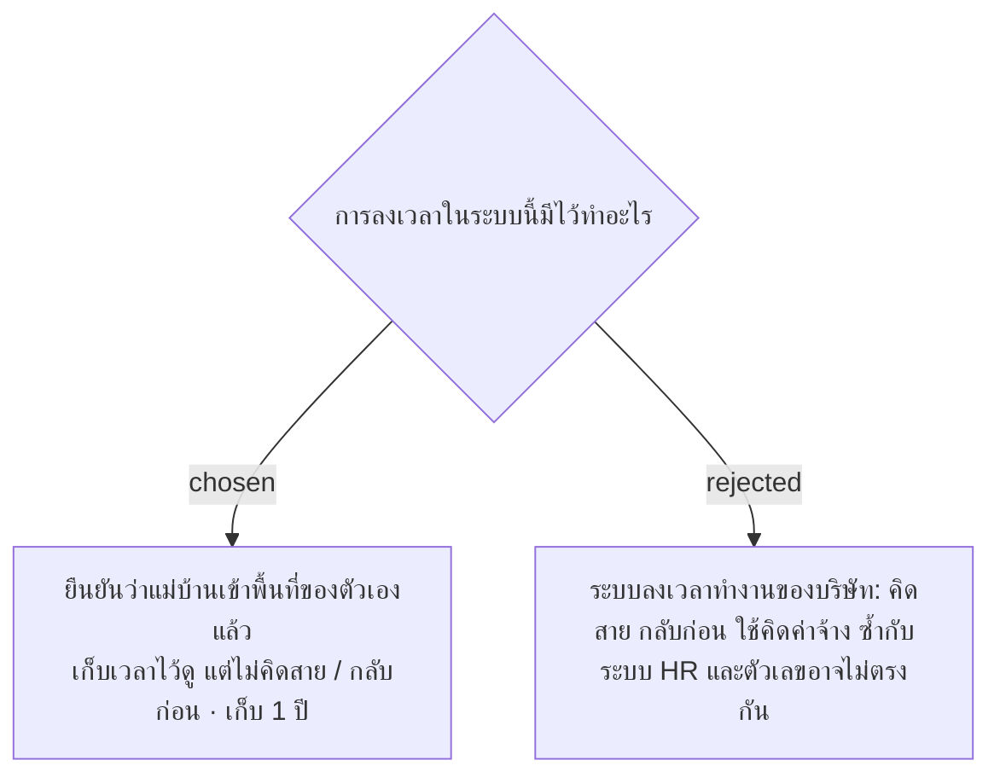

# Check-In Confirms Area Presence, Not Company Time Attendance — No Late or Early-Leave Rules

- วันที่: 2026-10-07
- ที่มา: เจ้าของโปรเจกต์ 2026-10-07 ("ระบบนี้มันไม่ได้เกี่ยวกับการเข้างาน เลิกงานของบริษัท เราแค่อยากเช็คว่าเวลาเข้าทำงานของเค้า เค้าเข้าพื้นที่ที่ตัวเองรับผิดชอบหรือยัง")
- เกี่ยวข้อง: facility-0026 (Shift Check-In), facility-0027 (Attendance Board), facility-0031 (ลงเวลา 4 ครั้ง), facility-0040 (Area), facility-0041 (ทำแทน)

## Context & Decision

1. **การลงเวลา = ยืนยันว่าเข้าพื้นที่** ระบบนี้ไม่ใช่ระบบลงเวลาทำงานของบริษัท และไม่ได้ใช้คิดค่าจ้าง กติกาเดิมยังใช้ทั้งหมด: ลงเวลา 4 ครั้ง (facility-0031), ต้องลงเวลาก่อนส่งงาน และสแกนซ้ำยึดเวลาแรก (facility-0026)
2. **ไม่คิดสาย / กลับก่อน** เก็บเวลาไว้ดูได้ แต่ไม่นับว่าสาย ไม่มีค่าผ่อนผัน และไม่ขึ้นเตือน สิ่งที่ Admin ต้องรู้คือ Area ไหนยังไม่มีคน ซึ่งหน้าการเข้างาน (D2) เรียงไว้บนสุดแล้ว
3. **ทุก Area ทำทุกวัน** ไม่มีวันหยุดของ Area ระบบจึงไม่ต้องมีตารางวันทำงานหรือวันหยุดนักขัตฤกษ์
4. **วันหยุดของแม่บ้าน** ระบบไม่เก็บตารางวันหยุด วันที่คนประจำไม่มา Area ขึ้น "ยังไม่มีคน" แล้ว Admin มอบหมายทำแทนตาม facility-0041 ทุกครั้ง
5. **แม่บ้านทุกคนมีสมาร์ทโฟนและอ่านภาษาไทยได้** หน้าจอใช้ภาษาไทยภาษาเดียว
6. **เก็บการลงเวลา 1 ปี** ไม่ต้องเก็บถึง 2 ปีหลังออกจากงานตามกฎหมายค่าจ้าง เพราะไม่ได้ใช้คิดค่าจ้าง (ร่างข้อเสนอระยะเวลาเก็บข้อมูล 2026-10-07)

## Consequences

- คำว่า "ลงเวลาเข้างาน" บนหน้าจอยังใช้ได้ แต่ใน CONTEXT.md นิยาม Shift Check-In ว่าเป็นการยืนยันว่าเข้าพื้นที่
- ช่วงทดลองที่มีแม่บ้านประจำ 1–2 คน Admin ต้องกดมอบหมายทำแทนทุกวันที่คนประจำหยุด ถ้าตอนขยายแล้วภาระนี้มากเกินไป ค่อยพิจารณาตารางวันหยุดประจำ
- ถ้าวันหลัง HR อยากใช้ข้อมูลนี้คิดค่าจ้าง ต้องทบทวน ADR นี้และระยะเวลาเก็บข้อมูล
