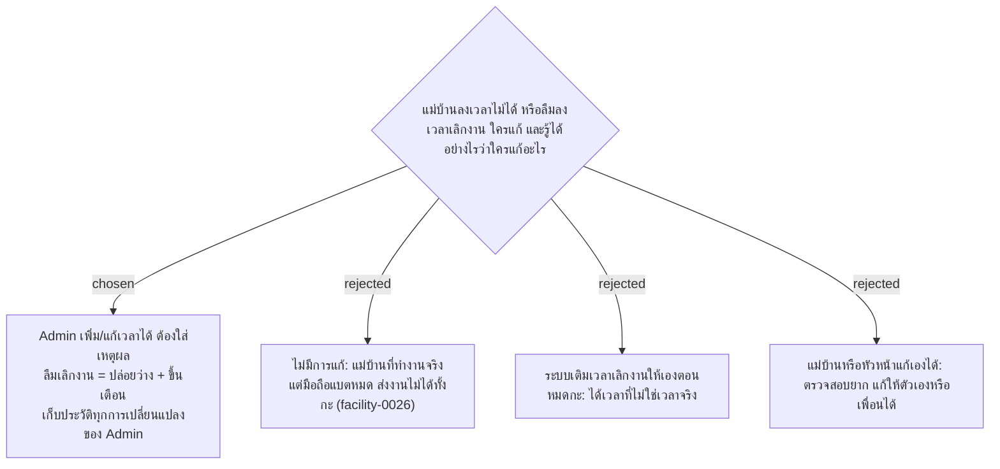

# Admin Corrects Attendance with a Reason, and Every Admin Change Is Logged

- วันที่: 2026-10-07
- ที่มา: เจ้าของโปรเจกต์ 2026-10-07
- เกี่ยวข้อง: facility-0026 (ต้องลงเวลาก่อนส่งงาน), facility-0031 (ลงเวลา 4 ครั้ง), facility-0020 (หน้าบัญชี), facility-0041 (ทำแทน), facility-0045 (หน้าจัดการ Area)

## Context & Decision

facility-0026 บล็อกการส่งงานถ้ายังไม่ลงเวลาเข้างาน แต่ไม่มี ADR ไหนบอกว่าใครแก้ข้อมูลได้เมื่อแม่บ้านมาทำงานจริงแต่ลงเวลาไม่ได้ (ลืม, มือถือแบตหมด, ไม่มีเน็ต)

1. **Admin เพิ่มหรือแก้การลงเวลาได้** ต้องใส่เหตุผลทุกครั้ง ระบบเก็บค่าเดิมไว้ และรายการนั้นมีป้าย "แก้โดย Admin" แม่บ้านและหัวหน้าแก้เองไม่ได้
2. **ลืมลงเวลาเลิกงานหรือกลับจากพัก** ระบบไม่เติมให้เอง ปล่อยว่างไว้ พอหมดกะแล้วขึ้นในรายการที่ขึ้นเตือนว่า "ไม่ได้ลงเวลาเลิกงาน" ให้ Admin เติมตามข้อ 1
3. **เก็บประวัติทุกการเปลี่ยนแปลงของ Admin:** ใคร, เมื่อไร, เปลี่ยนอะไร, ค่าก่อนและหลัง ครอบคลุม:
   - แก้การลงเวลา
   - มอบหมาย / ยกเลิกทำแทน
   - ปิดเตือน
   - สร้างหรือแก้ Area, จุด, เวลารอบ, พิกัดและรัศมีของป้าย
   - ออก QR ใหม่
   - สร้าง / แก้ / รีเซ็ตรหัสผ่าน / ปิดใช้งานบัญชี
   - ส่งออก Excel (facility-0053)

## Consequences

- ตาราง `audit_log` (ผู้ทำ, เวลา, ประเภท, รายการที่ถูกแก้, ค่าก่อน, ค่าหลัง, เหตุผล) เขียนในทุก endpoint ของ Admin
- การลงเวลาต้องมีช่องบอกที่มา (สแกนเอง / Admin เพิ่ม / Admin แก้) เพื่อแสดงป้ายบนหน้าการเข้างาน
- หน้าการเข้างาน (D2) ต้องมีปุ่มเพิ่ม/แก้เวลาของแต่ละคน ส่วนหน้ารายการที่ขึ้นเตือน (D3) มีประเภทใหม่ "ไม่ได้ลงเวลาเลิกงาน"
- ประวัติของ Admin เก็บนานเท่ากับข้อมูลที่ถูกแก้ ตามร่างระยะเวลาเก็บข้อมูล
