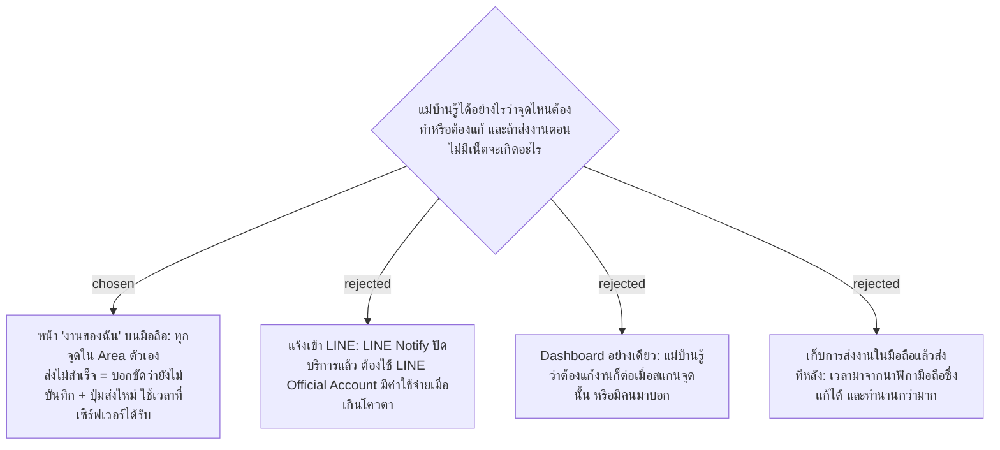

# Cleaner "My Work" Page Instead of Push Notifications; Failed Sends Are Resent by Hand

- วันที่: 2026-10-07
- ที่มา: เจ้าของโปรเจกต์ 2026-10-07
- เกี่ยวข้อง: facility-0007 (flow สแกน), facility-0029 (การตรวจงาน), facility-0047 (รอบเป็นช่วงเวลา), facility-0049 (แม่บ้านใช้เน็ตมือถือ)

## Context & Decision

1. **หน้า "งานของฉัน"** แม่บ้านเปิดหน้าเว็บเมื่อไรก็เห็นทุกจุดใน Area ของตัวเอง (และ Area ที่ได้รับมอบหมายทำแทนในกะนี้):
   - รอบปัจจุบันและรอบถัดไป
   - จุดที่เลยรอบ
   - จุดที่หัวหน้าให้แก้ พร้อมข้อบกพร่อง
2. **ไม่มีการแจ้งเตือนเด้งขึ้น** ไม่ส่งเข้า LINE และไม่ใช้ push notification ในช่วงทดลอง
3. **ส่งไม่สำเร็จเพราะไม่มีเน็ต** หน้าจอบอกชัดว่า "ยังไม่ได้บันทึก" พร้อมปุ่มส่งใหม่ แม่บ้านเดินไปตรงที่มีสัญญาณแล้วกดส่ง เวลาที่บันทึกคือเวลาที่เซิร์ฟเวอร์ได้รับ ไม่มีการเก็บไว้ในมือถือแล้วส่งทีหลัง

## Consequences

- เพิ่มหน้า "งานของฉัน" ใน Wireframe และ endpoint ที่คืนสถานะทุกจุดของ Area ตัวเอง (ตามสิทธิ์ใน facility-0041 ไม่คืนจุดของ Area อื่น)
- ส่งงานใหม่หลังเดินออกมา GPS อาจอยู่ไกลจากป้ายจนติดธง (facility-0035) และอาจพ้นช่วงรอบจนนับเป็นส่งช้า (facility-0047) ยอมรับได้ Admin เห็นเหตุผลจากธง
- ตอนเก็บพิกัดป้ายที่หน้างาน (facility-0045) ให้เช็กด้วยว่า Area ทดลองมีจุดที่ไม่มีสัญญาณไหม ถ้ามีเยอะค่อยทบทวนข้อ 3
