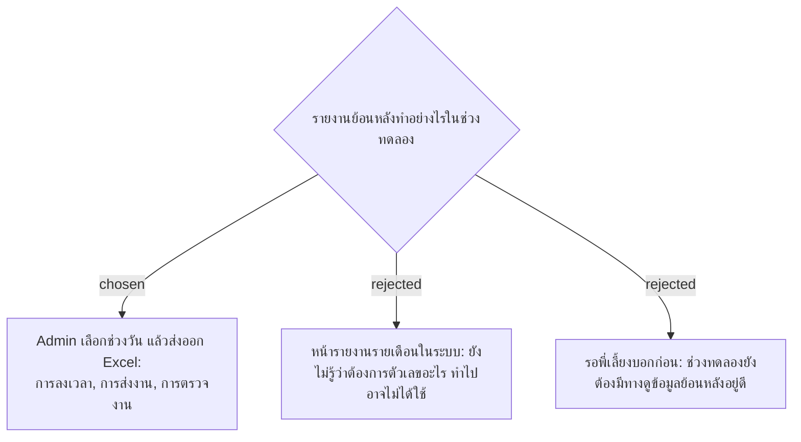

# Excel Export by Date Range Instead of Report Pages (Pilot)

- วันที่: 2026-10-07
- ที่มา: เจ้าของโปรเจกต์ 2026-10-07 (ตอบคำถามข้อ 9.3 ของพี่เลี้ยงแทน)
- เกี่ยวข้อง: facility-0048 (หน้าสรุปการตรวจของหัวหน้า), facility-0050 (การลงเวลา), facility-0047 (ผลของแต่ละรอบ)

## Context & Decision

ช่วงทดลองยังไม่ทำหน้ารายงาน Admin เลือกช่วงวันแล้วส่งออก Excel ได้ 3 ชุด:

1. **การลงเวลา:** คน, Area, กะ, เวลา 4 ครั้ง, ที่มา (สแกนเอง / แก้โดย Admin)
2. **การส่งงาน:** จุด, รอบ, เวลา, ผล (ตรงเวลา / ส่งช้า / นอกรอบ), Issue, ทำแทนหรือไม่, ธง GPS
3. **การตรวจงาน:** หัวหน้า, จุด, รอบ, ผล, ข้อบกพร่อง, ธง GPS

ส่งออกผลของรอบที่ "ไม่ได้ทำ / ไม่ได้ตรวจ / ไม่ได้แก้" (facility-0047) ด้วย แล้วใช้ไฟล์ที่ Admin ใช้จริงช่วงทดลองตัดสินว่าตอนขยายควรมีหน้ารายงานอะไร หน้าสรุปการตรวจของหัวหน้า (facility-0048) ยังทำตามเดิม

## Consequences

- Excel ไม่ใส่พิกัด GPS ดิบ ใส่แค่ระยะห่างและผลในรัศมี / นอกรัศมี
- ไฟล์ที่ส่งออกไปแล้วอยู่นอกการควบคุมของระบบ การลบตามระยะเวลาเก็บข้อมูลไม่ครอบคลุมไฟล์เหล่านั้น ต้องบอก HR
- การส่งออกเป็นการกระทำของ Admin ที่ต้องเก็บประวัติ (facility-0051)
