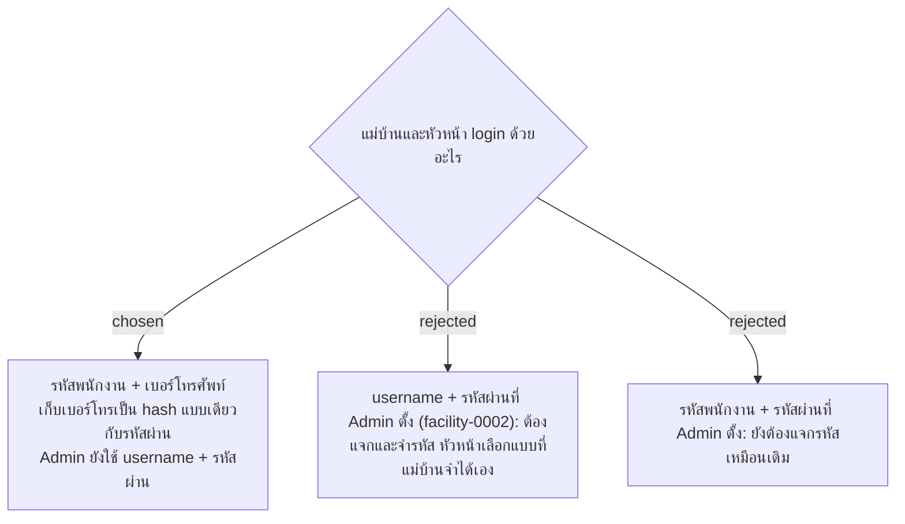

# Cleaners and Supervisors Log In with Employee ID + Phone Number; Admin Keeps a Password

- วันที่: 2026-10-07
- ที่มา: คำตอบของหัวหน้า ผ่านเจ้าของโปรเจกต์ 2026-10-07
- เกี่ยวข้อง: facility-0002 (ถูกแทนที่บางส่วน), facility-0010 (สิทธิ์ Admin), facility-0020 (หน้าบัญชี), facility-0044 (login ได้หลายเครื่อง), facility-0049 (เปิดสู่อินเทอร์เน็ต)

## Context & Decision

1. **Cleaner Account และ Supervisor Account** login ด้วย **รหัสพนักงาน** (ห้ามซ้ำ) กับ **เบอร์โทรศัพท์** แทน username + รหัสผ่าน แม่บ้านไม่ต้องจำรหัสใหม่ และ Admin ไม่ต้องแจกรหัส
2. **Admin Account** ยังใช้ username + รหัสผ่านตาม facility-0002 เพราะ Admin แก้เวลา มอบหมายทำแทน และจัดการบัญชีได้ (facility-0051) ถ้าเดาได้จากเบอร์โทร ความเสียหายสูงกว่ามาก
3. **เก็บเบอร์โทรเป็น hash** แบบเดียวกับรหัสผ่าน (PBKDF2 ที่ระบบใช้อยู่) ระบบตรวจได้ว่าเบอร์ที่กรอกถูกไหม แต่ไม่มีใครเปิดดูเบอร์จริงได้ ข้อ "ไม่เก็บเบอร์โทรศัพท์ส่วนตัว" ของ facility-0002 จึงยังใช้ในแง่ที่ไม่มีเบอร์จริงอยู่ในฐานข้อมูล
4. **เปลี่ยนเบอร์โทร** Admin แก้เบอร์ในหน้าบัญชี ระบบยกเลิก session ทุกเครื่องของคนนั้น (เหมือนรีเซ็ตรหัสผ่านใน facility-0020)
5. กติกาอื่นของ login ยังใช้: Persistent Session 30 วัน, JWT 5 นาที, login ได้หลายเครื่อง (facility-0044)

## Consequences

- **ความเสี่ยงที่ยอมรับ:** เพื่อนร่วมงานมักรู้เบอร์โทรกัน และบัญชีเดียวใช้ได้หลายเครื่อง จึง login เป็นคนอื่นแล้วลงเวลาหรือส่งงานแทนได้ง่ายกว่ารหัสผ่าน และถ้าเบอร์รั่วก็เปลี่ยนไม่ได้เหมือนรหัสผ่าน ถ้าช่วงทดลองเจอการทำแทนกัน ให้ทบทวน ADR นี้ (เช่น เพิ่ม PIN ที่ตั้งเอง)
- เบอร์โทรมีแค่ 10 หลัก ถ้าฐานข้อมูลรั่ว hash ก็ถูกไล่เดาได้ hash ช่วยให้ช้าลงเท่านั้น ยังต้องรักษาฐานข้อมูลให้ปลอดภัย
- ระบบเปิดสู่อินเทอร์เน็ต (facility-0049) ต้องจำกัดจำนวนครั้งที่ login ผิดต่อรหัสพนักงาน กันการไล่เดาเบอร์
- หน้าบัญชี (facility-0020, Wireframe D6): แม่บ้านและหัวหน้ากรอกรหัสพนักงานกับเบอร์โทรแทน username กับรหัสผ่านชั่วคราว ปุ่ม "รีเซ็ตรหัสผ่าน" ใช้กับ Admin เท่านั้น ส่วนคนอื่นเป็น "แก้เบอร์โทร"
- หน้า login (Wireframe M0) เปลี่ยนช่องเป็น "รหัสพนักงาน" และ "เบอร์โทรศัพท์"
- ต้องถาม HR: ถ้าแม่บ้านมาจากบริษัทรับจ้าง มีรหัสพนักงานของบริษัทไหม หรือใช้รหัสของบริษัทรับจ้าง

> **แก้ไข 2026-10-07:** แม่บ้านเป็นพนักงานของบริษัท ใช้รหัสพนักงานของบริษัท (facility-0055) คำถามถึง HR ในหัวข้อ Consequences จึงปิดแล้ว

> **แก้ไข 2026-10-09:** เบอร์โทรที่ใช้ login เป็นเลขอารบิก (0–9) เท่านั้น เจ้าของโปรเจกต์ตัดสิน ระบบตัดช่องว่าง ขีด และรหัสประเทศ +66 ออกก่อนเทียบ แต่ไม่แปลงเลขไทย (๐–๙) เบอร์ที่พิมพ์เป็นเลขไทยจึง login ไม่ผ่านและนับเป็นการ login ผิด 1 ครั้ง หน้า login ต้องให้พิมพ์ได้เฉพาะเลขอารบิก
