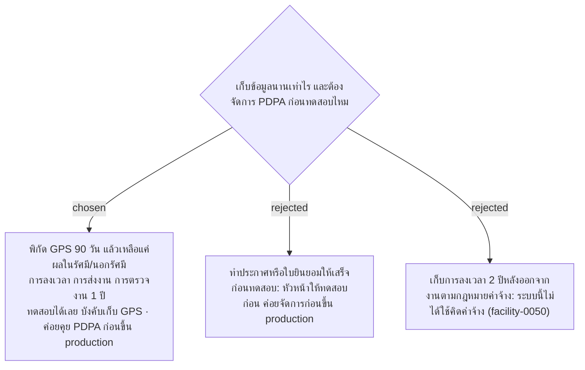

# Data Retention — GPS 90 Days, Records 1 Year; PDPA Notice Settled Before Production

- วันที่: 2026-10-07
- ที่มา: คำตอบในใบคำถามรอบ 2 ข้อ H1–H4 (หัวหน้า ผ่านเจ้าของโปรเจกต์ 2026-10-07) และร่าง `docs/requirements-gathering/2026-10-07-data-retention-proposal.md`
- เกี่ยวข้อง: facility-0037 (GPS ทุกการสแกน), facility-0050 (การลงเวลาไม่ใช่ระบบลงเวลาของบริษัท), facility-0051 (ประวัติของ Admin), facility-0053 (Excel)

## Context & Decision

1. **ระยะเวลาเก็บ** ตามร่างที่หัวหน้าตอบว่าใช้ได้:

   | ข้อมูล | เก็บ | หลังจากนั้น |
   |---|---|---|
   | พิกัด GPS ดิบ (ละติจูด, ลองจิจูด, ความแม่นยำ) | 90 วัน | ลบพิกัด เหลือระยะห่างจากป้ายและผลในรัศมี/นอกรัศมี |
   | การลงเวลา | 1 ปี | ลบ |
   | การส่งงานและการตรวจงาน | 1 ปี | เก็บสรุปรายเดือนต่อจุด ไม่มีชื่อคน แล้วลบรายการรายครั้ง |
   | ประวัติของ Admin | เท่ากับข้อมูลที่ถูกแก้ | ลบพร้อมกัน |

2. **ระบบไม่ประเมินผลใคร** แค่แสดงข้อมูลให้ Admin เห็น เช่น สัปดาห์นี้หัวหน้า A ตรวจไม่ครบทุกจุด (หน้าสรุปการตรวจ facility-0048)
3. **PDPA ไม่บล็อกการทดสอบ** ระบบบังคับเก็บ GPS ทุกการสแกนตาม facility-0037 ส่วนประกาศความเป็นส่วนตัวหรือใบยินยอม ค่อยคุยกับ HR ก่อนขึ้น production
4. **แม่บ้านเป็นพนักงานของบริษัท** บริษัทเป็นผู้ควบคุมข้อมูลตาม PDPA และใช้รหัสพนักงานของบริษัท login (facility-0054)
5. **บริษัทไม่ช่วยค่าเน็ต** แม่บ้านใช้เน็ตมือถือของตัวเอง หน้าเว็บจึงควรโหลดเบา

## Consequences

- งานรันทุกคืนสำหรับลบและสรุปข้อมูลต้องมีก่อนข้อมูลจริงอายุถึง 90 วัน ช่วงทดลองแรก ๆ ยังไม่ต้องรัน แต่ตารางต้องลบพิกัดแยกจากรายการได้ ตัวเลขทั้งหมดอยู่ใน config
- ก่อนขึ้น production ต้องกลับมาคุยกับ HR เรื่องประกาศความเป็นส่วนตัว (เก็บพิกัด เก็บนานเท่าไร เพื่ออะไร) ถ้าต้องมีหน้าให้แม่บ้านกดรับทราบ ต้องเพิ่มในหน้า login
- ไฟล์ Excel ที่ส่งออกไปแล้วอยู่นอกการลบตามข้อ 1 ยังไม่ได้ตัดสินว่าใครเก็บและลบเมื่อไร
