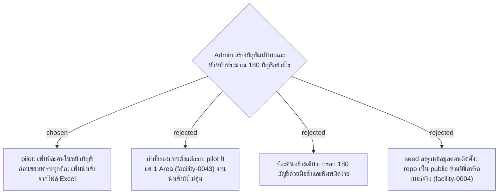

# Accounts Are Created One by One for the Pilot; Excel Import Comes Before Rollout

- วันที่: 2026-10-07
- ที่มา: เจ้าของโปรเจกต์ตัดสิน 2026-10-07 (ticket #40)
- เกี่ยวข้อง: facility-0004 (repo public), facility-0016 (PBKDF2), facility-0020 (หน้าบัญชี), facility-0043 (pilot 1 Area), facility-0048 (หัวหน้าประจำตึก + กะ), facility-0054 (login ด้วยรหัสพนักงาน + เบอร์โทร)

## Context & Decision

ticket #40 ถามว่าบัญชี 170 ใบเกิดขึ้นอย่างไร ส่วนใหญ่ตอบไปแล้ว:

- **ไม่ต้องแจกรหัสผ่าน** แม่บ้านและหัวหน้า login ด้วยรหัสพนักงาน + เบอร์โทร Admin เป็นคนแก้เบอร์ (facility-0054)
- **หน้าบัญชีมีช่องค้นหา** (Wireframe D6) ประมาณ 180 แถวกรองบนหน้าเว็บได้ ไม่ต้องแบ่งหน้า

ที่เหลือคือวิธีสร้างบัญชี จึงตัดสินว่า:

1. **pilot: เพิ่มทีละคน** ในหน้าบัญชีตาม facility-0020 กรอกรหัสพนักงาน, ชื่อ, เบอร์โทร, บทบาท และ Area (แม่บ้าน) หรือตึก + กะ (หัวหน้า)
2. **ก่อนขยายครบทุกตึก: เพิ่มนำเข้าจากไฟล์ Excel** คอลัมน์เดียวกับข้อ 1 ระบบตรวจทั้งไฟล์ก่อน (รหัสพนักงานซ้ำ, Area หรือตึกที่ไม่มี, เบอร์ไม่ครบ 10 หลัก) ถ้าผิดแม้แถวเดียวไม่นำเข้าเลย และบอกแถวที่ผิด
3. **ชื่อและเบอร์จริงไม่เข้า git** Admin กรอกหรือนำเข้าบนเซิร์ฟเวอร์เท่านั้น ข้อมูลทดสอบใน repo ใช้ชื่อสมมุติที่โค้ดสร้างขึ้น

## Consequences

- งานนำเข้า Excel ไม่อยู่ใน pilot แต่ต้องเสร็จก่อนขยายไปทุกตึก
- hash เบอร์โทรด้วย PBKDF2 600,000 รอบ (facility-0016) ใช้เวลาประมาณ 0.3–0.5 วินาทีต่อบัญชี นำเข้า 180 บัญชีจึงใช้เวลา 1–2 นาที ต้องแสดงความคืบหน้า หรือทำเป็นงานเบื้องหลัง
- ทุกบัญชีที่นำเข้าเก็บลงประวัติของ Admin (facility-0051)
- ไฟล์ Excel ที่ใช้นำเข้ามีเบอร์โทรจริง ระบบไม่เก็บไฟล์ไว้หลังนำเข้า ส่วนสำเนาในเครื่องของ Admin อยู่ในเรื่องเดียวกับไฟล์ Excel ที่ส่งออก ซึ่งต้องคุยกับ HR ก่อนขึ้น production (facility-0055)
