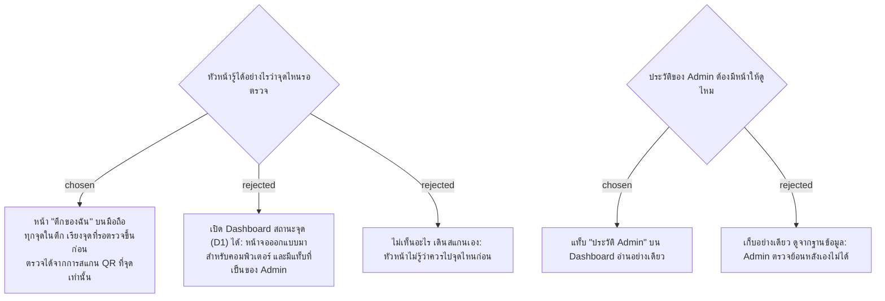

# Supervisors See a "My Building" Page; Admin Can Read the Audit Log

- วันที่: 2026-10-07
- ที่มา: เจ้าของโปรเจกต์ตัดสิน 2026-10-07 ระหว่างเติม Wireframe ให้ครบ
- เกี่ยวข้อง: facility-0047 (ตรวจได้เฉพาะงานของรอบปัจจุบัน), facility-0048 (หัวหน้าประจำตึก + กะ), facility-0051 (ประวัติของ Admin), facility-0052 (หน้างานของฉัน)

## Context & Decision

ADR ก่อนหน้าบอกว่าหัวหน้าสแกน QR ที่จุดแล้วตรวจ และระบบเก็บประวัติทุกการแก้ของ Admin แต่ไม่ได้บอกว่าหัวหน้าเห็นอะไรก่อนสแกน และไม่ได้บอกว่าจะเปิดดูประวัติจากที่ไหน จึงตัดสินว่า:

1. **หน้า "ตึกของฉัน"** สำหรับหัวหน้าบนมือถือ เหมือนหน้างานของฉันของแม่บ้าน (facility-0052):
   - เห็นทุกจุดในตึกของตัวเอง ไม่เห็นตึกอื่น
   - เรียงจุดที่รอตรวจขึ้นก่อน ตามเวลาที่ส่ง แล้วตามด้วยจุดที่รอแม่บ้านแก้
   - ตรวจได้จากการสแกน QR ที่จุดเท่านั้น หน้านี้แค่บอกว่าควรไปจุดไหน
   - เปิดดูนอกกะได้ แต่ตรวจไม่ได้ (facility-0048)
   - อัปเดตเองเมื่อแม่บ้านส่งงาน
2. **แท็บ "ประวัติ Admin"** บน Dashboard:
   - เปิดได้เฉพาะ Admin
   - กรองตามช่วงวัน ผู้ทำ และประเภท แสดงค่าก่อนและหลัง พร้อมเหตุผล
   - อ่านอย่างเดียว ไม่มีใครแก้หรือลบได้
   - ไม่แสดงเบอร์โทรหรือรหัสผ่าน ทั้งค่าก่อนและหลัง

## Consequences

- เพิ่ม endpoint ที่คืนสถานะทุกจุดในตึกของหัวหน้าคนนั้น (ตามสิทธิ์ใน facility-0048 ไม่คืนจุดของตึกอื่น) และ SignalR ต้องส่งการเปลี่ยนแปลงให้หัวหน้าของตึกนั้นด้วย
- Wireframe เพิ่ม M15 (ตึกของฉัน), M16 (ยังไม่มีงานให้ตรวจ) และ D9 (ประวัติ Admin)
- ตาราง `audit_log` ต้องมีคอลัมน์ข้อความสรุปสำหรับแสดงในหน้านี้ และ user ของแอปไม่ควรมีสิทธิ์ UPDATE หรือ DELETE ตารางนี้
