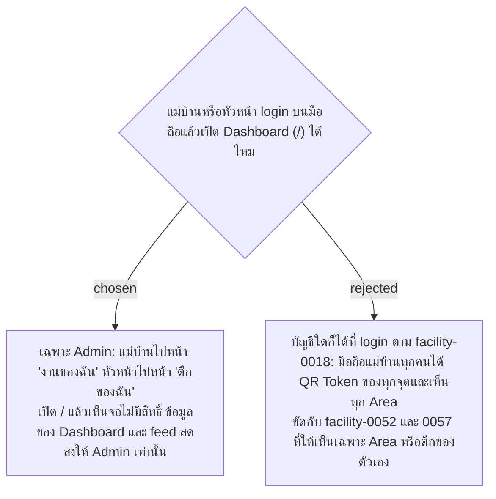

# Dashboard Is Admin Only — Cleaners and Supervisors Use Their Own Pages

- Decision map: [#42 qr-token-exposure](https://github.com/ThodsaphonSonthiphin/Facility-Real-time-dashboard/issues/42)
- วันที่: 2026-10-08
- ที่มา: เจ้าของโปรเจกต์ตัดสิน 2026-10-08
- เกี่ยวข้อง: facility-0018 (ถูกแทนที่บางส่วน), facility-0052 (หน้างานของฉัน), facility-0057 (หน้าตึกของฉัน ปฏิเสธให้หัวหน้าเปิด Dashboard), facility-0041 (สิทธิ์ตาม Area), facility-0048 (หัวหน้าประจำตึก)

## Context & Decision

facility-0018 ให้บัญชีใดก็ได้ที่ login เปิด Dashboard และรับ feed สดจาก SignalR hub ได้ ตอนนั้นยังไม่มีหน้าของแม่บ้านและหัวหน้า ต่อมา facility-0052 ให้แม่บ้านมีหน้า "งานของฉัน" ที่เห็นเฉพาะ Area ของตัวเอง และ facility-0057 ให้หัวหน้ามีหน้า "ตึกของฉัน" โดยปฏิเสธการให้หัวหน้าเปิด Dashboard แล้ว แต่ facility-0018 ยังเปิดให้ทุกบัญชีอยู่ บน master ข้อมูลของ Dashboard (`GET /api/service-points` และ `ScanRecorded` ที่ส่งด้วย `Clients.All`) มี QR Token ของทุกจุด มือถือแม่บ้านทุกคนจึงได้ QR Token ของทุกจุดโดยไม่ต้องเดินไปถ่ายรูปป้ายเลย (พบ 2026-10-02 ใน map #1)

จึงตัดสินใจให้ **Dashboard เปิดได้เฉพาะ Admin Account**:

1. Cleaner Account ที่ login แล้วไปหน้า "งานของฉัน" และ Supervisor Account ไปหน้า "ตึกของฉัน" ถ้าเปิด `/` เองจะเห็นจอไม่มีสิทธิ์
2. endpoint ที่ส่งข้อมูลของ Dashboard ต้องเป็น admin (facility-0010) ไม่ใช่แค่ login
3. feed สดของ Dashboard ส่งให้ Admin เท่านั้น ส่วนแม่บ้านและหัวหน้าได้เฉพาะการเปลี่ยนแปลงของ Area หรือตึกของตัวเอง ตาม facility-0052 และ 0057

## Consequences

- facility-0018 ถูกแทนที่ในข้อ "บัญชีใดก็ได้เปิด Dashboard ได้" ส่วนข้อที่ต้อง login ก่อนใช้ทุกหน้าและ hub ยังใช้เหมือนเดิม
- `Clients.All` ใน hub ใช้ไม่ได้แล้ว ต้องแยกกลุ่ม: Admin, แต่ละ Area และแต่ละตึก
- ผ่อนผันสองแท็บใน facility-0015 (แม่บ้านเปิด Dashboard กับหน้าสแกนพร้อมกัน) ไม่ใช่เหตุผลที่ต้องเปิด Dashboard ให้แม่บ้านอีกแล้ว เพราะแม่บ้านใช้หน้างานของฉันแทน
- ทีวีหรือจอบนผนังที่เปิด Dashboard ค้างไว้ต้อง login ด้วย Admin Account
