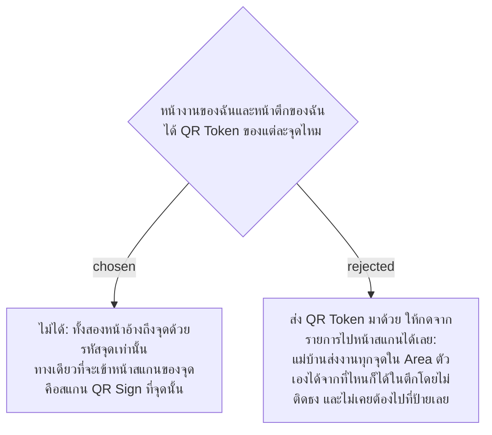

# Cleaners and Supervisors Get a QR Token Only by Scanning the Sign

- Decision map: [#42 qr-token-exposure](https://github.com/ThodsaphonSonthiphin/Facility-Real-time-dashboard/issues/42)
- วันที่: 2026-10-08
- ที่มา: เจ้าของโปรเจกต์ตัดสิน 2026-10-08
- เกี่ยวข้อง: facility-0006 (QR Token สุ่ม), facility-0037 (GPS ทุกการสแกน ช่องโหว่ในตึกเดียวกัน), facility-0041 (ตัดสิน Area จาก QR Token), facility-0052 (หน้างานของฉัน), facility-0057 (หน้าตึกของฉัน ตรวจได้จากการสแกน QR ที่จุดเท่านั้น), facility-0058 (Dashboard เฉพาะ Admin)

## Context & Decision

facility-0037 ยอมรับช่องโหว่ว่า GPS แยกห้องหรือชั้นในตึกเดียวกันไม่ได้ ใครยืนอยู่ในตึกก็สแกน *รูปถ่าย* ของป้ายในตึกนั้นได้โดยไม่ติดธง แต่อย่างน้อยต้องเคยไปที่ป้ายเพื่อถ่ายรูปสักครั้ง ถ้าข้อมูลของหน้างานของฉันมี QR Token มาด้วย แม่บ้านจะส่งงานของทุกจุดใน Area ตัวเองได้จากห้องพักโดยไม่เคยไปที่ป้ายเลย

จึงตัดสินใจว่า **หน้างานของฉัน (Cleaner Account) และหน้าตึกของฉัน (Supervisor Account) ไม่ได้รับ QR Token** ทั้งตอนโหลดหน้าและใน feed สด ทั้งสองหน้าอ้างถึงจุดด้วยรหัสจุด (Service Point Id) และไม่มีปุ่มที่พาไปหน้าสแกนของจุดโดยตรง ทางเดียวที่จะเข้าหน้าสแกนคือสแกน QR Sign ซึ่งใส่ QR Token มาใน URL

## Consequences

- endpoint ของหน้างานของฉันและหน้าตึกของฉันใช้ DTO ที่ไม่มีฟิลด์ QR Token ไม่ใช่ `ServicePointStatusDto` ตัวเดียวกับ Dashboard
- `GET /api/service-points/by-token/{token}` ส่ง QR Token กลับมาได้ เพราะคนเรียกมี token นั้นอยู่แล้วจาก URL
- QR Token ยังมีความหมายในฐานะหลักฐานว่าเคยไปที่ป้าย ออก QR ใหม่ (facility-0021) จึงยังเป็นวิธีปิดรูปถ่ายที่หลุดออกไป
- ช่องโหว่ของ facility-0037 (สแกนรูปถ่ายจากในตึกเดียวกัน) ยังอยู่เหมือนเดิม ADR นี้แค่ไม่เปิดทางที่ง่ายกว่านั้น
