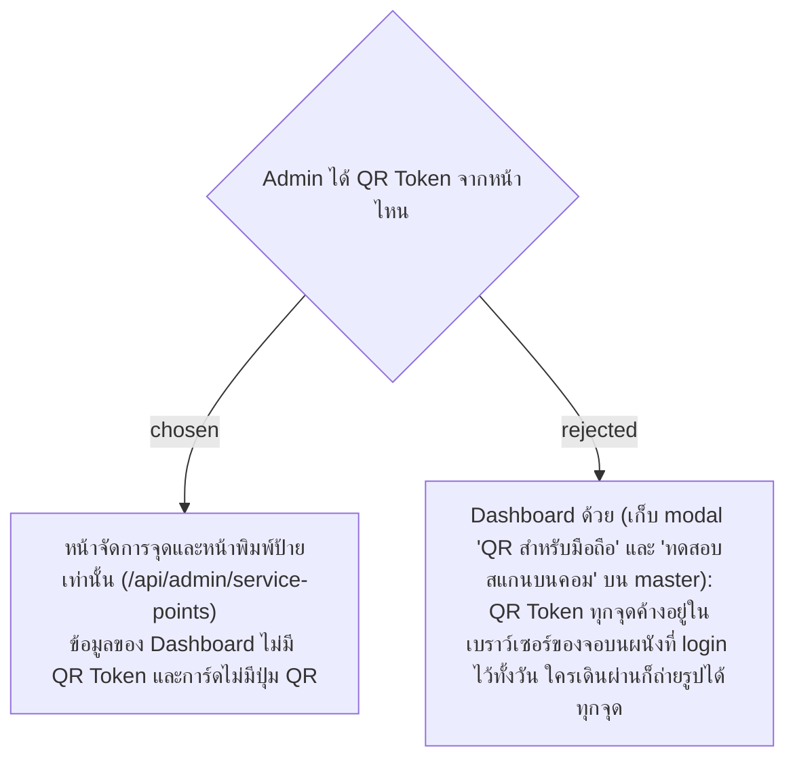

# Admin Gets a QR Token Only from the Points and Print Pages, Not the Dashboard

- Decision map: [#42 qr-token-exposure](https://github.com/ThodsaphonSonthiphin/Facility-Real-time-dashboard/issues/42)
- วันที่: 2026-10-08
- ที่มา: เจ้าของโปรเจกต์ตัดสิน 2026-10-08
- เกี่ยวข้อง: facility-0021 (หน้าจัดการจุด พิมพ์ป้าย ออก QR ใหม่), facility-0058 (Dashboard เฉพาะ Admin), facility-0059 (แม่บ้านและหัวหน้าได้ QR Token จากป้ายเท่านั้น)

## Context & Decision

facility-0058 ทำให้ Dashboard เปิดได้เฉพาะ Admin แต่ Dashboard มักเปิดค้างไว้บนจอที่คนอื่นเดินผ่านได้ บน master การ์ดแต่ละใบมีปุ่ม "QR สำหรับมือถือ" ที่แสดงรูป QR ของจุดนั้น และปุ่ม "ทดสอบสแกนบนคอม" ทั้งสองปุ่มเป็นความสะดวกตอนพัฒนาก่อนมีหน้าจัดการจุด (facility-0021) และ Wireframe ของ Dashboard (BoardStatus) ไม่มีปุ่ม QR แล้ว

จึงตัดสินใจว่า **Admin ได้ QR Token จากหน้าจัดการจุดและหน้าพิมพ์ป้ายเท่านั้น** ผ่าน `/api/admin/service-points` (facility-0021) ข้อมูลของ Dashboard และ feed สดของ Dashboard ไม่มี QR Token และการ์ดไม่มีปุ่ม QR

## Consequences

- ตัด QR Token ออกจาก `ServicePointStatusDto` ที่ `GET /api/service-points` และ `ScanRecorded` ใช้ และลบปุ่ม "QR สำหรับมือถือ" กับ "ทดสอบสแกนบนคอม" ออกจาก `ServicePointCard.tsx`
- การทดสอบสแกนบนคอมตอนพัฒนาใช้ URL จากป้ายที่พิมพ์ หรือจากหน้าจัดการจุด แทนปุ่มบนการ์ด
- IP ที่ฝังใน `ServicePointCard.tsx` หายไปพร้อมปุ่ม ซึ่งตรงกับ facility-0021 ที่ให้ URL บนป้ายมาจาก PublicBaseUrl
