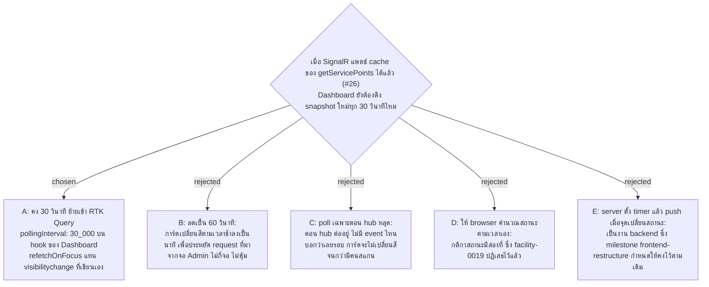

# Dashboard Keeps the 30 Second Poll Beside Push — RTK Query pollingInterval

- Decision map: [#27 polling-vs-push](https://github.com/ThodsaphonSonthiphin/Facility-Real-time-dashboard/issues/27) บนแผนที่ [#1](https://github.com/ThodsaphonSonthiphin/Facility-Real-time-dashboard/issues/1) (milestone frontend-restructure)
- วันที่: 2026-10-08
- ที่มา: เจ้าของโปรเจกต์เลือกข้อ A
- เกี่ยวข้อง: facility-0019 (กติกาสถานะอยู่ที่ server ที่เดียว, ดึงซ้ำทุก 30 วินาที), facility-0022 (ตำแหน่งของ `pollingInterval` ยกมาที่ #27), facility-0024 (server data อยู่ใน RTK Query cache), facility-0058 (Dashboard เฉพาะ Admin)

## Context & Decision

SignalR บอกได้แค่ว่า "มีคนสแกน" แต่การเปลี่ยนสถานะตามเวลา เช่น จุดที่ไม่มีใครสแกนจนเลยรอบ ไม่มี event ใดส่งมา ตาม facility-0019 สถานะคำนวณที่ server ที่เดียว และ Dashboard เห็นการเปลี่ยนนั้นจากการดึง snapshot ใหม่ทุก 30 วินาที (`setInterval` ใน `useDashboard.ts` บน `50a8d55`)

จึงตัดสินใจ **คงการดึงทุก 30 วินาทีไว้ข้าง push** และย้ายเข้า RTK Query:

1. Dashboard เรียก `useGetServicePointsQuery(undefined, { pollingInterval: 30_000, refetchOnFocus: true })` แทน `setInterval` และ `visibilitychange` ที่เขียนเอง
2. `refetchOnFocus` ต้องมี `setupListeners(store.dispatch)` ใน store
3. การแพตช์ผ่าน `updateCachedData` จาก hub (#26) ยังเป็นทางหลักของการสแกน poll เป็นตาข่ายสำหรับการเปลี่ยนตามเวลาและการแพตช์ที่หลุดไป
4. poll อยู่ที่ hook ของหน้า Dashboard ไม่ใช่ที่ endpoint หน้าอื่นที่ใช้ `getServicePoints` จะไม่ poll ตาม

## Consequences

- การ์ดเปลี่ยนสีตามเวลาภายใน 30 วินาทีหลังถึงเวลา เหมือนวันนี้
- request ทุก 30 วินาทีมาจากจอ Admin เท่านั้น เพราะ Dashboard เป็นของ Admin (facility-0058) มือถือแม่บ้านไม่ poll
- `refetchOnReconnect` และสิ่งที่ Dashboard แสดงตอน hub หลุด ยังไม่ตัดสินในนี้ — เป็นของ #28 hub-reconnect-catchup
