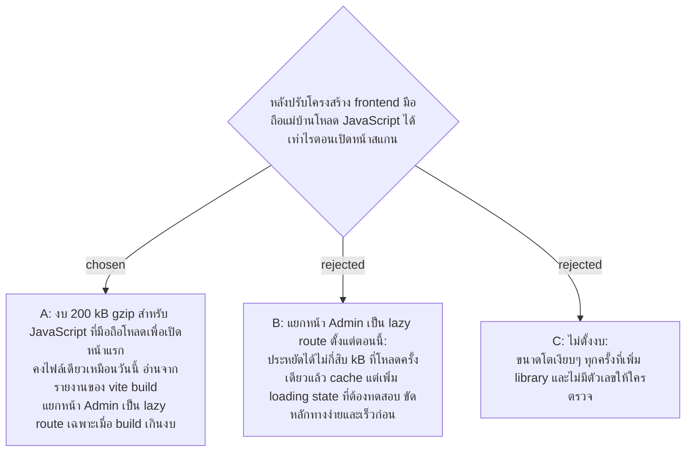

# Phone Bundle Budget — 200 kB gzip JavaScript, One File Until It Is Exceeded

- Decision map: [#27 polling-vs-push](https://github.com/ThodsaphonSonthiphin/Facility-Real-time-dashboard/issues/27) บนแผนที่ [#1](https://github.com/ThodsaphonSonthiphin/Facility-Real-time-dashboard/issues/1) (milestone frontend-restructure)
- วันที่: 2026-10-08
- ที่มา: เจ้าของโปรเจกต์เลือกข้อ A
- เกี่ยวข้อง: facility-0049 (server เปิดจากอินเทอร์เน็ต มือถืออาจใช้เน็ตมือถือ ไม่ใช่แค่ WiFi โรงงาน), facility-0058 (Dashboard เฉพาะ Admin)

## Context & Decision

วัดบน `50a8d55` ด้วย `vite build` (Vite 8.3.0): JavaScript ไฟล์เดียว 333 kB ดิบ / 99 kB gzip รวม React, `@microsoft/signalr` และ `lucide-react` CSS 1.8 kB gzip การปรับโครงสร้างจะเพิ่ม Redux Toolkit + RTK Query, React Router และ Base UI ซึ่งประมาณการ (ยังไม่ได้วัด) ว่าเพิ่มราว 40-50 kB gzip

จึงตัดสินใจ **ตั้งงบ 200 kB gzip** สำหรับ JavaScript ที่มือถือต้องโหลดเพื่อเปิดหน้าแรกที่มันเปิด (login หรือหน้าสแกน):

1. คงไฟล์เดียวไว้ ไม่แยก chunk ล่วงหน้า
2. ตรวจด้วยตัวเลข gzip ในรายงานของ `vite build` หลังทุกขั้นที่เพิ่ม dependency
3. ถ้าเกินงบ ทางแก้แรกคือแยกหน้า Admin (Dashboard, จัดการจุด, จัดการบัญชี) เป็น lazy route ของ `createBrowserRouter`

## Consequences

- เหลือที่ว่างราว 100 kB gzip จากวันนี้ เพียงพอสำหรับ library ที่ map นี้ตัดสินไว้แล้ว
- ตัวเลขนี้ตั้งสำหรับ POC ก่อนวัดกับมือถือแม่บ้านจริง ตอนฝึกงานควรวัดเวลาโหลดบนเครื่องจริงแล้วทบทวน
