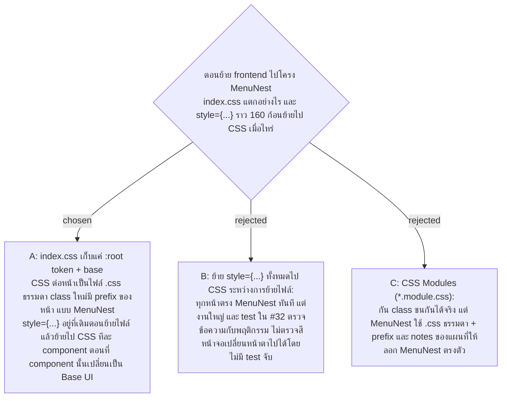

# Frontend CSS — index.css เก็บแค่ token, CSS แยกต่อหน้า, inline style ย้ายทีละ component ตอนเปลี่ยนเป็น Base UI

- Decision map: [#31 css-organisation](https://github.com/ThodsaphonSonthiphin/Facility-Real-time-dashboard/issues/31) บนแผนที่ [#1](https://github.com/ThodsaphonSonthiphin/Facility-Real-time-dashboard/issues/1) (milestone `frontend-restructure`)
- วันที่: 2026-10-08
- ที่มา: เจ้าของโปรเจกต์ตัดสิน 2026-10-08 ("go with recommend")
- เกี่ยวข้อง: facility-0025 (target tree — จองที่ `src/index.css` ไว้ให้ตั๋วนี้), #30 base-ui-inventory (Base UI ใส่สไตล์ผ่าน `data-*` และต้นทุนจริงคือการย้ายจาก inline style), #32 regression-net (test ตรวจข้อความและพฤติกรรม ไม่ตรวจสี), facility-0060 (ลบปุ่ม QR บนการ์ด)

## Context & Decision

วัดบน `master` df02936 ใน `frontend/src`: สไตล์ส่วนใหญ่เขียนเป็น `style={...}` ในตัว component ราว 160 จุด (ScanRecordPage 62, ServicePointCard 32, LoginPage 22, DashboardView 18, App 14, IssueTagSelector 9, KpiSummaryBar 5) ส่วน `styles/index.css` 372 บรรทัดมี `:root` token (สี Point Status, radius, shadow, font), base, `.badge-*` / `.dot-*` / `.flash-animate`, `.dev-navbar*` และ `.dashboard-header*` กับ `@media` ของมัน

MenuNest มี `src/index.css` global สำหรับ token และไฟล์ `.css` ธรรมดาต่อหน้าใน `pages/<page>/` ที่ class ขึ้นต้นด้วย prefix ของหน้า (เช่น `bdg-` ของ Budget) ไม่ใช้ CSS Modules

จึงตัดสินใจว่า:

1. `src/index.css` เก็บแค่ `:root` token และ base rule (`*`, `body`, `#root`, keyframes ที่ใช้ร่วม)
2. `.badge-*`, `.dot-*`, `.flash-animate` และ `.dashboard-header*` ย้ายไปไฟล์ CSS ของหน้า Dashboard ส่วน `.dev-navbar*` ย้ายไปกับ dev navbar โดย **ชื่อ class เดิมไม่เปลี่ยน** เพื่อให้การย้ายเป็นการย้ายล้วน
3. แต่ละหน้ามีไฟล์ `.css` ธรรมดาของตัวเอง class ที่เขียนใหม่ขึ้นต้นด้วย prefix ของหน้า ไม่ใช้ CSS Modules
4. Base UI part ได้สไตล์จากไฟล์ CSS ของหน้านั้นผ่าน `data-*` attribute (เช่น `[data-pressed]`, `[data-open]`)
5. ระหว่างการย้ายไฟล์ `style={...}` อยู่ที่เดิม component หนึ่งย้ายสไตล์ไป CSS ก็ต่อเมื่อ component นั้นเปลี่ยนเป็น Base UI part (เช่น IssueTagSelector เป็น Toggle Group, หน้าต่าง QR เป็น Dialog)

## Consequences

- หน้าจอต้องหน้าตาเหมือนเดิมหลังการย้าย ทั้งก่อนและหลังข้อนี้
- ช่วงหนึ่งโค้ดจะมีสไตล์สองแบบอยู่ด้วยกัน (inline กับ CSS file) ตามที่ #30 เตือนไว้ ADR นี้ยอมรับแบบ hybrid ต่อ component ไม่ใช่ต่อหน้า
- หน้าต่าง QR บนการ์ดจะถูกลบตาม facility-0060 จึงไม่ต้องย้ายสไตล์ของมัน
- หน้าใหม่ (My Work, หน้าตึกของฉัน, Audit Log และหน้าของแผน 2B, 2C) เขียนสไตล์ใน CSS file ของหน้าตั้งแต่แรก ไม่ใช้ `style={...}`
