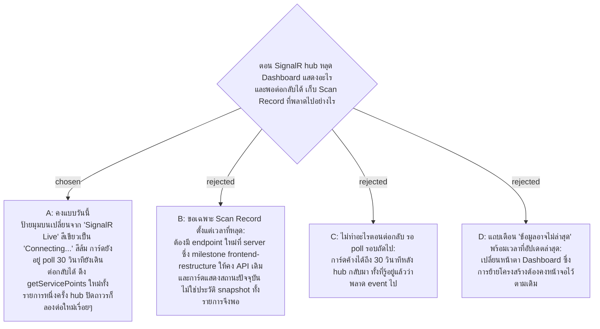

# Dashboard When the Hub Is Offline — Keep Today's Badge, Full Refetch on Reconnect

- Decision map: [#28 hub-reconnect-catchup](https://github.com/ThodsaphonSonthiphin/Facility-Real-time-dashboard/issues/28) บนแผนที่ [#1](https://github.com/ThodsaphonSonthiphin/Facility-Real-time-dashboard/issues/1) (milestone `frontend-restructure`)
- วันที่: 2026-10-08
- ที่มา: เจ้าของโปรเจกต์ตัดสิน 2026-10-08 ("ok" ต่อข้อเสนอให้คงพฤติกรรมวันนี้)
- เกี่ยวข้อง: facility-0061 (poll 30 วินาทีคู่กับ push, `refetchOnFocus`), #26 hub-cache-bridge (เปิด hub ใน `onCacheEntryAdded` ของ `getServicePoints`), facility-0024 (`dashboardSlice` เก็บ state ของหน้า), facility-0019 (สถานะคำนวณที่ server ที่เดียว), facility-0058 (Dashboard เฉพาะ Admin)

## Context & Decision

วันนี้ (`master` df02936, `useDashboard.ts` และ `services/signalr.ts`) hub ใช้ `withAutomaticReconnect([0, 2000, 5000, 10000, 30000])` ระหว่างหลุด ป้ายมุมบนของ Dashboard เปลี่ยนจาก "SignalR Live" สีเขียวเป็น "Connecting..." สีส้ม การ์ดยังแสดงข้อมูลเดิม และ poll 30 วินาทียังเดิน พอ `onreconnected` จะดึงรายการจุดใหม่ทั้งหมดหนึ่งครั้ง ถ้า `onclose` (ลองครบแล้วไม่ติด) จะเริ่มต่อใหม่ทุก 3 วินาที

การ์ดแสดงสถานะปัจจุบันของแต่ละ Service Point ไม่ใช่รายการ Scan Record ดังนั้น snapshot ทั้งรายการหนึ่งครั้งเก็บทุกอย่างที่พลาดไปได้ครบ

จึงตัดสินใจ **คงพฤติกรรมของวันนี้ทั้งหมด** และย้ายเข้าโครงใหม่:

1. สถานะการเชื่อมต่อของ hub (ต่ออยู่หรือไม่) เก็บใน `dashboardSlice` ป้ายมุมบนอ่านจากที่นั่น ข้อความและสีเหมือนเดิม
2. ใน `onCacheEntryAdded` ของ `getServicePoints` (#26): `onreconnecting` ตั้งสถานะเป็นหลุด, `onreconnected` ตั้งเป็นต่ออยู่และสั่ง refetch `getServicePoints` หนึ่งครั้ง, `onclose` ตั้งเป็นหลุดและเริ่มต่อใหม่ทุก 3 วินาทีจนกว่า cache entry ถูกลบ
3. ไม่เพิ่ม endpoint "ตั้งแต่เวลา" และไม่เพิ่มแถบเตือนใหม่

## Consequences

- ระหว่าง hub หลุด การ์ดเก่าได้ไม่เกิน 30 วินาทีเพราะ poll (facility-0061) ยังเดิน ตราบที่ REST ยังใช้ได้
- `refetchOnReconnect` ของ RTK Query (เน็ตของ browser กลับมา) ไม่ใช่สิ่งเดียวกับ hub ต่อกลับ ข้อ 2 คือตัวที่ครอบกรณี hub
- test ใน #32 ข้อ "hub ต่อกลับแล้วโหลดรายการใหม่" ครอบพฤติกรรมนี้อยู่แล้ว
- ถ้าวันหนึ่งต้องการแถบเตือนที่ชัดกว่านี้ เป็นการเปลี่ยนหน้าตา ต้องตัดสินแยกหลังการย้ายโครงสร้าง
