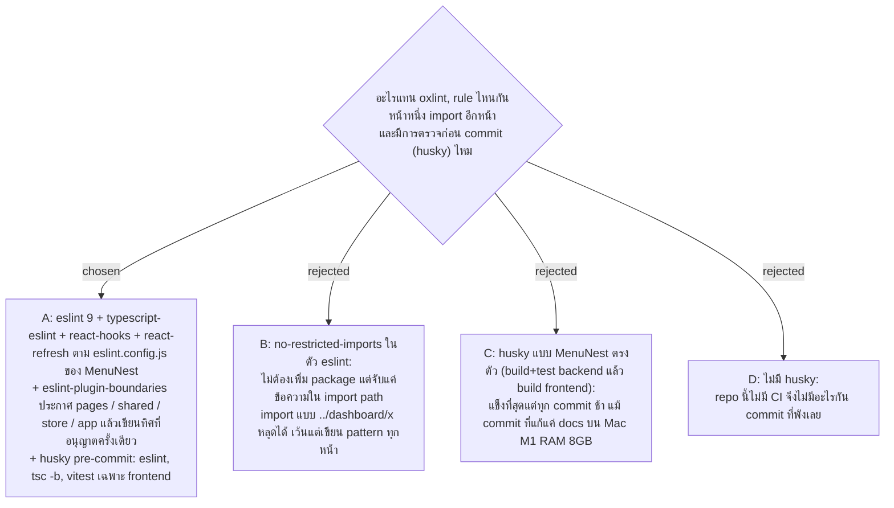

# Frontend Lint — eslint แบบ MenuNest + eslint-plugin-boundaries และ husky pre-commit แบบเบาเฉพาะ frontend

- Decision map: [#33 lint-and-boundaries](https://github.com/ThodsaphonSonthiphin/Facility-Real-time-dashboard/issues/33) บนแผนที่ [#1](https://github.com/ThodsaphonSonthiphin/Facility-Real-time-dashboard/issues/1) (milestone `frontend-restructure`)
- วันที่: 2026-10-08
- ที่มา: เจ้าของโปรเจกต์ตัดสิน 2026-10-08 ("go with recommend" ทั้งสองคำถาม)
- เกี่ยวข้อง: facility-0025 (target tree และลำดับย้าย ขั้นที่ 1 เพิ่ม dependency), facility-0024 (store และ slice ต่อหน้า), #32 regression-net (test ที่ pre-commit รัน)

## Context & Decision

ตอน chart แผนที่ (2026-09-16) ตัดสินแล้วว่า oxlint ถูกแทนด้วย eslint + typescript-eslint ที่มี rule กัน import ข้ามขอบเขต ตั๋วนี้ตัดสินสองเรื่องที่เหลือ วัดบน `master` df02936: frontend ใช้ oxlint (`.oxlintrc.json` สอง rule: `react/rules-of-hooks`, `react/only-export-components`) และ repo ไม่มี `.github/workflows` คือไม่มี CI MenuNest ใช้ `eslint.config.js` แบบ template ของ Vite (ไม่มี rule กันขอบเขต) และ husky ที่ build+test backend แล้ว typecheck+build frontend ทุก commit typescript-eslint 8.71.1 รองรับ TypeScript `>=4.8.4 <6.1.0` จึงใช้กับ TypeScript 6.0 ของ repo นี้ได้

จึงตัดสินใจว่า:

1. **eslint** ใช้ `eslint.config.js` ของ MenuNest เป็นฐาน: `@eslint/js` recommended, `typescript-eslint` recommended, `eslint-plugin-react-hooks`, `eslint-plugin-react-refresh` (vite) ซึ่งครอบสอง rule ของ oxlint เดิม ใช้ eslint major เดียวกับ MenuNest (9) แล้วลบ `oxlint` และ `.oxlintrc.json`
2. **eslint-plugin-boundaries** ประกาศ element: `app` (`src/main.tsx`, `src/App.tsx`, `src/router.tsx`), `pages` (`src/pages/*` จับชื่อหน้า), `shared` (`src/shared/**`), `store` (`src/store/**`) ทิศที่อนุญาต:
   - `app` → `pages`, `shared`, `store`
   - `pages` → หน้าเดียวกัน, `shared`, `store`
   - `store` → `shared`, `pages` (เพื่อลงทะเบียน slice ของแต่ละหน้า ตาม facility-0025)
   - `shared` → `shared`, `store`
   - ห้าม: หน้าหนึ่ง import อีกหน้า และ `shared` import `pages`
3. **husky** ติดตั้งแบบ MenuNest (`"prepare": "cd .. && husky frontend/.husky"` เพราะ root ไม่มี `package.json`) แต่ pre-commit รันแค่ frontend: `npm run lint`, `npx tsc -b`, `npm test`

## Consequences

- เพิ่มเข้าขั้นที่ 1 ของลำดับย้ายใน facility-0025 (deps) eslint จึงทำงานตั้งแต่ commit แรกของการย้าย
- โฟลเดอร์เดิม `features/` และ `services/` ยังไม่อยู่ใน element ใดระหว่างการย้าย จึงต้องปิด `boundaries/no-unknown` ไว้จนขั้นสุดท้าย "ลบของเก่า" แล้วเปิดเป็น error
- pre-commit ไม่ build หรือ test backend การแก้ backend ต้องรัน `dotnet build` และ `dotnet test` เอง จนกว่าจะมี CI
- การตรวจก่อน commit ข้ามได้ด้วย `git commit --no-verify` เป็นตาข่าย ไม่ใช่ประตูบังคับ ถ้าต้องการประตูจริงต้องตัดสินเรื่อง CI แยก
