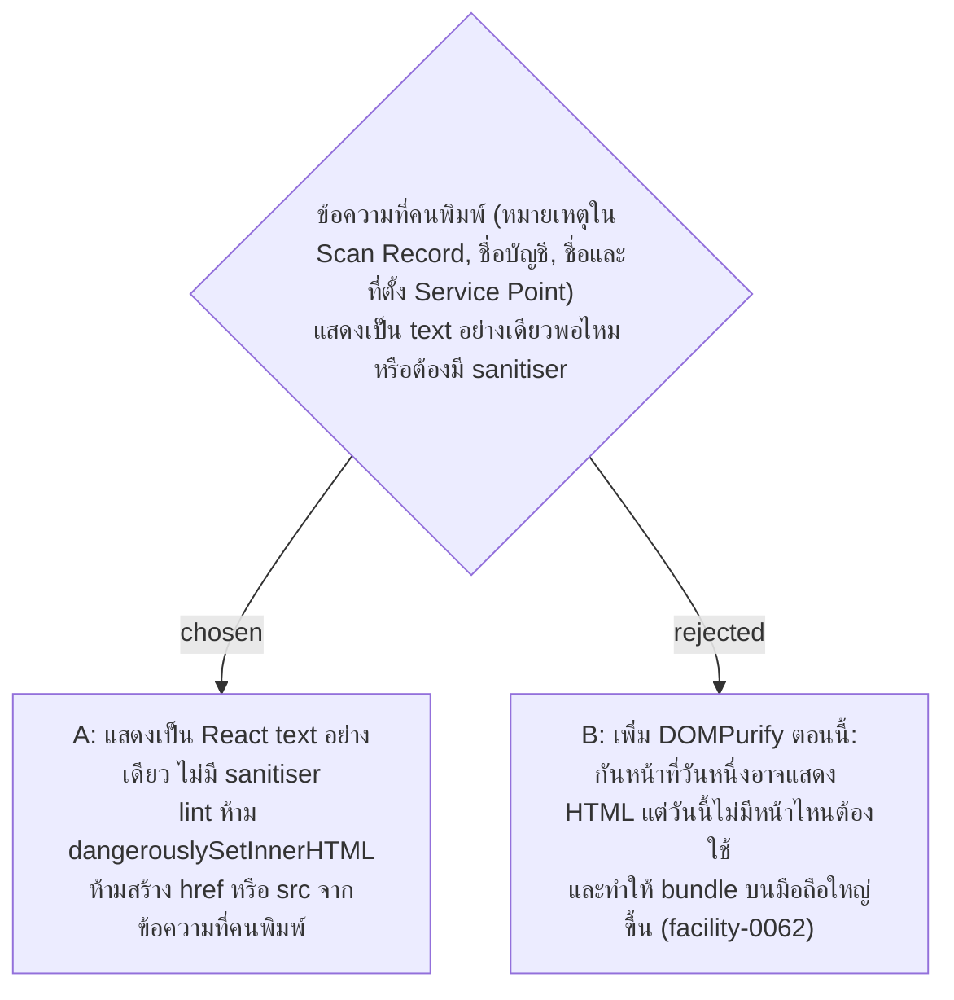

# User Text Is Rendered as React Text Only — No Sanitiser, Raw HTML Banned by Lint

- Decision map: [#36 note-rendering-safety](https://github.com/ThodsaphonSonthiphin/Facility-Real-time-dashboard/issues/36) บนแผนที่ [#1](https://github.com/ThodsaphonSonthiphin/Facility-Real-time-dashboard/issues/1) (milestone `frontend-restructure`)
- วันที่: 2026-10-08
- ที่มา: เจ้าของโปรเจกต์ตัดสิน 2026-10-08 ("ok" ต่อข้อเสนอ)
- เกี่ยวข้อง: facility-0065 (eslint config ที่ rule นี้ไปอยู่), facility-0060 (ลบหน้าต่าง QR บนการ์ด), facility-0021 และแผน 2C (วาดรูป QR ใน browser ด้วย `qrcode`), facility-0062 (งบขนาด bundle บนมือถือ)

## Context & Decision

ค้นใน `frontend/src` บน `master` df02936 (ไฟล์ `*.ts`, `*.tsx` ยกเว้น test) หา `dangerouslySetInnerHTML`, `innerHTML`, `outerHTML`, `insertAdjacentHTML`, `document.write`, `eval(`, `new Function`, `href={`, `src={` ได้ 2 จุด ทั้งคู่ใน `ServicePointCard.tsx` และไม่มีข้อความที่คนพิมพ์อยู่ในนั้น: `src` ของรูป QR จาก `api.qrserver.com` และ `href` ของ URL หน้าสแกน ทั้งสองสร้างจาก QR Token กับ host ไม่ใช่จากข้อความที่คนพิมพ์ ข้อความที่คนพิมพ์ทุกจุดเข้า DOM เป็น React text node ซึ่ง React escape ให้แล้ว

จึงตัดสินใจว่า:

1. ข้อความที่ Cleaner Account, Supervisor Account หรือ Admin Account พิมพ์ แสดงเป็น React text เท่านั้น รวมถึงใน Base UI Toast, Dialog และหน้าพิมพ์ป้าย ไม่มี sanitiser
2. eslint (facility-0065) ห้าม `dangerouslySetInnerHTML` ด้วย `no-restricted-syntax` selector `JSXAttribute[name.name='dangerouslySetInnerHTML']` ไม่ต้องเพิ่ม plugin
3. ห้ามสร้าง `href` หรือ `src` จากข้อความที่คนพิมพ์

## Consequences

- ถ้าวันหนึ่งต้องแสดงข้อความแบบมีรูปแบบ (Markdown หรือ HTML) ต้องตัดสินใหม่และเพิ่ม sanitiser ตอนนั้น lint จะบังคับให้เรื่องนี้ต้องตัดสินอย่างตั้งใจ
- ข้อพบระหว่างทาง: หน้าต่าง QR บนการ์ดส่ง URL หน้าสแกนพร้อม QR Token ไปที่ `api.qrserver.com` เพื่อวาดรูป facility-0060 ลบหน้าต่างนี้ และแผน 2C วาดรูป QR ใน browser ด้วย `qrcode` (บริการภายนอกเป็นแค่ทางสำรองตาม facility-0009 ข้อ 2) จึงไม่ต้องตัดสินเพิ่มในนี้
