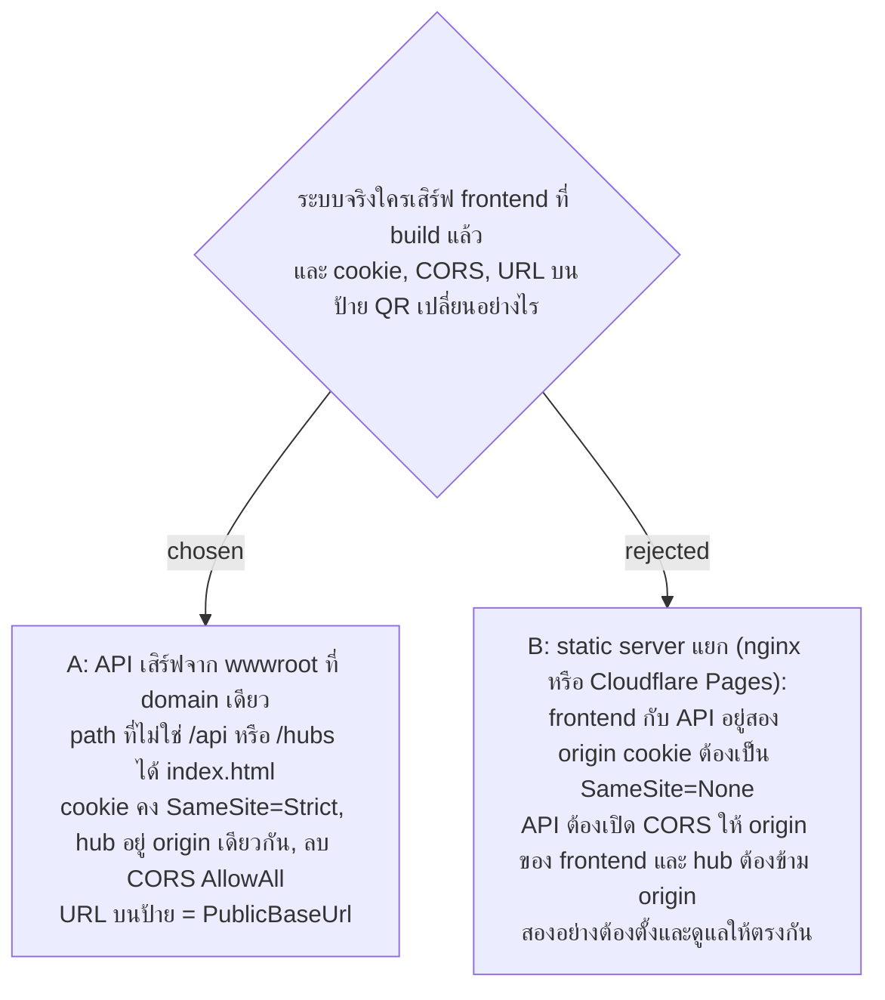

# The API Serves the Built Frontend from One Origin — AllowAll CORS Removed

- Decision map: [#34 deploy-origin](https://github.com/ThodsaphonSonthiphin/Facility-Real-time-dashboard/issues/34) บนแผนที่ [#1](https://github.com/ThodsaphonSonthiphin/Facility-Real-time-dashboard/issues/1) (milestone `frontend-restructure`)
- วันที่: 2026-10-08
- ที่มา: เจ้าของโปรเจกต์ตัดสิน 2026-10-08 ("go with recommend")
- เกี่ยวข้อง: facility-0049 (HTTPS ที่ domain คงที่ เครื่องรอฝ่าย IT), facility-0026 (router ใช้ path ปกติ `/scan/:token` ไม่ใช่ hash), facility-0013 (refresh token เป็น HttpOnly cookie), facility-0018 (ทุก endpoint และ hub ต้อง login), facility-0021 (`PublicBaseUrl`)

## Context & Decision

วัดบน `master` df02936: `Program.cs` เปิด CORS policy `AllowAll` (`SetIsOriginAllowed(_ => true)`) และ API ยังไม่เสิร์ฟไฟล์ static cookie ของ refresh token ตั้ง `HttpOnly`, `SameSite=Strict` และ `Secure` ตาม config ตอนพัฒนา Vite proxy `/api` กับ `/hubs` ไปที่ API browser จึงเห็น origin เดียวอยู่แล้ว router ของ facility-0026 ใช้ path ปกติ และป้าย QR Sign ที่พิมพ์ชี้ `/scan/<token>` ตรง ๆ ตัวเสิร์ฟจึงต้องส่ง `index.html` ให้ทุก path ของหน้า

จึงตัดสินใจว่า **API เสิร์ฟ frontend ที่ build แล้วจาก origin เดียว** ไม่ว่าฝ่าย IT จะเลือกเครื่องในโรงงานหรือ cloud:

1. ผล `npm run build` (`frontend/dist`) ไปอยู่ใน `wwwroot` ของ `FacilityRealtime.Api` ตอน publish
2. API ใช้ `UseDefaultFiles` + `UseStaticFiles` และ `MapFallbackToFile("index.html")` สำหรับ path ที่ไม่ขึ้นต้นด้วย `/api` หรือ `/hubs` (path ที่ขึ้นต้นด้วยสองตัวนี้แต่ไม่มี endpoint ได้ 404 ไม่ใช่ `index.html`)
3. cookie ของ refresh token คง `SameSite=Strict` และ hub อยู่ origin เดียวกัน
4. ลบ CORS policy `AllowAll` ไม่มีอะไรเรียก API จาก origin อื่น ทั้งระบบจริงและตอนพัฒนา (Vite proxy)
5. URL บนป้าย QR Sign มาจาก `PublicBaseUrl` ซึ่งคือ domain นั้น

## Consequences

- มีเครื่องเดียว ใบรับรองเดียว และ deploy ชิ้นเดียว ใช้ได้ทั้งกับ Cloudflare Tunnel ระหว่างรอฝ่าย IT และกับเครื่องจริง
- การเปลี่ยนอยู่ที่การตั้งค่าตอนเริ่มของ API project (เสิร์ฟไฟล์, ลบ `AllowAll`) ไม่เปลี่ยน endpoint, DTO หรือข้อความของ hub จึงไม่ขัดกับ out-of-scope ของ milestone `frontend-restructure`
- ถ้าวันหนึ่งต้องแยก frontend ไปอีก origin ต้องตัดสินใหม่เรื่อง cookie `SameSite=None`, CORS ที่จำกัด origin และ hub ข้าม origin
- การ build frontend เข้า `wwwroot` ต้องอยู่ในขั้นตอน deploy ซึ่งยังไม่มี CI (facility-0065)
