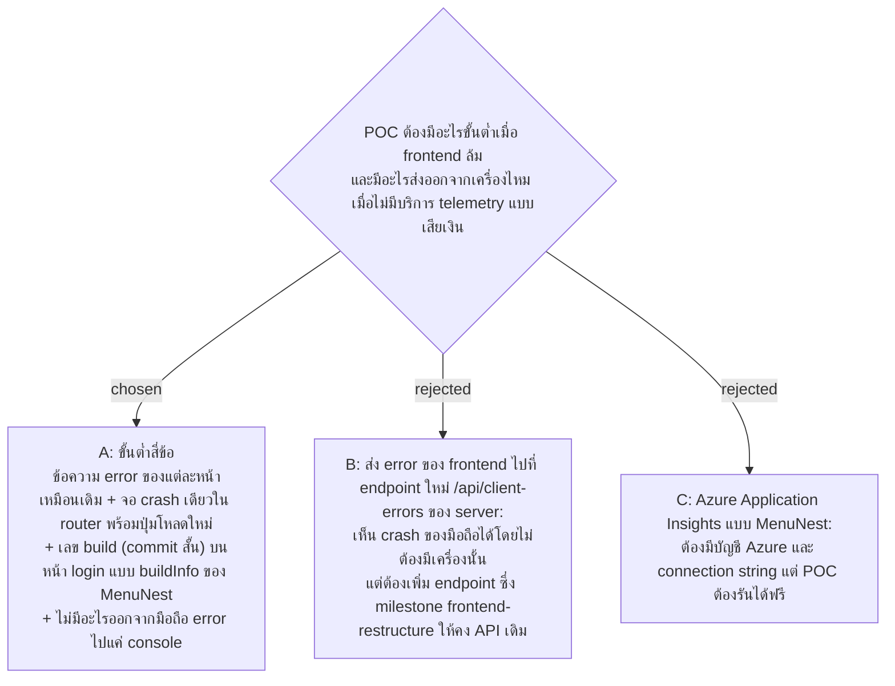

# Frontend Failure Minimum — Page Errors, One Crash Screen, Build Version, Nothing Leaves the Phone

- Decision map: [#35 ops-minimum](https://github.com/ThodsaphonSonthiphin/Facility-Real-time-dashboard/issues/35) บนแผนที่ [#1](https://github.com/ThodsaphonSonthiphin/Facility-Real-time-dashboard/issues/1) (milestone `frontend-restructure`)
- วันที่: 2026-10-08
- ที่มา: เจ้าของโปรเจกต์ตัดสิน 2026-10-08 ("ok" ต่อชุดขั้นต่ำที่เสนอ)
- เกี่ยวข้อง: facility-0026 (`createBrowserRouter` ที่จอ crash ไปอยู่), facility-0065 (pre-commit), facility-0067 (API เสิร์ฟ frontend), #32 regression-net (test ที่ตรวจข้อความ error ของแต่ละหน้า)

## Context & Decision

วัดบน `master` df02936 ใน `frontend/src`: แต่ละหน้ามีข้อความ error ของตัวเอง (Dashboard โหลดไม่ได้, หน้าสแกน "ไม่พบจุดบริการ" และส่งไม่สำเร็จ, หน้า login รหัสผิด) ค้นหา `ErrorBoundary`, `componentDidCatch`, `window.onerror`, `unhandledrejection` ไม่พบ หน้าที่ crash ระหว่าง render จึงเป็นจอขาวเปล่า ไม่มีเลข build บนจอ และไม่มี telemetry MenuNest มี `shared/version/buildInfo.ts` (ค่าจาก `define` ใน `vite.config.ts`) และส่ง error ไป Azure Application Insights

จึงตัดสินใจขั้นต่ำสี่ข้อ:

1. ข้อความ error ของแต่ละหน้าคงไว้เหมือนวันนี้
2. จอ crash เดียวเป็น `errorElement` ของ route ราก ใน `createBrowserRouter` (facility-0026) แสดง "เกิดข้อผิดพลาด" และปุ่ม "โหลดใหม่" แทนจอขาว
3. เลข build (commit สั้น) แสดงตัวเล็กบนหน้า login ผ่าน `buildInfo` แบบ MenuNest (`define` ใน `vite.config.ts`)
4. ไม่มีอะไรออกจากมือถือ error ไปแค่ browser console ฝั่ง server มี log ของตัวเองอยู่แล้ว

## Consequences

- การดู crash ของมือถือต้องมีเครื่องนั้นอยู่ในมือ (หรือ remote debugging) เพราะไม่มีอะไรส่งออก
- เลข build บนหน้า login บอกได้ว่ามือถือเปิด build ไหนอยู่ เช่น ตอนที่ browser ยังถือ bundle เก่าไว้
- ถ้าวันหนึ่งต้องเห็น crash ของมือถือจากที่อื่น ต้องตัดสินแยกเรื่อง endpoint หรือบริการ telemetry พร้อมเรื่องข้อมูลส่วนบุคคลที่จะส่งออก
