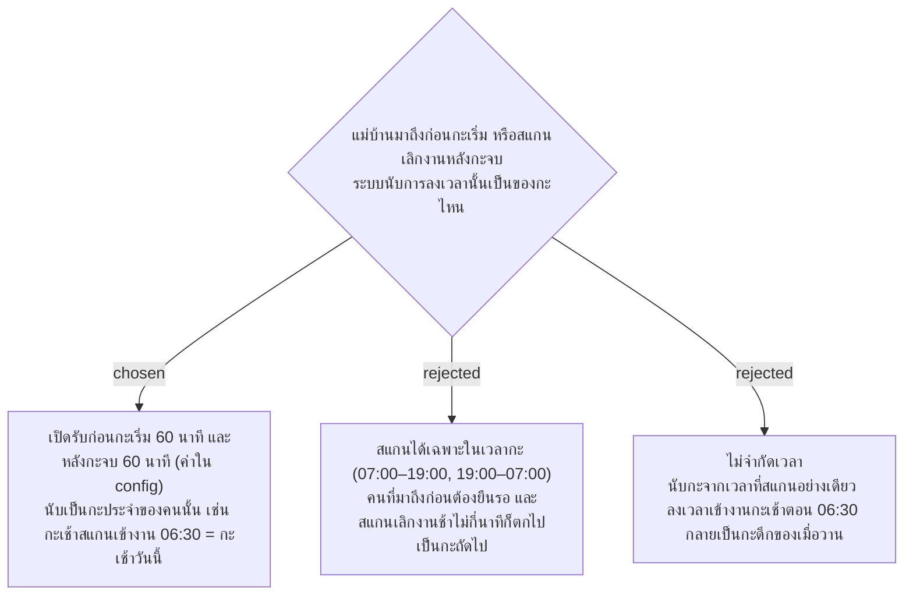

# Attendance Scans Open 60 Minutes Before the Shift and Close 60 Minutes After It

- วันที่: 2026-10-09
- ที่มา: เจ้าของโปรเจกต์ตัดสิน 2026-10-09 (ค่า 60 นาทีมาจากต้นแบบ `docs/design/prototype.html` และ `docs/design/database.html` หัวข้อ "ลงเวลาก่อนกะ")
- เกี่ยวข้อง: facility-0026 (Shift Check-In, สแกนซ้ำยึดเวลาแรก), facility-0031 (ลงเวลา 4 ครั้ง), facility-0040 (กะ 07:00–19:00 และ 19:00–07:00), facility-0050 (ลงเวลา = ยืนยันว่าเข้าพื้นที่ ไม่คิดสาย)

## Context & Decision

กะของแม่บ้านตายตัว (facility-0040) และแม่บ้านแต่ละคนมีกะประจำ แต่คนมักมาถึงก่อนกะเริ่ม และสแกนเลิกงานหลังกะจบไม่กี่นาที ถ้านับกะจากเวลาที่สแกนอย่างเดียว การเข้างานกะเช้าตอน 06:30 จะไปตกอยู่ในกะดึกของเมื่อวาน ต้นแบบตั้งไว้ 60 นาที แต่ยังไม่มี ADR รองรับ

จึงตัดสินใจว่า:

1. **เปิดรับการลงเวลาก่อนกะเริ่ม 60 นาที** เช่น กะเช้า (07:00) สแกนเข้างานได้ตั้งแต่ 06:00 กะดึก (19:00) ได้ตั้งแต่ 18:00
2. **รับการลงเวลาหลังกะจบได้อีก 60 นาที** เช่น กะดึกที่จบ 07:00 สแกนเลิกงานได้ถึง 08:00
3. **การลงเวลาในช่วงนี้นับเป็นกะประจำของคนที่สแกน** ไม่ใช่กะที่เวลานั้นตกอยู่ เช่น แม่บ้านกะเช้าสแกนเข้างาน 06:30 คือกะเช้าของวันนี้ ส่วนแม่บ้านกะดึกสแกนเลิกงาน 07:20 คือกะดึกที่เริ่มเมื่อวาน
4. **ทั้งสองค่าอยู่ใน config** แก้ได้โดยไม่ต้องแก้โค้ด
5. นอกช่วงนี้ระบบไม่รับการลงเวลา ถ้าลงเวลาไม่ได้ Admin เพิ่มเวลาให้พร้อมเหตุผล (facility-0051)

ช่วงนี้ไม่ใช่ค่าผ่อนผันเรื่องมาสาย: facility-0050 ไม่คิดสายหรือกลับก่อนอยู่แล้ว ช่วงนี้มีไว้ตัดสินว่าการลงเวลาเป็นของกะไหนเท่านั้น

## Consequences

- แม่บ้านที่มาถึงก่อนสแกนเข้างานได้เลย ไม่ต้องรอพร้อมกันตอน 07:00
- ช่วงก่อนกะของคนกะเช้า (06:00–07:00) ซ้อนกับช่วงท้ายของกะดึก แต่ไม่สับสน เพราะแต่ละคนมีกะประจำ และ Area หนึ่งมีแม่บ้านกะละ 1 คน
- การลงเวลาเข้างานล่วงหน้าไม่ได้ทำให้ส่งงานของรอบได้ก่อนเวลา: รอบแรกของกะยังเริ่มตามช่วงเวลาของรอบ (facility-0047) งานที่ส่งก่อนรอบแรกเป็นงานนอกรอบ
- ช่วงที่กว้างขึ้นทำให้ "ลงเวลาไว้แล้วกลับบ้าน" ทำได้นานขึ้น ซึ่งยอมรับได้ เพราะเวลาเข้างานไม่ได้ใช้วัดผล (facility-0050) และ GPS ยังติดธงเมื่อไม่ได้อยู่ใกล้ป้าย (facility-0035)
