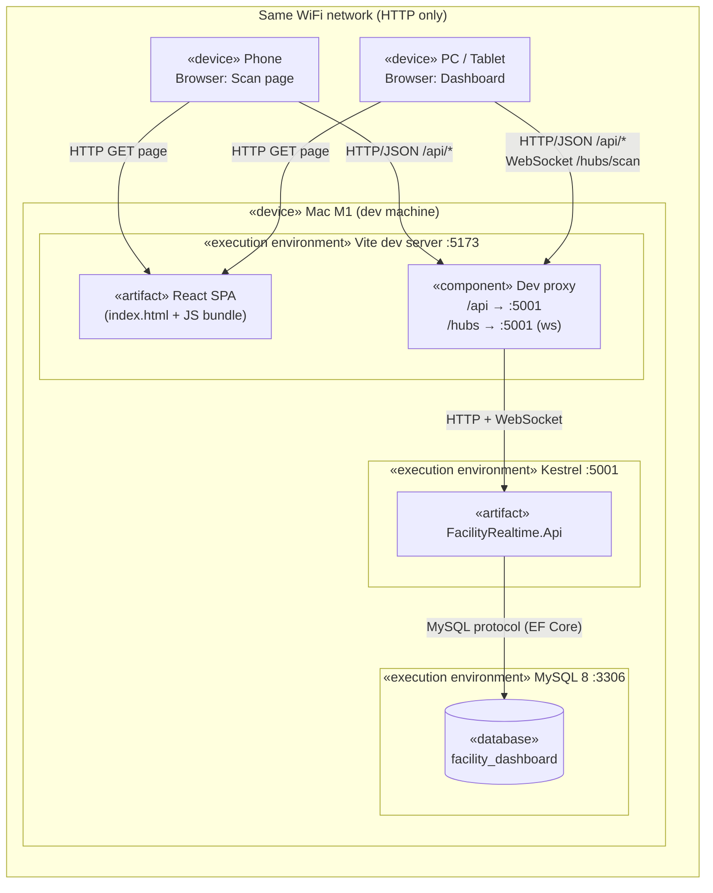
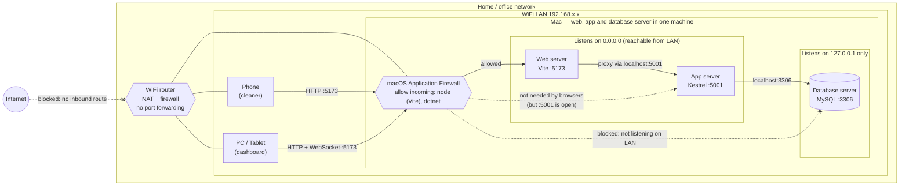
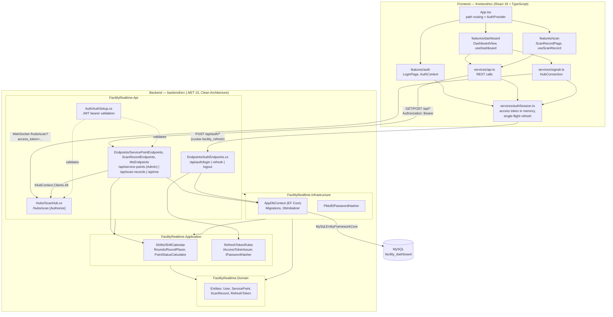
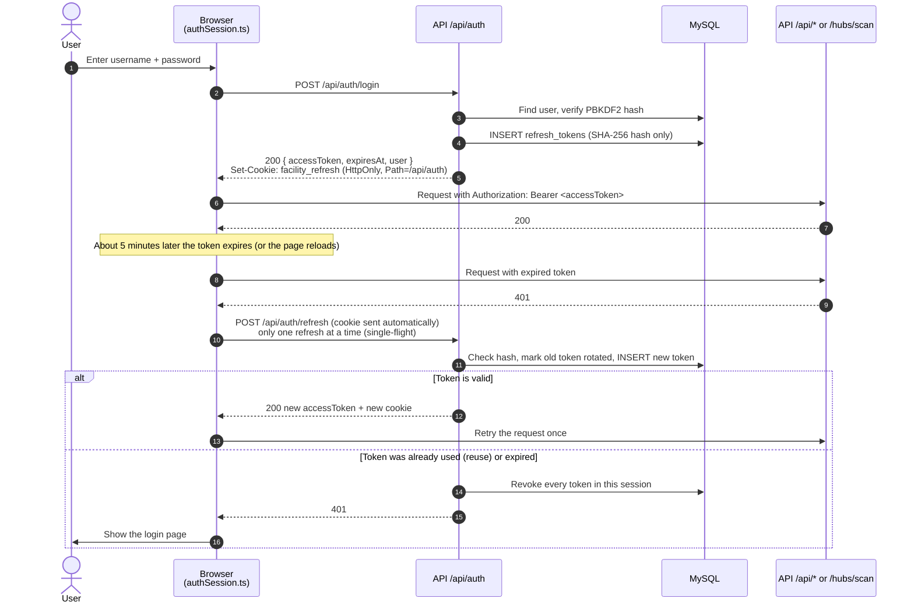
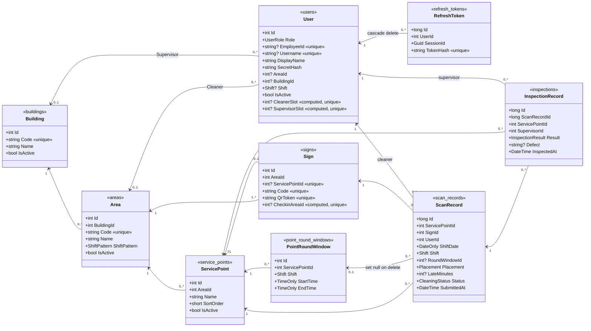

# Architecture — how the Facility Real-time Dashboard is connected

This page shows how the parts of the POC connect: browser, web server, API server and database server.
It describes the code as it is on `master` today. Decisions behind it are in [docs/adr/](adr/).

| Node | What runs there | Port |
|---|---|---|
| Phone (cleaner) | Browser opens `/scan/{qrToken}` from the QR code | — |
| Dashboard screen (PC / tablet) | Browser opens `/dashboard` | — |
| Web server (dev) | Vite dev server: serves the React app, proxies `/api` and `/hubs` | `5173` |
| API server | ASP.NET Core 10 (Kestrel): Minimal API + SignalR hub | `5001` |
| Database server | MySQL 8 (Homebrew, native) — database `facility_dashboard` | `3306` |

All of it runs on one Mac. The phone reaches the Mac over the same WiFi with plain HTTP ([facility-0003](adr/facility-0003-phone-reaches-mac-over-same-wifi-http.md)).

---

## 1. Deployment diagram — where each part runs



Why the proxy matters: the browser only ever talks to one origin (`:5173`).
So the refresh-token cookie works without CORS settings, and the URL inside the QR code is the Vite URL ([facility-0004](adr/facility-0004-app-architecture.md) item 5).

---

## 1b. Network diagram — servers, ports and firewalls

The deployment diagram shows *what runs where*. This network diagram shows *which traffic each boundary lets through*.
UML has no firewall element, so this is a plain infrastructure (network topology) diagram, not strict UML.



| Boundary | Rule | Why |
|---|---|---|
| Router (Internet → LAN) | Nothing comes in. No port forwarding, no tunnel | The phone is always on the same WiFi ([facility-0003](adr/facility-0003-phone-reaches-mac-over-same-wifi-http.md)) |
| macOS firewall (LAN → Mac) | Allow incoming connections for Vite (`node`) and the API (`dotnet`) | facility-0003 item 2. **On this Mac the firewall is currently off**, so every listening port is reachable from the WiFi |
| Vite `:5173` | The only port browsers use | Single origin, so cookies work without CORS |
| Kestrel `:5001` | Bound to `0.0.0.0` (`--urls "http://0.0.0.0:5001"` in the README). Reachable from the LAN, but only the Vite proxy needs it | Binding it to `localhost` would be enough while Vite proxies every request |
| MySQL `:3306` | Only the API connects, over `localhost` | Homebrew's MySQL config uses `bind-address = 127.0.0.1` by default, so other devices cannot reach it |

---

## 2. Component diagram — what talks to what



Project references follow Clean Architecture: `Api → Application, Infrastructure`; `Infrastructure → Application, Domain`; `Application → Domain`; `Domain` depends on nothing.

> Note: [facility-0004](adr/facility-0004-app-architecture.md) plans Mediator handlers in `Application`. The code does not use Mediator yet. The endpoint handlers live in `Endpoints/` (AuthEndpoints, MeEndpoints, ServicePointEndpoints, ScanRecordEndpoints), use `AppDbContext` directly, and `Program.cs` only composes them.

---

## 3. Sequence diagram — a scan reaches the dashboard in real time

This is the main flow: a Cleaner submits a Scan Record and the Admin Dashboard updates.

```mermaid
sequenceDiagram
    autonumber
    actor Cleaner
    participant Phone as Phone browser<br/>(ScanRecordPage)
    participant Vite as Vite :5173<br/>(proxy)
    participant Api as API :5001<br/>(Endpoints/*)
    participant DB as MySQL
    participant Hub as ScanHub<br/>/hubs/scan
    participant Dash as Dashboard browser<br/>(DashboardView)

    Note over Dash,Hub: Earlier: an Admin opened the Dashboard; its WebSocket to /hubs/scan<br/>(?access_token=<JWT>) joined the "admins" group (facility-0058)

    Cleaner->>Phone: Scan QR with phone camera → opens /scan/{qrToken}
    Phone->>Vite: GET /api/service-points/by-token/{qrToken}<br/>Authorization: Bearer <JWT>
    Vite->>Api: forward
    Api->>DB: SELECT sign → point, this shift's Round Windows, Scan and Inspection Records
    DB-->>Api: rows
    Api-->>Phone: 200 PointStatusDto (no QR Token)

    Cleaner->>Phone: Choose Normal / Issue (+ tags, notes), tap submit
    Phone->>Vite: POST /api/scan-records { qrToken, status, issueTags, notes }
    Vite->>Api: forward
    Note right of Api: The scanner is the user in the JWT,<br/>never a field in the body (facility-0017)
    Api->>Api: RoundPlacer.Place(...) → OnTime / Late / Rework / OffRound (facility-0047)
    Api->>DB: INSERT scan_records (shift, round, placement)
    DB-->>Api: OK
    Api->>Api: PointStatusCalculator.Calculate(...)
    Api->>Hub: Clients.Group("admins").SendAsync("ScanRecorded", dto)
    Hub-->>Dash: "ScanRecorded" (WebSocket push)
    Dash->>Dash: Update the card and KPI bar, no page reload
    Api-->>Phone: 201 Created { scanRecordId, placement, lateMinutes, newPointStatus, submittedAt }
```

---

## 4. Sequence diagram — login, token refresh and page reload

The access token (JWT, 5 minutes) lives only in browser memory. The refresh token lives in an HttpOnly cookie
that the browser sends only to `/api/auth` ([facility-0011](adr/facility-0011-jwt-api-authentication.md) – [facility-0016](adr/facility-0016-refresh-token-sliding-30-days.md)).



---

## 5. Class diagram — data stored in MySQL



The full target schema, including the tables later plans add, is `docs/design/database.html`. Point Status is not stored: the API computes it on every read from the point's current Round Window, that shift's Scan Records and their Inspection Records (`Application/Rounds/PointStatusCalculator`, [facility-0047](adr/facility-0047-cleaning-rounds-are-time-windows.md)). A Scan Record's round is decided once, when it is saved (`Application/Rounds/RoundPlacer`).

---

## Connection summary

| From | To | Protocol | Auth | Configured in |
|---|---|---|---|---|
| Browser | Vite `:5173` | HTTP | — | `frontend/vite.config.ts` |
| Vite proxy | API `:5001` `/api/*` | HTTP/JSON | `Authorization: Bearer <JWT>` | `frontend/vite.config.ts` |
| Vite proxy | API `:5001` `/hubs/scan` | WebSocket (SignalR) | `?access_token=<JWT>` (hub paths only) | `Auth/AuthSetup.cs`, `services/signalr.ts` |
| Browser | API `/api/auth/*` | HTTP/JSON | HttpOnly cookie `facility_refresh` | `Endpoints/AuthEndpoints.cs` |
| API | MySQL `:3306` | MySQL protocol via EF Core | `ConnectionStrings:DefaultConnection` | `appsettings.json` / user-secrets |
| API | itself on startup | — | — | `Program.cs` runs `MigrateAsync()` and seeds data |
