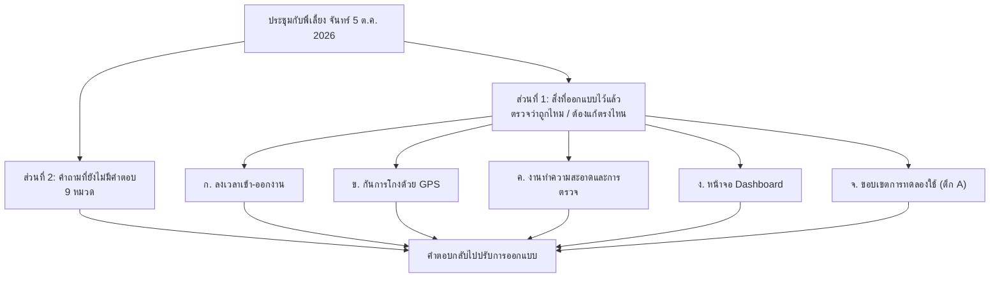

# ทบทวนความต้องการและคำถามที่ยังเปิดอยู่ — ระบบลงเวลาและตรวจงานทำความสะอาดแม่บ้าน

> **ได้คำตอบแล้ว 2026-10-06:** ดู `2026-10-06-supervisor-answers.md`

- ผู้จัดทำ: นักศึกษาฝึกงาน (ผู้พัฒนาระบบ)
- ผู้ตรวจ: พี่เลี้ยง / หัวหน้างาน
- วันที่ประชุม: จันทร์ 5 ต.ค. 2026

เอกสารนี้มี 2 ส่วน **ส่วนที่ 1** คือสิ่งที่ออกแบบไว้แล้ว ขอให้ช่วยดูว่าแต่ละข้อถูกต้องตามหน้างานจริงไหม ถ้าไม่ถูกให้เขียนแก้ได้เลย **ส่วนที่ 2** คือคำถามที่ยังไม่มีคำตอบ แต่ละข้อบอกว่าทำไมต้องถาม มีตัวเลือกให้ติ๊ก และมีที่ว่างให้จดคำตอบ

ระบบนี้มีเป้าหมาย 3 ข้อ:
1. **ตรวจสอบพนักงาน:** รู้ว่าแม่บ้านมาทำงานครบตามพื้นที่ที่ได้รับมอบหมายหรือไม่
2. **ตรวจสอบการทำงาน:** รู้ว่าแต่ละจุดทำความสะอาดแล้วหรือยัง
3. **ตรวจสอบการตรวจงาน:** รู้ว่าหัวหน้างานไปตรวจที่จุดจริง และประเมินผลแล้วหรือยัง

---

## ส่วนที่ 1: สิ่งที่ออกแบบไว้แล้ว — ช่วยตรวจว่าถูกไหม

### ก. ลงเวลาเข้า-ออกงาน

#### R1. มี 2 กะ

กะเช้า 07:00–19:00 และกะดึก 19:00–07:00 ระบบตัดรอบกะที่ 07:00 และ 19:00 ไม่ใช่เที่ยงคืน กะดึกจึงไม่ถูกตัดกลางคัน

- [ ] ถูกต้อง
- [ ] ต้องแก้: ____________________

#### R2. ลงเวลาวันละ 4 ครั้ง

เข้างาน → ออกพักเบรก → กลับจากพักเบรก → เลิกงาน หน้าจอมือถือจะแสดงปุ่มถัดไปให้เองตามลำดับ และกดซ้ำภายใน 5 นาทีไม่นับ

แม่บ้าน 170 คน คิดเป็นประมาณ 680 รายการต่อวัน

- [ ] ถูกต้อง
- [ ] ต้องแก้: ____________________

#### R3. ต้องลงเวลาเข้างานก่อน จึงจะสแกนส่งงานได้

ถ้ายังไม่ได้ลงเวลาเข้างานในกะนี้ แล้วไปสแกนส่งงานที่จุดทำความสะอาด ระบบจะไม่รับ และบอกให้ไปลงเวลาเข้างานก่อน

- [ ] ถูกต้อง
- [ ] ต้องแก้: ____________________

#### R4. ลงเวลาเข้างานซ้ำ ยึดเวลาแรก

ถ้าสแกนเข้างานซ้ำในกะเดียวกัน ระบบยึดเวลาครั้งแรก เพื่อไม่ให้แม่บ้านถูกนับว่ามาสาย

- [ ] ถูกต้อง
- [ ] ต้องแก้: ____________________

#### R5. ป้ายเข้างานติดหน้าประตูทุกตึก

ตึกละ 1 ป้าย แม่บ้านต้องลงเวลาที่ป้ายของตึกที่ตัวเองรับผิดชอบ เช่น สมศรีรับผิดชอบตึก A ต้องสแกนหน้าประตูตึก A

- [ ] ถูกต้อง
- [ ] ต้องแก้: ____________________

### ข. กันการโกงด้วย GPS

**ปัญหา:** ป้าย QR เป็นกระดาษ แม่บ้านถ่ายรูปป้ายเก็บไว้ แล้วสแกนจากบ้าน หรือจากตึกอื่นได้ ต้องกันได้ทั้ง 2 แบบ

#### R6. อ่าน GPS ทุกครั้งที่สแกน

ทุกป้าย ทั้งป้ายเข้างานและป้ายจุดทำความสะอาด เก็บพิกัดของตัวเองไว้ ทุกครั้งที่สแกน ไม่ว่าจะลงเวลา แม่บ้านส่งงาน หรือหัวหน้าตรวจงาน ระบบจะอ่านพิกัดมือถือแล้วเทียบกับพิกัดของป้ายนั้น

- [ ] ถูกต้อง
- [ ] ต้องแก้: ____________________

#### R7. อยู่ไกลจากป้าย = บันทึกไว้ แต่ขึ้นเตือน ไม่ห้ามสแกน

ถ้าพิกัดมือถืออยู่นอกรัศมีของป้าย หรือสแกนป้ายของตึกที่ไม่ใช่ของตัวเอง ระบบยังบันทึกให้ แต่ขึ้นเตือนบนหน้าจอหัวหน้า ให้หัวหน้าเรียกแม่บ้านมาคุย เพื่อให้รู้ว่าระบบตรวจได้

ที่ไม่ห้ามสแกน เพราะตึกที่ใกล้กันที่สุดห่างกันประมาณ 50 ม. และ GPS ในอาคารเพี้ยนได้ 20–50 ม. ถ้าห้ามสแกน คนที่ยืนถูกที่จริงจะลงเวลาไม่ได้

- [ ] ถูกต้อง
- [ ] ต้องแก้: ____________________

#### R8. ปิด Location = สแกนไม่ได้

ถ้ามือถือปิด Location ระบบจะไม่รับ และแสดงวิธีเปิด Location ให้ เปิดแล้วสแกนใหม่ได้ทันที

ส่วนกรณีที่เปิด Location แล้วแต่พิกัดเพี้ยน ระบบรับไว้และขึ้นเตือนตามข้อ R7

- [ ] ถูกต้อง
- [ ] ต้องแก้: ____________________

#### R9. รัศมีเริ่มที่ 50 ม. ปรับได้ทีละป้าย

ป้ายทุกป้ายเริ่มที่ 50 ม. ระหว่างทดลองที่ตึก A จะเก็บข้อมูลว่า GPS เพี้ยนจริงเท่าไร แล้วปรับก่อนขยายไปครบ 6 ตึก

- [ ] ถูกต้อง
- [ ] ต้องแก้: ____________________

#### R10. ข้อจำกัดที่ยอมรับ

- GPS บอกได้ว่าอยู่ตึกไหน แต่บอกไม่ได้ว่าอยู่ห้องหรือชั้นไหน ถ้ามีคนถ่ายรูป QR ทุกจุดในตึกเก็บไว้ ก็นั่งอยู่ในตึกแล้วสแกนได้ทุกจุดโดยไม่ขึ้นเตือน ช่องนี้ต้องใช้กฎดูจากเวลาที่สแกนช่วย (ดูคำถามข้อ 4)
- คนที่ตั้งใจใช้แอปปลอมพิกัดหลบได้ ระบบนี้จึงใช้เพื่อยับยั้ง ไม่ได้พิสูจน์ได้ 100%
- ช่วงทดลองไม่ใช้ป้าย NFC หรือแท็บเล็ตแสดง QR ที่เปลี่ยนรหัสทุกไม่กี่วินาที ถ้าทดลองแล้วเจอการโกงจริง ค่อยพิจารณาเพิ่มเฉพาะจุดสำคัญ

- [ ] ถูกต้อง
- [ ] ต้องแก้: ____________________

#### R21. 1 บัญชีใช้ได้กับมือถือเครื่องเดียว

กันเพื่อนยืมรหัสผ่านไป login แล้วลงเวลาแทนกัน แม่บ้านและหัวหน้า login ครั้งแรกบนมือถือเครื่องไหน บัญชีจะผูกกับเครื่องนั้น ถ้ามีเครื่องอื่นมา login บัญชีเดียวกัน ระบบไม่ให้เข้าและแจ้งผู้ดูแลระบบ ถ้าเปลี่ยนมือถือ ผู้ดูแลระบบกด "ปลดเครื่อง" ให้

ยังกันไม่ได้: ยืมมือถือทั้งเครื่องไปสแกนแทน ต้องอาศัยหัวหน้าเห็นหน้าคน

- [ ] ถูกต้อง
- [ ] ต้องแก้: ____________________

### ค. งานทำความสะอาดและการตรวจ

#### R11. แม่บ้านสแกน QR เมื่อทำความสะอาดเสร็จ

สถานะเริ่มต้นของทุกจุดคือ "ยังไม่ได้ทำความสะอาด" ทำเสร็จแล้ว แม่บ้านเปิดกล้องมือถือหรือ LINE สแกน QR ที่จุดนั้น แล้วกดยืนยัน 1 ครั้ง (ไม่ต้องลงแอป) สถานะจะเปลี่ยนเป็น "ทำความสะอาดแล้ว รอตรวจ"

ถ้าเจอปัญหา เช่น ขยะล้น หรือของชำรุด แจ้งพร้อมกันได้ตอนสแกน

- [ ] ถูกต้อง
- [ ] ต้องแก้: ____________________

#### R12. สแกนจุดนอกพื้นที่ตัวเอง = บันทึกได้ แต่ขึ้นเตือน

รองรับกรณีที่แม่บ้านไปช่วยงานแทนเพื่อนที่ลา งานจึงไม่สะดุด แต่หน้าจอหัวหน้าจะเห็นว่าใครไปสแกนนอกพื้นที่ของตัวเอง

- [ ] ถูกต้อง
- [ ] ต้องแก้: ____________________

#### R13. หัวหน้าตรวจงานด้วยการสแกน QR จุดเดียวกัน

หัวหน้าเดินไปที่จุด แล้วสแกน QR ป้ายเดียวกับที่แม่บ้านใช้ ระบบรู้ว่าเป็นหัวหน้า จะแสดงให้เลือก "สะอาด" หรือ "ไม่สะอาด" ถ้าไม่สะอาดต้องเขียนว่าบกพร่องตรงไหน

- [ ] ถูกต้อง
- [ ] ต้องแก้: ____________________

#### R14. ไม่สะอาด → แม่บ้านแก้งาน แล้วหัวหน้าตรวจอีกรอบ

สถานะเปลี่ยนเป็น "ต้องแก้ไข" แม่บ้านเห็นข้อบกพร่อง กลับไปทำใหม่ แล้วสแกนส่งงานอีกครั้ง จากนั้นหัวหน้าตรวจอีกรอบ ระบบเก็บประวัติทุกรอบไว้ ดูได้ว่าจุดไหนมีปัญหาบ่อย

- [ ] ถูกต้อง
- [ ] ต้องแก้: ____________________

#### R15. จุดทำความสะอาดมี 2 แบบ

| แบบ | ตัวอย่าง | กติกา |
|---|---|---|
| ตามรอบเวลา | ห้องน้ำ, โรงอาหาร, จุดทิ้งขยะ | ทำซ้ำทุก ๆ กี่นาทีตามที่ตั้งไว้แต่ละจุด (เช่น ทุก 120 นาที) ถ้าเลยเวลาแล้วยังไม่ทำ การ์ดเป็นสีส้ม |
| ตามกะ | ทางเดิน, ล็อบบี้, ห้องประชุม, บันไดหนีไฟ | ทำกะละ 1 ครั้ง สถานะกลับเป็น "ยังไม่ได้ทำความสะอาด" ทุก 07:00 และ 19:00 |

ยังไม่ได้ตัดสินว่ารอบเวลาเริ่มนับเมื่อไร (ดูคำถามข้อ 5)

- [ ] ถูกต้อง
- [ ] ต้องแก้: ____________________

### ง. หน้าจอ Dashboard (เปิดบนคอมพิวเตอร์)

#### R16. การ์ดสถานะของทุกจุด อัปเดตทันที

แสดงการ์ดของทุกจุด แบ่งตามตึกและชั้น ใช้สีบอกสถานะ เมื่อมีคนสแกน การ์ดเปลี่ยนเองทันทีโดยไม่ต้องกดรีเฟรช

- [ ] ถูกต้อง
- [ ] ต้องแก้: ____________________

#### R17. หน้ารายชื่อการเข้างาน

รายชื่อแม่บ้านทั้ง 170 คน แสดงสถานะ (ทำงานอยู่ / พักเบรก / เลิกงาน / ยังไม่เข้างาน) เวลาที่สแกน และจำนวนคนที่มาเทียบกับที่ต้องมีของแต่ละพื้นที่ กรองตามตึกและกะได้

**ใครเปิดหน้านี้ได้บ้าง** (เอกสารเดิมยังเขียนไม่ตรงกัน):
- [ ] ผู้ดูแลระบบ (Admin) เท่านั้น
- [ ] ผู้ดูแลระบบ และหัวหน้างาน

#### R18. หน้ารวมรายการที่ขึ้นเตือน

รวมทุกรายการที่ขึ้นเตือน เช่น สแกนนอกรัศมี สแกนข้ามพื้นที่ หรือสแกนเร็วผิดปกติ ผู้ดูแลกดดูรายละเอียดได้ และเมื่อคุยแล้วกดปิดเตือนได้

- [ ] ถูกต้อง
- [ ] ต้องแก้: ____________________

#### R19. ทุกคนต้อง login

หน้าจอทุกหน้าต้อง login ก่อน มือถือของแม่บ้าน login ครั้งแรกครั้งเดียว ระบบจำไว้ 30 วัน จนกว่าจะกดออก หรือผู้ดูแลระบบปิดบัญชี

- [ ] ถูกต้อง
- [ ] ต้องแก้: ____________________

### จ. ขอบเขตการทดลองใช้ (ก่อนขยายไปครบ 6 ตึก)

#### R20. ทดลองที่ตึก A (2 ชั้น)

- 12 จุด: ห้องน้ำชาย/หญิง ชั้น 1–2 รวม 4 จุด (ตามรอบเวลา ทุก 120 นาที) และทางเดิน ล็อบบี้ ห้องประชุม บันไดหนีไฟ รวม 8 จุด (ตามกะ)
- แม่บ้าน 15 คน (กะเช้า 10 คน กะดึก 5 คน) และหัวหน้างาน 2 คน
- ป้ายเข้างาน 1 ป้าย หน้าประตูตึก A

สิ่งที่ต้องพิสูจน์ในการทดลอง: GPS ไม่เตือนผิดกับคนที่ยืนถูกที่, การลงเวลา 4 ครั้งเก็บครบ และขั้นตอนส่งงาน → ตรวจ → แก้งาน → ตรวจซ้ำ ทำงานได้จริง

- [ ] ถูกต้อง
- [ ] ต้องแก้: ____________________

---

## ส่วนที่ 2: คำถามที่ยังไม่มีคำตอบ

---

### 1. หัวหน้ามอบหมายแม่บ้านหนึ่งคนให้ดูแลอะไร

**ทำไมต้องถาม:** ระบบต้องบอกให้ได้ว่า "แม่บ้านมาครบตามพื้นที่ที่ได้รับมอบหมายหรือไม่" จึงต้องรู้ว่าหน่วยของการมอบหมายคืออะไร คำตอบนี้กำหนดว่าหน้าจอจะนับคนมา-ขาดต่ออะไร และจะเตือนเมื่อแม่บ้านไปทำงานนอกพื้นที่ตอนไหน

**ตัวอย่างที่ต่างกัน:** ห้องน้ำหญิงตึก A ชั้น 2 ไม่มีใครทำ ถ้ามอบหมายเป็น "ทั้งตึก" หน้าจอบอกได้แค่ว่า "ตึก A ขาด 1 คน" ไม่รู้ว่าเป็นคนที่ดูแลชั้นไหน ถ้ามอบหมายเป็น "ชั้น/โซน" หน้าจอบอกได้ว่า "โซน A ชั้น 2 ขาด: สมศรี"

- [ ] ก. มอบหมายเป็นทั้งตึก (เช่น สมศรีดูแลตึก A)
- [ ] ข. มอบหมายเป็นโซน/ชั้น (เช่น สมศรีดูแลตึก A ชั้น 1 หรือ "ห้องน้ำทั้งหมดของตึก A")
- [ ] ค. มอบหมายเป็นรายจุด (เช่น สมศรีดูแลห้องน้ำชาย ชั้น 1 กับทางเดินชั้น 1)
- [ ] ง. อื่น ๆ: ____________________

**ถามต่อ:**
- 1.1 ที่บอกว่ามี "80 จุด" หมายถึงจำนวนป้ายที่ต้องทำความสะอาด (ห้องน้ำ ทางเดิน ฯลฯ) หรือจำนวนพื้นที่ที่มีคนประจำ? ____________________
  (เอกสารเดิมเขียน 70 จุด ต้องยืนยันตัวเลขจริง)
- 1.2 แม่บ้านหนึ่งคนอยู่พื้นที่เดิมทุกวัน หรือหัวหน้าจัดใหม่ทุกวัน/ทุกสัปดาห์? ____________________
- 1.3 มีเอกสารจัดคน (manpower plan) ที่ใช้อยู่ตอนนี้ไหม ขอสำเนาได้ไหม? ____________________

**คำตอบ / หมายเหตุ:**

____________________________________________________________

---

### 2. ป้ายลงเวลาเข้างานของแต่ละตึก

**ที่ตกลงกันแล้ว:** ทุกตึกจะมีป้ายลงเวลาหน้าประตูทางเข้า แม่บ้านต้องลงเวลาที่ตึกของตัวเอง มือถือต้องเปิด Location ถ้าสแกนจากไกลเกินไปหรือสแกนป้ายของตึกอื่น ระบบยังบันทึกไว้แต่ขึ้นเตือนบนหน้าจอหัวหน้า ให้หัวหน้าเรียกคุย

**ขอข้อมูล:**
- 2.1 แต่ละตึกมีประตูที่แม่บ้านใช้เข้ากี่ประตู? ถ้ามีหลายประตู จะติดป้ายประตูเดียว หรือทุกประตู? ____________________
- 2.2 ขอผังโรงงาน หรือให้ชี้จุดประตูของทั้ง 6 ตึกบนแผนที่ (เพื่อเก็บพิกัด) ____________________
- 2.3 ถ้าแม่บ้านคนเดียวรับผิดชอบหลายตึก จะให้ลงเวลาที่ตึกไหน? ____________________
- 2.4 หัวหน้างาน (Supervisor) ต้องลงเวลาแบบเดียวกับแม่บ้านด้วยไหม? ____________________

**คำตอบ / หมายเหตุ:**

____________________________________________________________

---

### 3. คำถามถึงฝ่าย IT (ฝากหัวหน้าช่วยประสาน)

**ทำไมต้องถาม:** เบราว์เซอร์บนมือถืออ่านพิกัด GPS ให้ได้ก็ต่อเมื่อเว็บเปิดผ่าน HTTPS เท่านั้น ระบบจึงต้องมีเครื่องเซิร์ฟเวอร์และชื่อเว็บที่มีใบรับรองถูกต้อง

- 3.1 บริษัทมีเซิร์ฟเวอร์ให้ติดตั้งระบบนี้ไหม (ในโรงงาน หรือ cloud)? ____________________
- 3.2 ขอชื่อเว็บ (domain) พร้อมใบรับรอง HTTPS ได้ไหม? ____________________
- 3.3 มือถือส่วนตัวของแม่บ้านเข้า WiFi ของโรงงานได้ไหม หรือต้องใช้เน็ตมือถือของตัวเอง? ____________________
- 3.4 บริษัทยอมให้เก็บพิกัด GPS ของพนักงานไหม (เรื่อง PDPA) ต้องให้พนักงานเซ็นยินยอมก่อนหรือเปล่า? ____________________

**คำตอบ / หมายเหตุ:**

____________________________________________________________

---

### 4. กฎจับการสแกนที่น่าสงสัย (ดูจากเวลา)

**ทำไมต้องถาม:** GPS บอกได้แค่ว่าอยู่ใน "ตึกไหน" แต่บอกไม่ได้ว่าอยู่ "ห้องไหน" ถ้ามีคนถ่ายรูป QR ทุกจุดในตึกเก็บไว้ ก็นั่งในห้องพักแล้วสแกนส่งงานหรือกดตรวจผ่านได้ทุกจุด ระบบจึงต้องดูจากเวลาที่สแกนด้วย ทุกข้อด้านล่างแค่ขึ้นเตือนบนหน้าจอหัวหน้า ไม่ได้ห้ามสแกน

**ตัวอย่าง:** หัวหน้ากด "ตรวจผ่าน" 6 จุดในตึก A ภายใน 2 นาที ซึ่งเดินตรวจจริงไม่มีทางทัน

ติ๊กข้อที่ต้องการ:
- [ ] ก. สแกนย้ายจุดเร็วกว่าที่เดินได้จริง (ใช้กับทั้งแม่บ้านและหัวหน้า)
  - เดินระหว่างจุดในตึกเดียวกันใช้เวลาอย่างน้อย ______ นาที
  - เดินข้ามตึกใช้เวลาอย่างน้อย ______ นาที
- [ ] ข. ทำความสะอาดเร็วเกินไป (ส่งงาน 2 จุดติดกันเร็วกว่าเวลาทำจริง)
  - ห้องน้ำ 1 ห้องใช้เวลาทำอย่างน้อย ______ นาที / ทางเดินอย่างน้อย ______ นาที
- [ ] ค. มีการสแกนส่งงานในช่วงที่ลงเวลาพักเบรกอยู่
- [ ] ง. อื่น ๆ: ____________________

- 4.1 เมื่อมีเตือน ใครเป็นคนดูและเรียกคุย (หัวหน้างาน / ผู้จัดการ)? ถ้าคนที่โดนเตือนเป็นหัวหน้างานเอง ใครดู? ____________________

**คำตอบ / หมายเหตุ:**

____________________________________________________________

---

### 5. รอบทำความสะอาดเริ่มนับเมื่อไร

**ทำไมต้องถาม:** จุดอย่างห้องน้ำมีรอบทำความสะอาด (เช่น ทุก 2 ชั่วโมง) ระบบต้องรู้ว่ารอบถัดไปนับจากตอนที่แม่บ้านทำเสร็จ หรือจากตอนที่หัวหน้าตรวจผ่าน

**ตัวอย่าง:** ห้องน้ำรอบละ 2 ชั่วโมง แม่บ้านทำเสร็จ 09:00 หัวหน้ามาตรวจผ่าน 10:30

- [ ] ก. นับจากตอนแม่บ้านทำเสร็จ → รอบถัดไป 11:00 ถ้าหัวหน้ายังไม่มาตรวจ หน้าจอขึ้นว่า "ยังไม่ได้ตรวจ" แยกไว้ แต่ห้องน้ำยังต้องทำตามรอบปกติ
- [ ] ข. นับจากตอนหัวหน้าตรวจผ่าน → รอบถัดไป 12:30 ถ้าหัวหน้าไม่มาตรวจเลย ห้องน้ำจะค้างสถานะ "รอตรวจ" และไม่ถึงรอบทำใหม่

**คำตอบ / หมายเหตุ:**

____________________________________________________________

---

### 6. หัวหน้าต้องตรวจงานบ่อยแค่ไหน

**ทำไมต้องถาม:** ถ้าหัวหน้าต้องตรวจทุกครั้งที่แม่บ้านทำเสร็จ งานจะมีจำนวนมากเกินไป ตัวอย่าง: ห้องน้ำ 4 ห้อง รอบละ 2 ชั่วโมง ตลอด 24 ชั่วโมง เท่ากับต้องตรวจ 48 ครั้งต่อวันแค่ที่ตึกเดียว

- [ ] ก. สุ่มตรวจ แต่ทุกจุดต้องถูกตรวจอย่างน้อย ______ ครั้งต่อกะ หน้าจอจะแสดงจุดที่หัวหน้ายังไม่ได้ไปตรวจ
- [ ] ข. ตรวจทุกครั้งที่แม่บ้านทำเสร็จ
- [ ] ค. อื่น ๆ: ____________________

- 6.1 หัวหน้างานกะละกี่คน และแต่ละคนดูแลกี่ตึก? ____________________

**คำตอบ / หมายเหตุ:**

____________________________________________________________

---

### 7. กะดึก (19:00–07:00) ทำความสะอาดจุดไหนบ้าง

**ทำไมต้องถาม:** ถ้าบางจุดไม่มีคนทำตอนกลางคืน (เช่น สำนักงานปิด) แต่ระบบยังนับรอบอยู่ จุดนั้นจะขึ้นสีส้ม "เลยรอบ" ทั้งคืนโดยไม่มีเหตุผล

- [ ] ก. ทุกจุดทำทั้ง 2 กะ (24 ชั่วโมง)
- [ ] ข. บางจุดทำเฉพาะกะเช้า (เช่น ______________________) ช่วงที่ไม่มีคนทำ หน้าจอจะแสดงเป็นสีเทา
- [ ] ค. อื่น ๆ: ____________________

**คำตอบ / หมายเหตุ:**

____________________________________________________________

---

### 8. "ช่องว่างตอนเปลี่ยนกะไม่ควรห่างเกินไป" หมายถึงอะไร

**ทำไมต้องถาม:** ความต้องการข้อนี้วัดได้หลายแบบ ระบบต้องรู้ว่าจะเตือนเมื่อไร

**ตัวอย่าง:** คนกะเช้าของพื้นที่หนึ่งลงเวลาเลิกงาน 18:30 คนกะดึกของพื้นที่เดียวกันมาลงเวลา 19:20 พื้นที่นั้นจึงไม่มีคนอยู่ 50 นาที

- [ ] ก. เตือนเมื่อพื้นที่หนึ่งไม่มีคนอยู่เลยนานเกิน ______ นาที (นับจากคนกะเก่าเลิกงาน ถึงคนกะใหม่มาถึง)
- [ ] ข. เตือนเมื่อคนกะใหม่มาสายเกิน ______ นาที (ไม่สนว่าคนกะเก่ากลับก่อน)
- [ ] ค. เตือนเมื่อคนกะเก่าเลิกงานก่อนคนกะใหม่มาถึง (ต้องมีการส่งเวรตัวต่อตัว)
- [ ] ง. อื่น ๆ: ____________________

- 8.1 "พื้นที่" ในข้อนี้นับเป็นตึก ชั้น หรือจุด (ดูข้อ 1)? ____________________

**คำตอบ / หมายเหตุ:**

____________________________________________________________

---

### 9. เก็บข้อมูลย้อนหลังนานเท่าไร

**ทำไมต้องถาม:** ข้อมูลลงเวลามีพิกัด GPS ของพนักงานซึ่งเป็นข้อมูลส่วนบุคคล (PDPA) จึงควรเก็บเท่าที่จำเป็น แต่ต้องนานพอสำหรับประเมินผลงาน

- 9.1 ใช้ข้อมูลประเมินผลงานรอบละกี่เดือน (รายเดือน / รายไตรมาส / รายปี)? ____________________
- 9.2 เก็บได้นานสุดกี่เดือน หลังจากนั้นลบหรือเก็บเป็นสรุปโดยไม่มีพิกัด? ____________________
- 9.3 ต้องส่งออกเป็น Excel ให้ฝ่ายบุคคล/บริษัทแม่บ้านไหม? ____________________

**คำตอบ / หมายเหตุ:**

____________________________________________________________
