# Pilot Data Model (Backend) Implementation Plan

> **For agentic workers:** REQUIRED SUB-SKILL: Use sp-subagent-driven-development (recommended) or sp-executing-plans to implement this plan task-by-task. Steps use checkbox (`- [ ]`) syntax for tracking.

**Goal:** Replace the phase-1 "cleaning interval + working hours" model with the pilot model: buildings, Areas, Service Points, QR Signs, Round Windows, Scan Records placed into rounds, Inspection Records, three account roles that log in with employee ID + phone (Admin keeps username + password), and a Point Status computed from the current Round Window.

**Architecture:** Pure rules live in `FacilityRealtime.Application` and are unit-tested with fixed Thai times: `ShiftCalendar` (which shift a moment belongs to), `RoundPlacer` (which round a submission counts for, ADR 0047 rule 3) and `PointStatusCalculator` (the card status, ADR 0047 rule 4). `FacilityRealtime.Infrastructure` owns the EF Core schema (snake_case columns, enums stored as UPPER_SNAKE text, database-enforced uniqueness through generated columns) and two read queries that load one shift's facts in three queries regardless of point count. The API keeps its URLs (`/api/service-points`, `/api/scan-records`, `/api/auth/*`) but their payloads change; endpoint behaviour is tested through `WebApplicationFactory` on in-memory SQLite with a movable clock.

**Tech Stack:** .NET 10 Minimal API, EF Core 10 (`MySql.EntityFrameworkCore` 10.0.9 at runtime, `Microsoft.EntityFrameworkCore.Sqlite` 10.0.12 in tests), `dotnet-ef` 10.0.12 as a local tool, xUnit 2.9.3, `Microsoft.AspNetCore.Mvc.Testing` 10.0.12, `Microsoft.AspNetCore.SignalR.Client` 10.0.12 (tests only).

**Spec:**
- `docs/design/database.html` (the target schema; deviations listed below)
- `CONTEXT.md` (names: Scan Record, Inspection Record, Round Window, Point Status, Late Submission, Off-Round Submission, Shift Pattern)
- `docs/adr/facility-0040-area-is-the-unit-of-assignment.md` (Area, one cleaner per Area per shift, shifts 07:00–19:00 / 19:00–07:00, one Check-In Sign per Area)
- `docs/adr/facility-0042-fixed-time-cleaning-rounds.md` (rule 4 only: a day-only Area is Off Hours at night)
- `docs/adr/facility-0045-admin-manages-areas-and-captures-sign-location.md` (Area level in the data)
- `docs/adr/facility-0046-issue-is-a-tag-not-a-card-status.md`
- `docs/adr/facility-0047-cleaning-rounds-are-time-windows.md` (rules 1–5)
- `docs/adr/facility-0048-supervisor-assigned-to-building.md` (one Supervisor per building per shift)
- `docs/adr/facility-0054-login-with-employee-id-and-phone.md` (including the Consequence: limit failed logins)
- `docs/adr/facility-0058-dashboard-is-admin-only.md`, `facility-0059-qr-token-only-from-the-sign.md`, `facility-0060-admin-gets-qr-token-from-points-page-only.md` — these three are in PR #49; merge it before starting.
- `docs/adr/facility-0017-scanner-identity-from-jwt.md` (scanner comes from the token, unchanged)

## Global Constraints

- Shifts are fixed (ADR 0040): Day 07:00–19:00, Night 19:00–07:00, Asia/Bangkok. A night shift is identified by the date it started on (database.html, "วันของกะดึก").
- Every stored `DATETIME` is UTC. Round Window times are `TIME` in Thai wall-clock.
- No grace period anywhere (ADR 0047): a round's end minute is on time, anything after it is late or overdue.
- Point Status is never stored; it is computed on every read (CONTEXT.md, Point Status).
- The repo is public: seed data uses made-up names and phone numbers only.
- No phone number is stored in clear; the phone is hashed with the existing `Pbkdf2PasswordHasher` (ADR 0054 rule 3).
- Every `string` column gets a max length (MySQL cannot put a UNIQUE index on `longtext`).
- Keep the existing auth rules untouched: 5-minute JWT, rotating refresh cookie, reuse detection, 30-day sliding session (ADRs 0011–0016).
- Package versions: stay on the versions already in the `.csproj` files; new packages use 10.0.12.

### Deviations from database.html (decided while planning; keep them unless someone objects)

1. **Only 9 of the 15 tables** are created here: `buildings`, `areas`, `service_points`, `signs`, `point_round_windows`, `users`, `refresh_tokens`, `scan_records`, `inspections`. `shift_attendances`, `cover_assignments`, `blocked_scans`, `alert_reviews`, `audit_log` and `point_monthly_summaries` arrive with the plans whose features write them, each with its own migration. The same goes for the GPS column set, `signs` location/radius, `users.secret_changed_at` and `cover_assignment_id`.
2. **Names follow CONTEXT.md:** entity `ScanRecord` on table `scan_records` (database.html: `cleaning_submissions`), entity `InspectionRecord` on table `inspections` with FK column `scan_record_id` (database.html: `submission_id`), inspection result values `PASSED` / `REWORK` (database.html: `PASS` / `FAIL`).
3. **Enum columns are `VARCHAR`**, not MySQL `ENUM`, holding UPPER_SNAKE names (`DAY`, `ON_TIME`, `DAY_AND_NIGHT`). Same values, works on SQLite in tests.
4. **`cleaner_slot` and `supervisor_slot` are `INT`** = `area_id * 2 + (1 if NIGHT else 0)` (or `building_id * 2 + …`), not `VARCHAR 'area_id:shift'`. Same uniqueness, and the expression runs unchanged on MySQL and SQLite (verified with a spike on 2026-10-08).

### Known effect on the frontend (not fixed by this plan)

The frontend is not touched. After Task 5 the current login page (username + password) only works for the Admin; after Tasks 7–8 the Dashboard and scan page receive the new payloads and will show unknown statuses. The frontend plan adapts them. Do this plan on a branch (`feat/pilot-data-model`) and decide with the owner when to merge.

### Out of scope (later plans)

Check-in (Attendance Events), GPS on every scan, blocking scans of another Area, Cover Assignments, the Supervisor inspection endpoint and page, My Work / My Building pages, Admin pages (Areas, signs, round windows, accounts), audit log, data-retention jobs, Excel export (deferred by the owner on 2026-10-08), the frontend.

---

## File Structure

```
backend/
  src/FacilityRealtime.Domain/
    Enums/       Shift, ShiftPattern, UserRole, CleaningStatus, Placement, InspectionResult   (new; ScanStatus + PointStatus deleted)
    Entities/    Building, Area, Sign, PointRoundWindow, InspectionRecord                      (new)
                 ServicePoint, User, ScanRecord                                                (rewritten)
                 RefreshToken                                                                  (unchanged)
  src/FacilityRealtime.Application/
    Common/ThaiTime.cs              Asia/Bangkok <-> UTC                                        (new)
    Shifts/ShiftCalendar.cs         ShiftSlot, which shift a moment is in, Thai time -> UTC     (new)
    Rounds/RoundWindow.cs           a Round Window placed on one shift's timeline               (new)
    Rounds/RoundFacts.cs            SubmissionFact, InspectionFact                               (new)
    Rounds/RoundRules.cs            current/next round, latest inspection, needs-rework          (new, internal)
    Rounds/RoundPlacer.cs           ADR 0047 rule 3                                               (new)
    Rounds/PointStatusCalculator.cs ADR 0047 rule 4 + PointStatus enum                           (new)
    Auth/PhoneNumber.cs             normalise a typed phone number                                (new)
    Auth/LoginThrottle.cs           failed-login lockout in memory                                (new)
    Common/StatusCalculator.cs, Common/WorkingHours.cs                                            (deleted)
  src/FacilityRealtime.Infrastructure/
    Persistence/ModelConventions.cs snake_case columns + UpperSnakeEnumConverter                  (new)
    Persistence/AppDbContext.cs     the 9 tables                                                  (rewritten)
    Persistence/DbInitializer.cs    made-up development data                                      (rewritten)
    Persistence/RoundFactsQuery.cs  one shift's windows/scans/inspections per point               (new)
    Persistence/PointBoardQuery.cs  every active point with its Point Status                      (new)
    Migrations/                     one new migration "PilotSchema"                               (regenerated)
  src/FacilityRealtime.Api/
    Program.cs                      composition only                                              (rewritten)
    Endpoints/MeEndpoints.cs        GET /api/me                                                   (new)
    Endpoints/ServicePointEndpoints.cs  GET /api/service-points (Admin), GET .../by-token/{token} (new)
    Endpoints/ScanRecordEndpoints.cs    POST /api/scan-records                                    (new)
    Endpoints/AuthEndpoints.cs      employee-ID + phone login, throttle                           (modified)
    DTOs/PointDtos.cs               Point Status payloads                                         (new; ScanDtos.cs deleted)
    Hubs/ScanHub.cs                 Admin group only                                              (modified)
  tests/FacilityRealtime.UnitTests/ ShiftCalendarTests, RoundPlacerTests, PointStatusCalculatorTests,
                                    PhoneNumberTests, LoginThrottleTests, MigrationTests          (new; StatusCalculatorTests deleted)
  tests/FacilityRealtime.ApiTests/  Infrastructure/{AuthApi, ThaiClock, TestData, HubClient, TestTimeProvider}
                                    Persistence/SchemaRuleTests, Points/ServicePointEndpointTests,
                                    Points/ScanRecordEndpointTests                                 (new or modified)
.config/dotnet-tools.json            dotnet-ef 10.0.12                                            (new)
```

Run every command from the repository root. Test commands: `dotnet test backend/FacilityRealtime.slnx` runs everything (about a minute the first time).

---

### Task 1: Shift calendar

**Files:**
- Create: `backend/src/FacilityRealtime.Domain/Enums/Shift.cs`
- Create: `backend/src/FacilityRealtime.Application/Common/ThaiTime.cs`
- Create: `backend/src/FacilityRealtime.Application/Shifts/ShiftCalendar.cs`
- Test: `backend/tests/FacilityRealtime.UnitTests/ShiftCalendarTests.cs`

**Interfaces:**
- Produces: `enum Shift { Day, Night }` (namespace `FacilityRealtime.Domain.Enums`); `static class ThaiTime { DateTime FromUtc(DateTime utc); DateTime ToUtc(DateTime thaiWallClock); }` (namespace `FacilityRealtime.Application.Common`); `sealed record ShiftSlot(DateOnly ShiftDate, Shift Shift)` and `static class ShiftCalendar { TimeOnly DayStart; TimeOnly NightStart; ShiftSlot SlotAt(DateTime utc); DateTime ToUtc(ShiftSlot slot, TimeOnly thaiTime); }` (namespace `FacilityRealtime.Application.Shifts`).

- [ ] **Step 1: Write the failing test**

Create `backend/tests/FacilityRealtime.UnitTests/ShiftCalendarTests.cs`:

```csharp
using FacilityRealtime.Application.Shifts;
using FacilityRealtime.Domain.Enums;

namespace FacilityRealtime.UnitTests;

/// <summary>ADR facility-0040: Day 07:00-19:00, Night 19:00-07:00 Asia/Bangkok; a night shift is named by the date it started.</summary>
public class ShiftCalendarTests
{
    /// <summary>Thai wall-clock on <paramref name="day"/> October 2026, as UTC (Bangkok is UTC+7 all year).</summary>
    private static DateTime Thai(int day, int hour, int minute) =>
        new DateTime(2026, 10, day, hour, minute, 0, DateTimeKind.Utc).AddHours(-7);

    [Theory]
    [InlineData(8, 7, 0, 8, Shift.Day)]
    [InlineData(8, 18, 59, 8, Shift.Day)]
    [InlineData(8, 19, 0, 8, Shift.Night)]
    [InlineData(8, 23, 59, 8, Shift.Night)]
    [InlineData(9, 0, 0, 8, Shift.Night)]
    [InlineData(9, 6, 59, 8, Shift.Night)]
    public void Slot_is_the_shift_running_at_that_moment(int day, int hour, int minute, int shiftDay, Shift shift)
    {
        var slot = ShiftCalendar.SlotAt(Thai(day, hour, minute));

        Assert.Equal(new ShiftSlot(new DateOnly(2026, 10, shiftDay), shift), slot);
    }

    [Theory]
    [InlineData(Shift.Day, 7, 0, 8, 7, 0)]
    [InlineData(Shift.Day, 16, 0, 8, 16, 0)]
    [InlineData(Shift.Night, 20, 0, 8, 20, 0)]
    [InlineData(Shift.Night, 3, 0, 9, 3, 0)]
    [InlineData(Shift.Night, 7, 0, 9, 7, 0)]
    public void Time_inside_a_shift_becomes_the_right_instant(
        Shift shift, int hour, int minute, int expectedDay, int expectedHour, int expectedMinute)
    {
        var slot = new ShiftSlot(new DateOnly(2026, 10, 8), shift);

        var utc = ShiftCalendar.ToUtc(slot, new TimeOnly(hour, minute));

        Assert.Equal(Thai(expectedDay, expectedHour, expectedMinute), utc);
    }
}
```

- [ ] **Step 2: Run it to verify it fails**

Run: `dotnet test backend/tests/FacilityRealtime.UnitTests --filter "FullyQualifiedName~ShiftCalendarTests"`
Expected: build FAILS with `CS0234`/`CS0246` — `FacilityRealtime.Application.Shifts` and `Shift` do not exist.

- [ ] **Step 3: Write the implementation**

Create `backend/src/FacilityRealtime.Domain/Enums/Shift.cs`:

```csharp
namespace FacilityRealtime.Domain.Enums;

/// <summary>ADR facility-0040: Day 07:00-19:00 and Night 19:00-07:00, Asia/Bangkok.</summary>
public enum Shift
{
    Day,
    Night,
}
```

Create `backend/src/FacilityRealtime.Application/Common/ThaiTime.cs`:

```csharp
namespace FacilityRealtime.Application.Common;

/// <summary>Asia/Bangkok wall-clock conversions. Shifts and Round Windows are Thai time; every stored DATETIME is UTC.</summary>
public static class ThaiTime
{
    private static readonly TimeZoneInfo Zone = ResolveZone();

    public static DateTime FromUtc(DateTime utc) =>
        TimeZoneInfo.ConvertTimeFromUtc(DateTime.SpecifyKind(utc, DateTimeKind.Utc), Zone);

    public static DateTime ToUtc(DateTime thaiWallClock) =>
        TimeZoneInfo.ConvertTimeToUtc(DateTime.SpecifyKind(thaiWallClock, DateTimeKind.Unspecified), Zone);

    private static TimeZoneInfo ResolveZone()
    {
        foreach (var id in new[] { "Asia/Bangkok", "SE Asia Standard Time" })
        {
            try
            {
                return TimeZoneInfo.FindSystemTimeZoneById(id);
            }
            catch (TimeZoneNotFoundException) { }
            catch (InvalidTimeZoneException) { }
        }

        // Bangkok has no daylight saving, so a fixed +7 offset is an exact fallback
        return TimeZoneInfo.CreateCustomTimeZone("UTC+07", TimeSpan.FromHours(7), "UTC+07", "UTC+07");
    }
}
```

Create `backend/src/FacilityRealtime.Application/Shifts/ShiftCalendar.cs`:

```csharp
using FacilityRealtime.Application.Common;
using FacilityRealtime.Domain.Enums;

namespace FacilityRealtime.Application.Shifts;

/// <summary>One shift: the date it started on and Day or Night. 19:00 on 7 Oct to 07:00 on 8 Oct is (2026-10-07, Night).</summary>
public sealed record ShiftSlot(DateOnly ShiftDate, Shift Shift);

/// <summary>The two fixed shifts of ADR facility-0040.</summary>
public static class ShiftCalendar
{
    public static readonly TimeOnly DayStart = new(7, 0);
    public static readonly TimeOnly NightStart = new(19, 0);

    public static ShiftSlot SlotAt(DateTime utc)
    {
        var thai = ThaiTime.FromUtc(utc);
        var date = DateOnly.FromDateTime(thai);
        var time = TimeOnly.FromDateTime(thai);

        if (time < DayStart)
        {
            return new ShiftSlot(date.AddDays(-1), Shift.Night);
        }

        return new ShiftSlot(date, time < NightStart ? Shift.Day : Shift.Night);
    }

    /// <summary>
    /// A Thai wall-clock time inside the shift, as UTC. In a night shift every time before 19:00
    /// is after midnight, so it falls on the day after ShiftDate.
    /// </summary>
    public static DateTime ToUtc(ShiftSlot slot, TimeOnly thaiTime)
    {
        var date = slot.Shift == Shift.Night && thaiTime < NightStart ? slot.ShiftDate.AddDays(1) : slot.ShiftDate;
        return ThaiTime.ToUtc(date.ToDateTime(thaiTime));
    }
}
```

- [ ] **Step 4: Run the tests to verify they pass**

Run: `dotnet test backend/tests/FacilityRealtime.UnitTests --filter "FullyQualifiedName~ShiftCalendarTests"`
Expected: PASS, 11 tests.

Run: `dotnet test backend/FacilityRealtime.slnx`
Expected: every test passes (the old suites are untouched).

- [ ] **Step 5: Commit**

```bash
git add backend/src/FacilityRealtime.Domain/Enums/Shift.cs backend/src/FacilityRealtime.Application/Common/ThaiTime.cs backend/src/FacilityRealtime.Application/Shifts/ShiftCalendar.cs backend/tests/FacilityRealtime.UnitTests/ShiftCalendarTests.cs
git commit -m "feat(backend): shift calendar for the fixed day and night shifts (facility-0040)"
```

---

### Task 2: Round placement

**Files:**
- Create: `backend/src/FacilityRealtime.Domain/Enums/Placement.cs`
- Create: `backend/src/FacilityRealtime.Domain/Enums/InspectionResult.cs`
- Create: `backend/src/FacilityRealtime.Application/Rounds/RoundWindow.cs`
- Create: `backend/src/FacilityRealtime.Application/Rounds/RoundFacts.cs`
- Create: `backend/src/FacilityRealtime.Application/Rounds/RoundRules.cs`
- Create: `backend/src/FacilityRealtime.Application/Rounds/RoundPlacer.cs`
- Test: `backend/tests/FacilityRealtime.UnitTests/RoundPlacerTests.cs`

**Interfaces:**
- Consumes: `ShiftSlot`, `ShiftCalendar.ToUtc(ShiftSlot, TimeOnly)` (Task 1).
- Produces (namespace `FacilityRealtime.Domain.Enums`): `enum Placement { OnTime, Late, Rework, OffRound }`, `enum InspectionResult { Passed, Rework }`.
- Produces (namespace `FacilityRealtime.Application.Rounds`):
  - `sealed record RoundWindow(int Id, TimeOnly Start, TimeOnly End, DateTime StartUtc, DateTime EndUtc)` with `static RoundWindow For(int id, TimeOnly start, TimeOnly end, ShiftSlot slot)`.
  - `sealed record SubmissionFact(long Id, int? RoundWindowId, DateTime SubmittedAt)` — a Scan Record of this shift; `RoundWindowId` null = off-round.
  - `sealed record InspectionFact(long SubmissionId, InspectionResult Result, DateTime InspectedAt)`.
  - `sealed record RoundPlacement(RoundWindow? Round, Placement Placement, int? LateMinutes)`.
  - `static class RoundPlacer { RoundPlacement Place(IReadOnlyList<RoundWindow> windows, IReadOnlyList<SubmissionFact> submissions, IReadOnlyList<InspectionFact> inspections, DateTime submittedAtUtc); }` — `windows` are the point's windows of the shift being submitted into; `submissions`/`inspections` are that point's records of the same shift, excluding the one being placed.

- [ ] **Step 1: Write the failing test**

Create `backend/tests/FacilityRealtime.UnitTests/RoundPlacerTests.cs`:

```csharp
using FacilityRealtime.Application.Rounds;
using FacilityRealtime.Application.Shifts;
using FacilityRealtime.Domain.Enums;

namespace FacilityRealtime.UnitTests;

/// <summary>ADR facility-0047 rule 3, using its own example: rounds 07:00-09:00 and 16:00-18:00 on 8 Oct.</summary>
public class RoundPlacerTests
{
    private static readonly ShiftSlot Day8 = new(new DateOnly(2026, 10, 8), Shift.Day);

    private static readonly IReadOnlyList<RoundWindow> Rounds =
    [
        RoundWindow.For(1, new TimeOnly(7, 0), new TimeOnly(9, 0), Day8),
        RoundWindow.For(2, new TimeOnly(16, 0), new TimeOnly(18, 0), Day8),
    ];

    private static DateTime Thai(int day, int hour, int minute, int second = 0) =>
        new DateTime(2026, 10, day, hour, minute, second, DateTimeKind.Utc).AddHours(-7);

    private static RoundPlacement Place(
        DateTime at,
        SubmissionFact[]? submissions = null,
        InspectionFact[]? inspections = null,
        IReadOnlyList<RoundWindow>? rounds = null) =>
        RoundPlacer.Place(
            rounds ?? Rounds,
            submissions ?? Array.Empty<SubmissionFact>(),
            inspections ?? Array.Empty<InspectionFact>(),
            at);

    [Fact]
    public void Inside_the_round_is_on_time()
    {
        var placed = Place(Thai(8, 8, 10));

        Assert.Equal(Placement.OnTime, placed.Placement);
        Assert.Equal(1, placed.Round?.Id);
        Assert.Null(placed.LateMinutes);
    }

    [Theory]
    [InlineData(7, 0)]
    [InlineData(9, 0)]
    public void Both_ends_of_the_round_are_on_time(int hour, int minute)
    {
        var placed = Place(Thai(8, hour, minute));

        Assert.Equal(Placement.OnTime, placed.Placement);
        Assert.Equal(1, placed.Round?.Id);
    }

    [Fact]
    public void Before_any_round_has_started_is_off_round()
    {
        var placed = Place(Thai(8, 6, 59));

        Assert.Equal(Placement.OffRound, placed.Placement);
        Assert.Null(placed.Round);
    }

    [Fact]
    public void After_an_empty_round_is_late_for_that_round()
    {
        var placed = Place(Thai(8, 9, 40));

        Assert.Equal(Placement.Late, placed.Placement);
        Assert.Equal(1, placed.Round?.Id);
        Assert.Equal(40, placed.LateMinutes);
    }

    [Fact]
    public void Part_of_a_minute_late_counts_as_one_minute()
    {
        var placed = Place(Thai(8, 9, 0, second: 30));

        Assert.Equal(Placement.Late, placed.Placement);
        Assert.Equal(1, placed.LateMinutes);
    }

    [Fact]
    public void After_a_submitted_round_is_off_round()
    {
        var placed = Place(Thai(8, 15, 30), [new SubmissionFact(10, 1, Thai(8, 8, 10))]);

        Assert.Equal(Placement.OffRound, placed.Placement);
        Assert.Null(placed.Round);
    }

    [Fact]
    public void After_a_round_sent_back_for_rework_is_its_rework()
    {
        var placed = Place(
            Thai(8, 11, 0),
            [new SubmissionFact(10, 1, Thai(8, 8, 10))],
            [new InspectionFact(10, InspectionResult.Rework, Thai(8, 10, 0))]);

        Assert.Equal(Placement.Rework, placed.Placement);
        Assert.Equal(1, placed.Round?.Id);
    }

    [Fact]
    public void Rework_already_resubmitted_makes_the_next_one_off_round()
    {
        var placed = Place(
            Thai(8, 11, 0),
            [new SubmissionFact(10, 1, Thai(8, 8, 10)), new SubmissionFact(11, 1, Thai(8, 10, 30))],
            [new InspectionFact(10, InspectionResult.Rework, Thai(8, 10, 0))]);

        Assert.Equal(Placement.OffRound, placed.Placement);
    }

    [Fact]
    public void Inside_the_round_after_a_rework_inspection_is_rework()
    {
        var placed = Place(
            Thai(8, 8, 30),
            [new SubmissionFact(10, 1, Thai(8, 8, 10))],
            [new InspectionFact(10, InspectionResult.Rework, Thai(8, 8, 20))]);

        Assert.Equal(Placement.Rework, placed.Placement);
        Assert.Equal(1, placed.Round?.Id);
    }

    [Fact]
    public void Inside_the_round_after_a_pass_is_on_time()
    {
        var placed = Place(
            Thai(8, 8, 30),
            [new SubmissionFact(10, 1, Thai(8, 8, 10))],
            [new InspectionFact(10, InspectionResult.Passed, Thai(8, 8, 20))]);

        Assert.Equal(Placement.OnTime, placed.Placement);
    }

    [Fact]
    public void Latest_started_round_is_the_one_that_counts()
    {
        var placed = Place(Thai(8, 16, 30));

        Assert.Equal(Placement.OnTime, placed.Placement);
        Assert.Equal(2, placed.Round?.Id);
    }

    [Fact]
    public void Night_round_across_midnight_ends_on_the_next_day()
    {
        var night8 = new ShiftSlot(new DateOnly(2026, 10, 8), Shift.Night);
        IReadOnlyList<RoundWindow> rounds = [RoundWindow.For(3, new TimeOnly(23, 0), new TimeOnly(1, 0), night8)];

        var onTime = Place(Thai(9, 0, 30), rounds: rounds);
        var late = Place(Thai(9, 1, 20), rounds: rounds);

        Assert.Equal(Placement.OnTime, onTime.Placement);
        Assert.Equal(Placement.Late, late.Placement);
        Assert.Equal(20, late.LateMinutes);
    }
}
```

- [ ] **Step 2: Run it to verify it fails**

Run: `dotnet test backend/tests/FacilityRealtime.UnitTests --filter "FullyQualifiedName~RoundPlacerTests"`
Expected: build FAILS — `FacilityRealtime.Application.Rounds`, `Placement` and `InspectionResult` do not exist.

- [ ] **Step 3: Write the implementation**

Create `backend/src/FacilityRealtime.Domain/Enums/Placement.cs`:

```csharp
namespace FacilityRealtime.Domain.Enums;

/// <summary>Which round a Scan Record counts for, decided once when it is saved (ADR facility-0047 rule 3).</summary>
public enum Placement
{
    /// <summary>Inside its Round Window.</summary>
    OnTime,

    /// <summary>A Late Submission: after the window ended, for a round that had none yet.</summary>
    Late,

    /// <summary>The rework a Supervisor asked for on that round.</summary>
    Rework,

    /// <summary>An Off-Round Submission: kept, but counts for no round and does not change the card.</summary>
    OffRound,
}
```

Create `backend/src/FacilityRealtime.Domain/Enums/InspectionResult.cs`:

```csharp
namespace FacilityRealtime.Domain.Enums;

/// <summary>A Supervisor's verdict on one Scan Record (CONTEXT.md, Inspection Record).</summary>
public enum InspectionResult
{
    Passed,
    Rework,
}
```

Create `backend/src/FacilityRealtime.Application/Rounds/RoundWindow.cs`:

```csharp
using FacilityRealtime.Application.Shifts;

namespace FacilityRealtime.Application.Rounds;

/// <summary>A Round Window placed on one shift's timeline: Thai Start/End as entered, and the UTC instants they mean in that shift.</summary>
public sealed record RoundWindow(int Id, TimeOnly Start, TimeOnly End, DateTime StartUtc, DateTime EndUtc)
{
    public static RoundWindow For(int id, TimeOnly start, TimeOnly end, ShiftSlot slot) =>
        new(id, start, end, ShiftCalendar.ToUtc(slot, start), ShiftCalendar.ToUtc(slot, end));
}
```

Create `backend/src/FacilityRealtime.Application/Rounds/RoundFacts.cs`:

```csharp
using FacilityRealtime.Domain.Enums;

namespace FacilityRealtime.Application.Rounds;

/// <summary>A Scan Record of the shift being looked at. RoundWindowId null = Off-Round Submission.</summary>
public sealed record SubmissionFact(long Id, int? RoundWindowId, DateTime SubmittedAt);

/// <summary>An Inspection Record of one of those Scan Records.</summary>
public sealed record InspectionFact(long SubmissionId, InspectionResult Result, DateTime InspectedAt);
```

Create `backend/src/FacilityRealtime.Application/Rounds/RoundRules.cs`:

```csharp
using FacilityRealtime.Domain.Enums;

namespace FacilityRealtime.Application.Rounds;

/// <summary>The questions RoundPlacer and PointStatusCalculator both ask about one round.</summary>
internal static class RoundRules
{
    /// <summary>ADR facility-0047 rule 2: the latest round of the shift whose start has passed.</summary>
    public static RoundWindow? Current(IReadOnlyList<RoundWindow> windows, DateTime nowUtc) =>
        windows.Where(w => w.StartUtc <= nowUtc).MaxBy(w => w.StartUtc);

    public static RoundWindow? Next(IReadOnlyList<RoundWindow> windows, DateTime nowUtc) =>
        windows.Where(w => w.StartUtc > nowUtc).MinBy(w => w.StartUtc);

    public static List<SubmissionFact> SubmissionsOf(RoundWindow round, IReadOnlyList<SubmissionFact> submissions) =>
        submissions.Where(s => s.RoundWindowId == round.Id).ToList();

    public static InspectionFact? LatestInspection(IReadOnlyList<SubmissionFact> roundSubmissions, IReadOnlyList<InspectionFact> inspections)
    {
        var ids = roundSubmissions.Select(s => s.Id).ToHashSet();
        return inspections.Where(i => ids.Contains(i.SubmissionId)).MaxBy(i => i.InspectedAt);
    }

    /// <summary>The latest inspection said rework and nothing was submitted for the round after it.</summary>
    public static bool NeedsRework(IReadOnlyList<SubmissionFact> roundSubmissions, InspectionFact? latest) =>
        latest is { Result: InspectionResult.Rework }
        && !roundSubmissions.Any(s => s.SubmittedAt > latest.InspectedAt);
}
```

Create `backend/src/FacilityRealtime.Application/Rounds/RoundPlacer.cs`:

```csharp
using FacilityRealtime.Domain.Enums;

namespace FacilityRealtime.Application.Rounds;

/// <summary>Round null means Off-Round. LateMinutes is set only for a Late Submission.</summary>
public sealed record RoundPlacement(RoundWindow? Round, Placement Placement, int? LateMinutes);

/// <summary>ADR facility-0047 rule 3, the flowchart in docs/design/database.html. No grace period.</summary>
public static class RoundPlacer
{
    public static RoundPlacement Place(
        IReadOnlyList<RoundWindow> windows,
        IReadOnlyList<SubmissionFact> submissions,
        IReadOnlyList<InspectionFact> inspections,
        DateTime submittedAtUtc)
    {
        var round = RoundRules.Current(windows, submittedAtUtc);
        if (round is null)
        {
            return new RoundPlacement(null, Placement.OffRound, null);
        }

        var roundSubmissions = RoundRules.SubmissionsOf(round, submissions);
        var needsRework = RoundRules.NeedsRework(roundSubmissions, RoundRules.LatestInspection(roundSubmissions, inspections));

        if (submittedAtUtc <= round.EndUtc)
        {
            return new RoundPlacement(round, needsRework ? Placement.Rework : Placement.OnTime, null);
        }

        if (roundSubmissions.Count == 0)
        {
            var lateMinutes = (int)Math.Ceiling((submittedAtUtc - round.EndUtc).TotalMinutes);
            return new RoundPlacement(round, Placement.Late, lateMinutes);
        }

        return needsRework
            ? new RoundPlacement(round, Placement.Rework, null)
            : new RoundPlacement(null, Placement.OffRound, null);
    }
}
```

- [ ] **Step 4: Run the tests to verify they pass**

Run: `dotnet test backend/tests/FacilityRealtime.UnitTests --filter "FullyQualifiedName~RoundPlacerTests"`
Expected: PASS, 13 tests.

Run: `dotnet test backend/FacilityRealtime.slnx`
Expected: every test passes.

- [ ] **Step 5: Commit**

```bash
git add backend/src/FacilityRealtime.Domain/Enums/Placement.cs backend/src/FacilityRealtime.Domain/Enums/InspectionResult.cs backend/src/FacilityRealtime.Application/Rounds backend/tests/FacilityRealtime.UnitTests/RoundPlacerTests.cs
git commit -m "feat(backend): place each Scan Record into its Round Window (facility-0047 rule 3)"
```

---

### Task 3: Point Status calculator

**Files:**
- Create: `backend/src/FacilityRealtime.Application/Rounds/PointStatusCalculator.cs`
- Test: `backend/tests/FacilityRealtime.UnitTests/PointStatusCalculatorTests.cs`

**Interfaces:**
- Consumes: `RoundWindow`, `SubmissionFact`, `InspectionFact`, `RoundRules` (Task 2).
- Produces (namespace `FacilityRealtime.Application.Rounds`):
  - `enum PointStatus { Rework, Overdue, PendingInspection, Passed, NotYetDone, BeforeFirstRound, OffHours }` — declared in priority order. It lives in Application, not Domain, because it is never stored. The old `FacilityRealtime.Domain.Enums.PointStatus` still exists until Task 4 deletes it, so test files import this one through an alias.
  - `sealed record PointStatusResult(PointStatus Status, RoundWindow? CurrentRound, RoundWindow? NextRound)`.
  - `static class PointStatusCalculator { PointStatusResult Calculate(bool areaWorksThisShift, IReadOnlyList<RoundWindow> windows, IReadOnlyList<SubmissionFact> submissions, IReadOnlyList<InspectionFact> inspections, DateTime nowUtc); }`.

- [ ] **Step 1: Write the failing test**

Create `backend/tests/FacilityRealtime.UnitTests/PointStatusCalculatorTests.cs`:

```csharp
using FacilityRealtime.Application.Rounds;
using FacilityRealtime.Application.Shifts;
using InspectionResult = FacilityRealtime.Domain.Enums.InspectionResult;
using Shift = FacilityRealtime.Domain.Enums.Shift;

namespace FacilityRealtime.UnitTests;

/// <summary>ADR facility-0047 rules 2, 4 and 5 on 8 Oct with rounds 08:00-10:00 and 16:00-18:00.</summary>
public class PointStatusCalculatorTests
{
    private static readonly ShiftSlot Day8 = new(new DateOnly(2026, 10, 8), Shift.Day);

    private static readonly IReadOnlyList<RoundWindow> Rounds =
    [
        RoundWindow.For(1, new TimeOnly(8, 0), new TimeOnly(10, 0), Day8),
        RoundWindow.For(2, new TimeOnly(16, 0), new TimeOnly(18, 0), Day8),
    ];

    private static DateTime Thai(int hour, int minute) =>
        new DateTime(2026, 10, 8, hour, minute, 0, DateTimeKind.Utc).AddHours(-7);

    private static SubmissionFact Sent(long id, int? roundId, int hour, int minute) => new(id, roundId, Thai(hour, minute));

    private static InspectionFact Inspected(long submissionId, InspectionResult result, int hour, int minute) =>
        new(submissionId, result, Thai(hour, minute));

    private static PointStatusResult Status(
        DateTime now,
        SubmissionFact[]? submissions = null,
        InspectionFact[]? inspections = null,
        bool areaWorksThisShift = true,
        IReadOnlyList<RoundWindow>? rounds = null) =>
        PointStatusCalculator.Calculate(
            areaWorksThisShift,
            rounds ?? Rounds,
            submissions ?? Array.Empty<SubmissionFact>(),
            inspections ?? Array.Empty<InspectionFact>(),
            now);

    [Fact]
    public void Area_without_this_shift_is_off_hours()
    {
        var result = Status(Thai(8, 30), areaWorksThisShift: false);

        Assert.Equal(PointStatus.OffHours, result.Status);
        Assert.Null(result.CurrentRound);
        Assert.Null(result.NextRound);
    }

    [Fact]
    public void Point_without_rounds_this_shift_is_off_hours()
    {
        Assert.Equal(PointStatus.OffHours, Status(Thai(8, 30), rounds: Array.Empty<RoundWindow>()).Status);
    }

    [Fact]
    public void Before_the_first_round_shows_the_next_one()
    {
        var result = Status(Thai(7, 30));

        Assert.Equal(PointStatus.BeforeFirstRound, result.Status);
        Assert.Null(result.CurrentRound);
        Assert.Equal(1, result.NextRound?.Id);
    }

    [Fact]
    public void Open_round_without_a_submission_is_not_yet_done()
    {
        var result = Status(Thai(8, 30));

        Assert.Equal(PointStatus.NotYetDone, result.Status);
        Assert.Equal(1, result.CurrentRound?.Id);
        Assert.Equal(2, result.NextRound?.Id);
    }

    [Fact]
    public void Round_end_itself_is_not_yet_overdue()
    {
        Assert.Equal(PointStatus.NotYetDone, Status(Thai(10, 0)).Status);
    }

    [Fact]
    public void Ended_round_without_a_submission_is_overdue()
    {
        Assert.Equal(PointStatus.Overdue, Status(Thai(10, 1)).Status);
    }

    [Fact]
    public void Submission_waits_for_inspection()
    {
        Assert.Equal(PointStatus.PendingInspection, Status(Thai(8, 30), [Sent(10, 1, 8, 20)]).Status);
    }

    [Fact]
    public void Late_submission_waits_for_inspection_too()
    {
        Assert.Equal(PointStatus.PendingInspection, Status(Thai(11, 0), [Sent(10, 1, 10, 30)]).Status);
    }

    [Fact]
    public void Passed_inspection_is_passed()
    {
        var result = Status(Thai(9, 0), [Sent(10, 1, 8, 20)], [Inspected(10, InspectionResult.Passed, 8, 40)]);

        Assert.Equal(PointStatus.Passed, result.Status);
    }

    [Fact]
    public void Rework_inspection_needs_rework()
    {
        var result = Status(Thai(9, 0), [Sent(10, 1, 8, 20)], [Inspected(10, InspectionResult.Rework, 8, 40)]);

        Assert.Equal(PointStatus.Rework, result.Status);
    }

    [Fact]
    public void Rework_stays_after_the_round_ends()
    {
        var result = Status(Thai(11, 0), [Sent(10, 1, 8, 20)], [Inspected(10, InspectionResult.Rework, 8, 40)]);

        Assert.Equal(PointStatus.Rework, result.Status);
    }

    [Fact]
    public void Resubmitted_rework_waits_for_inspection_again()
    {
        var result = Status(
            Thai(9, 0),
            [Sent(10, 1, 8, 20), Sent(11, 1, 8, 50)],
            [Inspected(10, InspectionResult.Rework, 8, 40)]);

        Assert.Equal(PointStatus.PendingInspection, result.Status);
    }

    [Fact]
    public void New_round_starts_the_card_over()
    {
        var result = Status(Thai(16, 30), [Sent(10, 1, 8, 20)], [Inspected(10, InspectionResult.Passed, 8, 40)]);

        Assert.Equal(PointStatus.NotYetDone, result.Status);
        Assert.Equal(2, result.CurrentRound?.Id);
        Assert.Null(result.NextRound);
    }

    [Fact]
    public void Off_round_submission_does_not_count()
    {
        Assert.Equal(PointStatus.NotYetDone, Status(Thai(16, 30), [Sent(12, null, 15, 30)]).Status);
    }
}
```

- [ ] **Step 2: Run it to verify it fails**

Run: `dotnet test backend/tests/FacilityRealtime.UnitTests --filter "FullyQualifiedName~PointStatusCalculatorTests"`
Expected: build FAILS — `PointStatusCalculator`, `PointStatusResult` and `FacilityRealtime.Application.Rounds.PointStatus` do not exist.

- [ ] **Step 3: Write the implementation**

Create `backend/src/FacilityRealtime.Application/Rounds/PointStatusCalculator.cs`:

```csharp
using FacilityRealtime.Domain.Enums;

namespace FacilityRealtime.Application.Rounds;

/// <summary>CONTEXT.md, Point Status. Declared in priority order: when two apply, the earlier one wins.</summary>
public enum PointStatus
{
    /// <summary>ต้องแก้ไข: the latest inspection said rework and nothing was submitted after it.</summary>
    Rework,

    /// <summary>เลยรอบ: the round's end has passed and nothing was submitted for it.</summary>
    Overdue,

    /// <summary>รอตรวจ: something was submitted after the latest inspection (or there is none).</summary>
    PendingInspection,

    /// <summary>ตรวจผ่าน.</summary>
    Passed,

    /// <summary>ยังไม่ทำ: inside the round, nothing submitted yet.</summary>
    NotYetDone,

    /// <summary>ยังไม่ถึงรอบ: the shift has started but its first round has not.</summary>
    BeforeFirstRound,

    /// <summary>นอกเวลา: the Area does not work this shift (or is deactivated), or the point has no round this shift.</summary>
    OffHours,
}

public sealed record PointStatusResult(PointStatus Status, RoundWindow? CurrentRound, RoundWindow? NextRound);

/// <summary>ADR facility-0047 rules 2, 4 and 5. Issue is not a status (facility-0046); callers show it as a separate tag.</summary>
public static class PointStatusCalculator
{
    public static PointStatusResult Calculate(
        bool areaWorksThisShift,
        IReadOnlyList<RoundWindow> windows,
        IReadOnlyList<SubmissionFact> submissions,
        IReadOnlyList<InspectionFact> inspections,
        DateTime nowUtc)
    {
        if (!areaWorksThisShift || windows.Count == 0)
        {
            return new PointStatusResult(PointStatus.OffHours, null, null);
        }

        var current = RoundRules.Current(windows, nowUtc);
        var next = RoundRules.Next(windows, nowUtc);
        if (current is null)
        {
            return new PointStatusResult(PointStatus.BeforeFirstRound, null, next);
        }

        // Rule 5: only this round's submissions count, so a new round always starts the card over
        var roundSubmissions = RoundRules.SubmissionsOf(current, submissions);
        var latest = RoundRules.LatestInspection(roundSubmissions, inspections);

        var status =
            RoundRules.NeedsRework(roundSubmissions, latest) ? PointStatus.Rework
            : roundSubmissions.Count == 0 && nowUtc > current.EndUtc ? PointStatus.Overdue
            : roundSubmissions.Any(s => latest is null || s.SubmittedAt > latest.InspectedAt) ? PointStatus.PendingInspection
            : latest is { Result: InspectionResult.Passed } ? PointStatus.Passed
            : PointStatus.NotYetDone;

        return new PointStatusResult(status, current, next);
    }
}
```

- [ ] **Step 4: Run the tests to verify they pass**

Run: `dotnet test backend/tests/FacilityRealtime.UnitTests --filter "FullyQualifiedName~PointStatusCalculatorTests"`
Expected: PASS, 14 tests.

Run: `dotnet test backend/FacilityRealtime.slnx`
Expected: every test passes.

- [ ] **Step 5: Commit**

```bash
git add backend/src/FacilityRealtime.Application/Rounds/PointStatusCalculator.cs backend/tests/FacilityRealtime.UnitTests/PointStatusCalculatorTests.cs
git commit -m "feat(backend): Point Status from the current Round Window (facility-0047 rule 4)"
```

---

### Task 4: Places and records schema

Replaces the phase-1 tables with buildings, Areas, Service Points, QR Signs, Round Windows, Scan Records and Inspection Records, and removes the interval-based status code with its endpoints. Accounts keep their phase-1 shape until Task 5. After this task the API answers only `/`, `/api/auth/*`, the new `GET /api/me` and the hub; Tasks 7–8 bring the point endpoints back. The MySQL migration is regenerated in Task 6, so between Tasks 4 and 6 only the SQLite tests are meaningful.

**Files:**
- Create: `backend/src/FacilityRealtime.Domain/Enums/ShiftPattern.cs`, `backend/src/FacilityRealtime.Domain/Enums/CleaningStatus.cs`
- Create: `backend/src/FacilityRealtime.Domain/Entities/Building.cs`, `Area.cs`, `Sign.cs`, `PointRoundWindow.cs`, `InspectionRecord.cs`
- Modify (rewrite): `backend/src/FacilityRealtime.Domain/Entities/ServicePoint.cs`, `backend/src/FacilityRealtime.Domain/Entities/ScanRecord.cs`
- Create: `backend/src/FacilityRealtime.Infrastructure/Persistence/ModelConventions.cs`
- Modify (rewrite): `backend/src/FacilityRealtime.Infrastructure/Persistence/AppDbContext.cs`, `backend/src/FacilityRealtime.Infrastructure/Persistence/DbInitializer.cs`
- Create: `backend/src/FacilityRealtime.Api/Endpoints/MeEndpoints.cs`
- Modify: `backend/src/FacilityRealtime.Api/Endpoints/AuthEndpoints.cs` (one method), `backend/src/FacilityRealtime.Api/Hubs/ScanHub.cs`, `backend/src/FacilityRealtime.Api/Program.cs` (rewrite), `backend/src/FacilityRealtime.Api/appsettings.json`
- Delete: `backend/src/FacilityRealtime.Domain/Enums/ScanStatus.cs`, `backend/src/FacilityRealtime.Domain/Enums/PointStatus.cs`, `backend/src/FacilityRealtime.Application/Common/StatusCalculator.cs`, `backend/src/FacilityRealtime.Application/Common/WorkingHours.cs`, `backend/src/FacilityRealtime.Api/DTOs/ScanDtos.cs`, `backend/tests/FacilityRealtime.UnitTests/StatusCalculatorTests.cs`
- Test: `backend/tests/FacilityRealtime.ApiTests/Persistence/SchemaRuleTests.cs` (new), `backend/tests/FacilityRealtime.ApiTests/HarnessTests.cs`, `backend/tests/FacilityRealtime.ApiTests/Auth/ProtectedEndpointTests.cs`

**Interfaces:**
- Consumes: `Shift` (Task 1), `Placement`, `InspectionResult` (Task 2).
- Produces (namespace `FacilityRealtime.Domain.Enums`): `enum ShiftPattern { DayAndNight, DayOnly }`, `enum CleaningStatus { Normal, Issue }`.
- Produces (namespace `FacilityRealtime.Domain.Entities`):
  - `Building { int Id; string Code; string Name; bool IsActive; DateTime CreatedAt }`
  - `Area { int Id; int BuildingId; string Code; string Name; ShiftPattern ShiftPattern; bool IsActive; DateTime CreatedAt; Building? Building; bool HasShift(Shift shift) }`
  - `ServicePoint { int Id; int AreaId; string Name; short SortOrder; bool IsActive; DateTime CreatedAt; Area? Area }`
  - `Sign { int Id; int AreaId; int? ServicePointId; string Code; string QrToken; DateTime QrIssuedAt; int? CheckinAreaId (db-computed); Area? Area; ServicePoint? ServicePoint }`
  - `PointRoundWindow { int Id; int ServicePointId; Shift Shift; TimeOnly StartTime; TimeOnly EndTime; DateTime CreatedAt; ServicePoint? ServicePoint }`
  - `ScanRecord { long Id; int ServicePointId; int SignId; int UserId; DateOnly ShiftDate; Shift Shift; int? RoundWindowId; TimeOnly? RoundStart; TimeOnly? RoundEnd; Placement Placement; int? LateMinutes; CleaningStatus Status; string? IssueTags; string? Note; DateTime SubmittedAt; ServicePoint? ServicePoint; Sign? Sign; User? User; PointRoundWindow? RoundWindow }`
  - `InspectionRecord { long Id; long ScanRecordId; int ServicePointId; int SupervisorId; InspectionResult Result; string? Defect; DateTime InspectedAt; ScanRecord? ScanRecord; User? Supervisor }`
- Produces (namespace `FacilityRealtime.Infrastructure.Persistence`): `AppDbContext` with `DbSet`s `Buildings, Areas, ServicePoints, Signs, PointRoundWindows, Users, RefreshTokens, ScanRecords, InspectionRecords`; `ModelConventions.ToSnakeCase(string)`; `UpperSnakeEnumConverter<TEnum>`.
- Produces (namespace `FacilityRealtime.Api.Endpoints`): `AuthEndpoints.ToUserDto(User user) : AuthUserDto` (internal), `MeEndpoints.MapMeEndpoints(this IEndpointRouteBuilder)`; route `GET /api/me` → `AuthUserDto`, requires login.
- Seed (development + tests): building `A`; Area `AR01` (DayAndNight) with points "ห้องน้ำชาย ชั้น 1" (sign `AR01-01`, token `token-restroom-m1`) and "ห้องน้ำหญิง ชั้น 1" (`AR01-02`, `token-restroom-f1`) and Check-In Sign `AR01-IN` (`token-checkin-ar01`); Area `AR02` (DayOnly) with point "ห้องประชุม" (`AR02-01`, `token-meeting-room`) and Check-In Sign `AR02-IN` (`token-checkin-ar02`). Round Windows: both restrooms Day 07:00–09:00, 16:00–18:00 and Night 20:00–22:00, 03:00–05:00; meeting room Day 08:00–10:00 (9 windows).

- [ ] **Step 1: Write the failing tests**

Create `backend/tests/FacilityRealtime.ApiTests/Persistence/SchemaRuleTests.cs`:

```csharp
using FacilityRealtime.ApiTests.Infrastructure;
using FacilityRealtime.Domain.Entities;
using FacilityRealtime.Domain.Enums;
using Microsoft.EntityFrameworkCore;

namespace FacilityRealtime.ApiTests.Persistence;

/// <summary>Rules docs/design/database.html puts in the database itself ("กติกาที่ใครกัน"), so an app bug cannot break them.</summary>
public class SchemaRuleTests
{
    [Fact]
    public async Task An_area_has_one_check_in_sign()
    {
        using var factory = new FacilityApiFactory();

        await factory.WithDbAsync(async db =>
        {
            var area = await db.Areas.SingleAsync(a => a.Code == "AR01");
            db.Signs.Add(new Sign { AreaId = area.Id, Code = "AR01-IN2", QrToken = "token-second-checkin", QrIssuedAt = DateTime.UtcNow });

            await Assert.ThrowsAsync<DbUpdateException>(() => db.SaveChangesAsync());
        });
    }

    [Fact]
    public async Task Point_signs_are_not_check_in_signs()
    {
        using var factory = new FacilityApiFactory();
        var checkinAreaIds = new List<int?>();

        await factory.WithDbAsync(async db =>
            checkinAreaIds = await db.Signs.Where(s => s.ServicePointId != null).Select(s => s.CheckinAreaId).ToListAsync());

        Assert.Equal(3, checkinAreaIds.Count);
        Assert.All(checkinAreaIds, id => Assert.Null(id));
    }

    [Fact]
    public async Task A_service_point_has_one_sign()
    {
        using var factory = new FacilityApiFactory();

        await factory.WithDbAsync(async db =>
        {
            var sign = await db.Signs.SingleAsync(s => s.QrToken == "token-restroom-m1");
            db.Signs.Add(new Sign
            {
                AreaId = sign.AreaId,
                ServicePointId = sign.ServicePointId,
                Code = "AR01-01B",
                QrToken = "token-second-m1",
                QrIssuedAt = DateTime.UtcNow,
            });

            await Assert.ThrowsAsync<DbUpdateException>(() => db.SaveChangesAsync());
        });
    }

    [Fact]
    public async Task Rework_inspection_must_name_the_defect()
    {
        using var factory = new FacilityApiFactory();

        await factory.WithDbAsync(async db =>
        {
            var sign = await db.Signs.SingleAsync(s => s.QrToken == "token-restroom-m1");
            var user = await db.Users.FirstAsync();
            var scan = new ScanRecord
            {
                ServicePointId = sign.ServicePointId!.Value,
                SignId = sign.Id,
                UserId = user.Id,
                ShiftDate = new DateOnly(2026, 10, 8),
                Shift = Shift.Day,
                Placement = Placement.OnTime,
                SubmittedAt = DateTime.UtcNow,
            };
            db.ScanRecords.Add(scan);
            await db.SaveChangesAsync();

            db.InspectionRecords.Add(new InspectionRecord
            {
                ScanRecordId = scan.Id,
                ServicePointId = scan.ServicePointId,
                SupervisorId = user.Id,
                Result = InspectionResult.Rework,
                Defect = null,
                InspectedAt = DateTime.UtcNow,
            });

            await Assert.ThrowsAsync<DbUpdateException>(() => db.SaveChangesAsync());
        });
    }
}
```

In `backend/tests/FacilityRealtime.ApiTests/HarnessTests.cs`, replace the method `Seed_runs_against_the_test_database` with:

```csharp
    [Fact]
    public async Task Seed_runs_against_the_test_database()
    {
        using var factory = new FacilityApiFactory();
        var counts = Array.Empty<int>();

        await factory.WithDbAsync(async db => counts = new[]
        {
            await db.Buildings.CountAsync(),
            await db.Areas.CountAsync(),
            await db.ServicePoints.CountAsync(),
            await db.Signs.CountAsync(),
            await db.PointRoundWindows.CountAsync(),
            await db.Users.CountAsync(),
        });

        // buildings, areas, points, signs (3 point + 2 check-in), round windows, users
        Assert.Equal(new[] { 1, 2, 3, 5, 9, 2 }, counts);
    }
```

In `backend/tests/FacilityRealtime.ApiTests/Auth/ProtectedEndpointTests.cs`:
1. Delete the constant `QrToken` and these tests, which move to Tasks 7–8: `Dashboard_and_point_lookup_require_login`, `Any_logged_in_account_can_read_the_dashboard_and_a_point`, `Scanning_requires_login`, `Scan_is_recorded_as_the_logged_in_user_even_if_the_body_names_someone_else`, `Admin_accounts_can_scan_too`.
2. Add these two tests at the top of the class:

```csharp
    [Fact]
    public async Task Me_requires_login()
    {
        using var factory = new FacilityApiFactory();

        var response = await factory.CreateApiClient().GetAsync("/api/me");

        Assert.Equal(HttpStatusCode.Unauthorized, response.StatusCode);
    }

    [Fact]
    public async Task Me_returns_the_account_in_the_access_token()
    {
        using var factory = new FacilityApiFactory();
        var (client, auth, _) = await AuthApi.LoggedInAsync(factory);

        var me = await client.GetFromJsonAsync<AuthUserModel>("/api/me");

        Assert.Equal(auth.User, me);
    }
```

3. In `Query_string_token_is_ignored_outside_hubs`, `Token_signed_with_a_different_key_is_rejected` and `Expired_token_is_accepted_only_within_the_clock_skew`, change the requested path from `/api/service-points` to `/api/me` (keep `?access_token=...` in the first one).

- [ ] **Step 2: Run them to verify they fail**

Run: `dotnet test backend/tests/FacilityRealtime.ApiTests`
Expected: build FAILS — `Sign`, `InspectionRecord`, `db.Buildings`, `db.Areas`, `db.Signs` and the new `ScanRecord` members do not exist.

- [ ] **Step 3: Add the domain types**

Create `backend/src/FacilityRealtime.Domain/Enums/ShiftPattern.cs`:

```csharp
namespace FacilityRealtime.Domain.Enums;

/// <summary>CONTEXT.md, Shift Pattern (ADR facility-0040 rule 4).</summary>
public enum ShiftPattern
{
    DayAndNight,
    DayOnly,
}
```

Create `backend/src/FacilityRealtime.Domain/Enums/CleaningStatus.cs`:

```csharp
namespace FacilityRealtime.Domain.Enums;

/// <summary>CONTEXT.md, Cleaning Status. Issue is a tag on the card, never a Point Status (facility-0046).</summary>
public enum CleaningStatus
{
    Normal,
    Issue,
}
```

Create `backend/src/FacilityRealtime.Domain/Entities/Building.cs`:

```csharp
namespace FacilityRealtime.Domain.Entities;

/// <summary>A building. Areas sit in one building; a Supervisor is assigned to one (facility-0048).</summary>
public class Building
{
    public int Id { get; set; }
    public string Code { get; set; } = string.Empty;
    public string Name { get; set; } = string.Empty;
    public bool IsActive { get; set; } = true;
    public DateTime CreatedAt { get; set; }
}
```

Create `backend/src/FacilityRealtime.Domain/Entities/Area.cs`:

```csharp
using FacilityRealtime.Domain.Enums;

namespace FacilityRealtime.Domain.Entities;

/// <summary>CONTEXT.md, Area: one Cleaner per shift, one Check-In Sign, N Service Points (facility-0040).</summary>
public class Area
{
    public int Id { get; set; }
    public int BuildingId { get; set; }
    public string Code { get; set; } = string.Empty;
    public string Name { get; set; } = string.Empty;
    public ShiftPattern ShiftPattern { get; set; } = ShiftPattern.DayAndNight;
    public bool IsActive { get; set; } = true;
    public DateTime CreatedAt { get; set; }

    public Building? Building { get; set; }

    /// <summary>False for a deactivated Area, and for a day-only Area during the night shift: its points are Off Hours.</summary>
    public bool HasShift(Shift shift) => IsActive && (shift == Shift.Day || ShiftPattern == ShiftPattern.DayAndNight);
}
```

Replace the whole of `backend/src/FacilityRealtime.Domain/Entities/ServicePoint.cs` with:

```csharp
namespace FacilityRealtime.Domain.Entities;

/// <summary>CONTEXT.md, Service Point. Its QR Token now lives on its Sign.</summary>
public class ServicePoint
{
    public int Id { get; set; }
    public int AreaId { get; set; }
    public string Name { get; set; } = string.Empty;

    /// <summary>Order on the card list and on the printed signs.</summary>
    public short SortOrder { get; set; }

    public bool IsActive { get; set; } = true;
    public DateTime CreatedAt { get; set; }

    public Area? Area { get; set; }
}
```

Create `backend/src/FacilityRealtime.Domain/Entities/Sign.cs`:

```csharp
namespace FacilityRealtime.Domain.Entities;

/// <summary>A printed QR Sign. ServicePointId null = the Area's Check-In Sign (facility-0040).</summary>
public class Sign
{
    public int Id { get; set; }
    public int AreaId { get; set; }
    public int? ServicePointId { get; set; }

    /// <summary>Printed on the sign, e.g. AR01-IN, AR01-03.</summary>
    public string Code { get; set; } = string.Empty;

    /// <summary>Regenerating it makes the old printed sign stop working (facility-0006).</summary>
    public string QrToken { get; set; } = string.Empty;

    public DateTime QrIssuedAt { get; set; }

    /// <summary>Computed by the database: AreaId for a Check-In Sign, else null. Unique, so an Area has one Check-In Sign.</summary>
    public int? CheckinAreaId { get; private set; }

    public Area? Area { get; set; }
    public ServicePoint? ServicePoint { get; set; }
}
```

Create `backend/src/FacilityRealtime.Domain/Entities/PointRoundWindow.cs`:

```csharp
using FacilityRealtime.Domain.Enums;

namespace FacilityRealtime.Domain.Entities;

/// <summary>CONTEXT.md, Round Window, in Asia/Bangkok wall-clock time. A night window may end after midnight (EndTime &lt; StartTime).</summary>
public class PointRoundWindow
{
    public int Id { get; set; }
    public int ServicePointId { get; set; }
    public Shift Shift { get; set; }
    public TimeOnly StartTime { get; set; }
    public TimeOnly EndTime { get; set; }
    public DateTime CreatedAt { get; set; }

    public ServicePoint? ServicePoint { get; set; }
}
```

Replace the whole of `backend/src/FacilityRealtime.Domain/Entities/ScanRecord.cs` with:

```csharp
using FacilityRealtime.Domain.Enums;

namespace FacilityRealtime.Domain.Entities;

/// <summary>CONTEXT.md, Scan Record: one submission at a Service Point, placed into a Round Window when saved (facility-0047).</summary>
public class ScanRecord
{
    public long Id { get; set; }
    public int ServicePointId { get; set; }
    public int SignId { get; set; }
    public int UserId { get; set; }

    /// <summary>The date the shift started on: a night-shift scan at 03:00 on 9 Oct belongs to 8 Oct.</summary>
    public DateOnly ShiftDate { get; set; }

    public Shift Shift { get; set; }

    /// <summary>Null for an Off-Round Submission, or when an Admin later deletes the window.</summary>
    public int? RoundWindowId { get; set; }

    /// <summary>Copied from the window at submission, because an Admin may edit the window later.</summary>
    public TimeOnly? RoundStart { get; set; }

    public TimeOnly? RoundEnd { get; set; }
    public Placement Placement { get; set; }

    /// <summary>Set only for a Late Submission.</summary>
    public int? LateMinutes { get; set; }

    public CleaningStatus Status { get; set; } = CleaningStatus.Normal;

    /// <summary>Comma-separated tag keys, e.g. "wet_floor,bad_odor".</summary>
    public string? IssueTags { get; set; }

    public string? Note { get; set; }

    /// <summary>Server time when the submission was saved (facility-0052).</summary>
    public DateTime SubmittedAt { get; set; }

    public ServicePoint? ServicePoint { get; set; }
    public Sign? Sign { get; set; }
    public User? User { get; set; }
    public PointRoundWindow? RoundWindow { get; set; }
}
```

Create `backend/src/FacilityRealtime.Domain/Entities/InspectionRecord.cs`:

```csharp
using FacilityRealtime.Domain.Enums;

namespace FacilityRealtime.Domain.Entities;

/// <summary>CONTEXT.md, Inspection Record: a Supervisor's verdict on one Scan Record.</summary>
public class InspectionRecord
{
    public long Id { get; set; }
    public long ScanRecordId { get; set; }

    /// <summary>Repeats ScanRecord.ServicePointId so a point's status query needs no join.</summary>
    public int ServicePointId { get; set; }

    public int SupervisorId { get; set; }
    public InspectionResult Result { get; set; }

    /// <summary>Required when Result is Rework (a CHECK constraint enforces it).</summary>
    public string? Defect { get; set; }

    public DateTime InspectedAt { get; set; }

    public ScanRecord? ScanRecord { get; set; }
    public User? Supervisor { get; set; }
}
```

Delete the replaced phase-1 types:

```bash
git rm -q backend/src/FacilityRealtime.Domain/Enums/ScanStatus.cs backend/src/FacilityRealtime.Domain/Enums/PointStatus.cs backend/src/FacilityRealtime.Application/Common/StatusCalculator.cs backend/src/FacilityRealtime.Application/Common/WorkingHours.cs backend/src/FacilityRealtime.Api/DTOs/ScanDtos.cs backend/tests/FacilityRealtime.UnitTests/StatusCalculatorTests.cs
```

- [ ] **Step 4: Add the model conventions and the schema**

Create `backend/src/FacilityRealtime.Infrastructure/Persistence/ModelConventions.cs`:

```csharp
using System.Text.RegularExpressions;
using Microsoft.EntityFrameworkCore;
using Microsoft.EntityFrameworkCore.Storage.ValueConversion;

namespace FacilityRealtime.Infrastructure.Persistence;

public static partial class ModelConventions
{
    /// <summary>database.html names every column in snake_case; the computed-column and CHECK SQL below rely on it.</summary>
    public static void UseSnakeCaseColumns(this ModelBuilder modelBuilder)
    {
        foreach (var entity in modelBuilder.Model.GetEntityTypes())
        {
            foreach (var property in entity.GetProperties())
            {
                property.SetColumnName(ToSnakeCase(property.Name));
            }
        }
    }

    public static string ToSnakeCase(string name) => UpperAfterLowerOrDigit().Replace(name, "_$1").ToLowerInvariant();

    [GeneratedRegex("(?<=[a-z0-9])([A-Z])")]
    private static partial Regex UpperAfterLowerOrDigit();
}

/// <summary>Stores an enum as its UPPER_SNAKE name ('DAY', 'ON_TIME', 'DAY_AND_NIGHT'), the values database.html lists.</summary>
public sealed class UpperSnakeEnumConverter<TEnum>() : ValueConverter<TEnum, string>(
    value => ModelConventions.ToSnakeCase(value.ToString()).ToUpperInvariant(),
    stored => Enum.Parse<TEnum>(stored.Replace("_", string.Empty), true))
    where TEnum : struct, Enum
{
}
```

Replace the whole of `backend/src/FacilityRealtime.Infrastructure/Persistence/AppDbContext.cs` with:

```csharp
using FacilityRealtime.Domain.Entities;
using FacilityRealtime.Domain.Enums;
using Microsoft.EntityFrameworkCore;

namespace FacilityRealtime.Infrastructure.Persistence;

/// <summary>The tables of docs/design/database.html that the pilot's first features use. Nothing is ever deleted: rows are deactivated.</summary>
public class AppDbContext(DbContextOptions<AppDbContext> options) : DbContext(options)
{
    public DbSet<Building> Buildings => Set<Building>();
    public DbSet<Area> Areas => Set<Area>();
    public DbSet<ServicePoint> ServicePoints => Set<ServicePoint>();
    public DbSet<Sign> Signs => Set<Sign>();
    public DbSet<PointRoundWindow> PointRoundWindows => Set<PointRoundWindow>();
    public DbSet<User> Users => Set<User>();
    public DbSet<RefreshToken> RefreshTokens => Set<RefreshToken>();
    public DbSet<ScanRecord> ScanRecords => Set<ScanRecord>();
    public DbSet<InspectionRecord> InspectionRecords => Set<InspectionRecord>();

    protected override void OnModelCreating(ModelBuilder modelBuilder)
    {
        base.OnModelCreating(modelBuilder);

        modelBuilder.Entity<Building>(e =>
        {
            e.ToTable("buildings");
            e.Property(x => x.Code).HasMaxLength(20).IsRequired();
            e.Property(x => x.Name).HasMaxLength(100).IsRequired();
            e.HasIndex(x => x.Code).IsUnique();
        });

        modelBuilder.Entity<Area>(e =>
        {
            e.ToTable("areas");
            e.Property(x => x.Code).HasMaxLength(20).IsRequired();
            e.Property(x => x.Name).HasMaxLength(150).IsRequired();
            e.Property(x => x.ShiftPattern).HasConversion(new UpperSnakeEnumConverter<ShiftPattern>()).HasMaxLength(20);
            e.HasIndex(x => x.Code).IsUnique();
            e.HasOne(x => x.Building).WithMany().HasForeignKey(x => x.BuildingId).OnDelete(DeleteBehavior.Restrict);
        });

        modelBuilder.Entity<ServicePoint>(e =>
        {
            e.ToTable("service_points");
            e.Property(x => x.Name).HasMaxLength(150).IsRequired();
            e.HasIndex(x => new { x.AreaId, x.SortOrder });
            e.HasOne(x => x.Area).WithMany().HasForeignKey(x => x.AreaId).OnDelete(DeleteBehavior.Restrict);
        });

        modelBuilder.Entity<Sign>(e =>
        {
            e.ToTable("signs");
            e.Property(x => x.Code).HasMaxLength(30).IsRequired();
            e.Property(x => x.QrToken).HasMaxLength(100).IsRequired();
            e.Property(x => x.CheckinAreaId)
                .HasComputedColumnSql("CASE WHEN service_point_id IS NULL THEN area_id END", stored: true);
            e.HasIndex(x => x.Code).IsUnique();
            e.HasIndex(x => x.QrToken).IsUnique();
            e.HasIndex(x => x.ServicePointId).IsUnique();
            e.HasIndex(x => x.CheckinAreaId).IsUnique();
            e.HasOne(x => x.Area).WithMany().HasForeignKey(x => x.AreaId).OnDelete(DeleteBehavior.Restrict);
            e.HasOne(x => x.ServicePoint).WithMany().HasForeignKey(x => x.ServicePointId).OnDelete(DeleteBehavior.Restrict);
        });

        modelBuilder.Entity<PointRoundWindow>(e =>
        {
            e.ToTable("point_round_windows");
            e.Property(x => x.Shift).HasConversion(new UpperSnakeEnumConverter<Shift>()).HasMaxLength(10);
            e.HasIndex(x => new { x.ServicePointId, x.Shift, x.StartTime });
            e.HasOne(x => x.ServicePoint).WithMany().HasForeignKey(x => x.ServicePointId).OnDelete(DeleteBehavior.Restrict);
        });

        // Phase-1 shape until the accounts task reshapes it (Task 5)
        modelBuilder.Entity<User>(e =>
        {
            e.ToTable("users");
            e.Property(x => x.Username).HasMaxLength(100).IsRequired();
            e.Property(x => x.PasswordHash).HasMaxLength(255).IsRequired();
            e.Property(x => x.FullName).HasMaxLength(150).IsRequired();
            e.Property(x => x.Role).HasMaxLength(50).IsRequired();
            e.HasIndex(x => x.Username).IsUnique();
        });

        // ADR facility-0014
        modelBuilder.Entity<RefreshToken>(e =>
        {
            e.ToTable("refresh_tokens");
            e.Property(x => x.TokenHash).HasMaxLength(64).IsRequired();
            e.HasIndex(x => x.TokenHash).IsUnique();
            e.HasIndex(x => x.SessionId);
            e.HasIndex(x => x.UserId);
            e.HasOne(x => x.User).WithMany().HasForeignKey(x => x.UserId).OnDelete(DeleteBehavior.Cascade);
        });

        modelBuilder.Entity<ScanRecord>(e =>
        {
            e.ToTable("scan_records");
            e.Property(x => x.Shift).HasConversion(new UpperSnakeEnumConverter<Shift>()).HasMaxLength(10);
            e.Property(x => x.Placement).HasConversion(new UpperSnakeEnumConverter<Placement>()).HasMaxLength(20);
            e.Property(x => x.Status).HasConversion(new UpperSnakeEnumConverter<CleaningStatus>()).HasMaxLength(10);
            e.Property(x => x.IssueTags).HasMaxLength(200);
            e.Property(x => x.Note).HasMaxLength(1000);
            e.HasIndex(x => new { x.ServicePointId, x.ShiftDate, x.Shift });
            e.HasIndex(x => new { x.UserId, x.SubmittedAt });
            e.HasIndex(x => x.SubmittedAt);
            e.HasOne(x => x.ServicePoint).WithMany().HasForeignKey(x => x.ServicePointId).OnDelete(DeleteBehavior.Restrict);
            e.HasOne(x => x.Sign).WithMany().HasForeignKey(x => x.SignId).OnDelete(DeleteBehavior.Restrict);
            e.HasOne(x => x.User).WithMany().HasForeignKey(x => x.UserId).OnDelete(DeleteBehavior.Restrict);
            e.HasOne(x => x.RoundWindow).WithMany().HasForeignKey(x => x.RoundWindowId).OnDelete(DeleteBehavior.SetNull);
        });

        modelBuilder.Entity<InspectionRecord>(e =>
        {
            e.ToTable("inspections", t => t.HasCheckConstraint(
                "ck_inspections_rework_has_defect", "result <> 'REWORK' OR defect IS NOT NULL"));
            e.Property(x => x.Result).HasConversion(new UpperSnakeEnumConverter<InspectionResult>()).HasMaxLength(10);
            e.Property(x => x.Defect).HasMaxLength(1000);
            e.HasIndex(x => new { x.ServicePointId, x.InspectedAt });
            e.HasIndex(x => new { x.SupervisorId, x.InspectedAt });
            e.HasOne(x => x.ScanRecord).WithMany().HasForeignKey(x => x.ScanRecordId).OnDelete(DeleteBehavior.Restrict);
            e.HasOne<ServicePoint>().WithMany().HasForeignKey(x => x.ServicePointId).OnDelete(DeleteBehavior.Restrict);
            e.HasOne(x => x.Supervisor).WithMany().HasForeignKey(x => x.SupervisorId).OnDelete(DeleteBehavior.Restrict);
        });

        modelBuilder.UseSnakeCaseColumns();
    }
}
```

- [ ] **Step 5: Rewrite the seed**

Replace the whole of `backend/src/FacilityRealtime.Infrastructure/Persistence/DbInitializer.cs` with:

```csharp
using FacilityRealtime.Application.Auth;
using FacilityRealtime.Domain.Entities;
using FacilityRealtime.Domain.Enums;
using Microsoft.EntityFrameworkCore;

namespace FacilityRealtime.Infrastructure.Persistence;

/// <summary>Development and test data only. Every name and phone number is made up: this repo is public.</summary>
public static class DbInitializer
{
    public static async Task SeedAsync(AppDbContext db, IPasswordHasher hasher)
    {
        if (await db.Users.AnyAsync())
        {
            return;
        }

        var now = DateTime.UtcNow;

        var buildingA = new Building { Code = "A", Name = "ตึก A", CreatedAt = now };
        var area1 = new Area { Building = buildingA, Code = "AR01", Name = "Area 1 ชั้น 1", ShiftPattern = ShiftPattern.DayAndNight, CreatedAt = now };
        var area2 = new Area { Building = buildingA, Code = "AR02", Name = "Office ชั้น 2", ShiftPattern = ShiftPattern.DayOnly, CreatedAt = now };

        var menRestroom = new ServicePoint { Area = area1, Name = "ห้องน้ำชาย ชั้น 1", SortOrder = 1, CreatedAt = now };
        var womenRestroom = new ServicePoint { Area = area1, Name = "ห้องน้ำหญิง ชั้น 1", SortOrder = 2, CreatedAt = now };
        var meetingRoom = new ServicePoint { Area = area2, Name = "ห้องประชุม", SortOrder = 1, CreatedAt = now };

        db.Signs.AddRange(
            new Sign { Area = area1, Code = "AR01-IN", QrToken = "token-checkin-ar01", QrIssuedAt = now },
            new Sign { Area = area1, ServicePoint = menRestroom, Code = "AR01-01", QrToken = "token-restroom-m1", QrIssuedAt = now },
            new Sign { Area = area1, ServicePoint = womenRestroom, Code = "AR01-02", QrToken = "token-restroom-f1", QrIssuedAt = now },
            new Sign { Area = area2, Code = "AR02-IN", QrToken = "token-checkin-ar02", QrIssuedAt = now },
            new Sign { Area = area2, ServicePoint = meetingRoom, Code = "AR02-01", QrToken = "token-meeting-room", QrIssuedAt = now });

        foreach (var restroom in new[] { menRestroom, womenRestroom })
        {
            db.PointRoundWindows.AddRange(
                Window(restroom, Shift.Day, 7, 9),
                Window(restroom, Shift.Day, 16, 18),
                Window(restroom, Shift.Night, 20, 22),
                Window(restroom, Shift.Night, 3, 5));
        }

        db.PointRoundWindows.Add(Window(meetingRoom, Shift.Day, 8, 10));

        db.Users.AddRange(
            new User { Username = "somchai", PasswordHash = hasher.Hash("password123"), FullName = "สมชาย ใจดี", Role = "cleaner", CreatedAt = now },
            new User { Username = "admin", PasswordHash = hasher.Hash("admin1234"), FullName = "ผู้ดูแลระบบ", Role = "admin", CreatedAt = now });

        await db.SaveChangesAsync();

        PointRoundWindow Window(ServicePoint point, Shift shift, int startHour, int endHour) => new()
        {
            ServicePoint = point,
            Shift = shift,
            StartTime = new TimeOnly(startHour, 0),
            EndTime = new TimeOnly(endHour, 0),
            CreatedAt = now,
        };
    }
}
```

- [ ] **Step 6: Rewire the API**

In `backend/src/FacilityRealtime.Api/Endpoints/AuthEndpoints.cs`, replace the method `ToResponse` at the bottom of the class with:

```csharp
    private static AuthResponse ToResponse(User user, AccessToken access) =>
        new(access.Token, access.ExpiresAtUtc, ToUserDto(user));

    internal static AuthUserDto ToUserDto(User user) => new(user.Id, user.Username, user.FullName, user.Role);
```

Create `backend/src/FacilityRealtime.Api/Endpoints/MeEndpoints.cs`:

```csharp
using System.Security.Claims;
using FacilityRealtime.Api.Auth;
using FacilityRealtime.Infrastructure.Persistence;

namespace FacilityRealtime.Api.Endpoints;

public static class MeEndpoints
{
    /// <summary>The logged-in account, read fresh from the database (the My Work page and its header build on it).</summary>
    public static IEndpointRouteBuilder MapMeEndpoints(this IEndpointRouteBuilder app)
    {
        app.MapGet("/api/me", async (ClaimsPrincipal principal, AppDbContext db) =>
        {
            var user = int.TryParse(principal.FindFirstValue(AuthClaims.UserId), out var id) ? await db.Users.FindAsync(id) : null;
            return user is null ? Results.Unauthorized() : Results.Ok(AuthEndpoints.ToUserDto(user));
        }).RequireAuthorization();

        return app;
    }
}
```

Replace the whole of `backend/src/FacilityRealtime.Api/Hubs/ScanHub.cs` with:

```csharp
using Microsoft.AspNetCore.Authorization;
using Microsoft.AspNetCore.SignalR;

namespace FacilityRealtime.Api.Hubs;

/// <summary>Server-to-client only. The old NotifyPointUpdated method let any logged-in client broadcast to everyone, so it is gone.</summary>
[Authorize]
public class ScanHub : Hub
{
}
```

Replace the whole of `backend/src/FacilityRealtime.Api/Program.cs` with:

```csharp
using System.Text.Json.Serialization;
using FacilityRealtime.Api.Auth;
using FacilityRealtime.Api.Endpoints;
using FacilityRealtime.Api.Hubs;
using FacilityRealtime.Application.Auth;
using FacilityRealtime.Infrastructure.Auth;
using FacilityRealtime.Infrastructure.Persistence;
using Microsoft.EntityFrameworkCore;

var builder = WebApplication.CreateBuilder(args);

// 1. Clock, hashing, auth and database. The "Testing" environment (API tests) registers its own SQLite context.
builder.Services.AddSingleton(TimeProvider.System);
builder.Services.AddSingleton<IPasswordHasher>(new Pbkdf2PasswordHasher());
builder.Services.AddFacilityAuth(builder.Configuration);

if (!builder.Environment.IsEnvironment("Testing"))
{
    var connectionString = builder.Configuration.GetConnectionString("DefaultConnection")
        ?? "Server=localhost;Port=3306;Database=facility_dashboard;Uid=root;Pwd=;CharSet=utf8mb4;";

    builder.Services.AddDbContext<AppDbContext>(options => options.UseMySQL(connectionString));
}

// 2. SignalR with string enum serialization
builder.Services.AddSignalR()
    .AddJsonProtocol(options =>
    {
        options.PayloadSerializerOptions.Converters.Add(new JsonStringEnumConverter());
        options.PayloadSerializerOptions.DefaultIgnoreCondition = JsonIgnoreCondition.WhenWritingNull;
    });

// 3. CORS (Allow local network devices & dev servers)
builder.Services.AddCors(options =>
{
    options.AddPolicy("AllowAll", policy =>
    {
        policy.SetIsOriginAllowed(_ => true)
              .AllowAnyHeader()
              .AllowAnyMethod();
    });
});

// 4. JSON Serialization with String Enum Converter
builder.Services.ConfigureHttpJsonOptions(options =>
{
    options.SerializerOptions.Converters.Add(new JsonStringEnumConverter());
    options.SerializerOptions.DefaultIgnoreCondition = JsonIgnoreCondition.WhenWritingNull;
});

var app = builder.Build();

app.UseCors("AllowAll");
app.UseAuthentication();
app.UseAuthorization();

// 5. Migrate on startup. Seed only on a developer machine: the seed's known Admin password must never reach a server on the internet (facility-0049).
if (!app.Environment.IsEnvironment("Testing"))
{
    using var scope = app.Services.CreateScope();
    var db = scope.ServiceProvider.GetRequiredService<AppDbContext>();
    await db.Database.MigrateAsync();
    if (app.Environment.IsDevelopment())
    {
        await DbInitializer.SeedAsync(db, scope.ServiceProvider.GetRequiredService<IPasswordHasher>());
    }
}

// 6. SignalR Hub Mapping
app.MapHub<ScanHub>("/hubs/scan");

// 7. Endpoints
app.MapGet("/", () => Results.Ok(new { status = "healthy", service = "Facility Real-time Dashboard API" }));
app.MapAuthEndpoints();
app.MapMeEndpoints();

app.Run();

// Lets WebApplicationFactory<Program> in the API tests reach the entry point
public partial class Program;
```

In `backend/src/FacilityRealtime.Api/appsettings.json`, delete the `"WorkingHours": { "Start": "08:00", "End": "17:00" },` block (Shift Pattern replaces Working Hours; CONTEXT.md lists "Working Hours" as a term to avoid).

- [ ] **Step 7: Run the tests to verify they pass**

Run: `dotnet build backend/FacilityRealtime.slnx`
Expected: Build succeeded, 0 errors. If anything still references `ScanStatus`, `WorkingHours`, `StatusCalculator`, `ServicePointStatusDto`, `CleaningIntervalMinutes` or `QrToken` on `ServicePoint`, it is phase-1 code this task removes; delete that reference.

Run: `dotnet test backend/FacilityRealtime.slnx`
Expected: every test passes, including `SchemaRuleTests` (4), `Seed_runs_against_the_test_database`, `Me_requires_login` and `Me_returns_the_account_in_the_access_token`.

- [ ] **Step 8: Commit**

```bash
git add -A backend/src backend/tests
git status --short   # check: only backend/src and backend/tests paths, no bin/ or obj/
git commit -m "feat(backend): buildings, Areas, signs, Round Windows, Scan and Inspection Records (database.html)

Retires the cleaning-interval status model (facility-0005/0019, superseded by 0042/0047)
and its endpoints; the point endpoints come back on the new model in later commits."
```

---

### Task 5: Accounts and employee-ID login

Reshapes `users` to the three roles of database.html and switches Cleaner and Supervisor login to employee ID + phone (ADR 0054). The API keeps the `AuthUserDto` shape (`id, username, fullName, role`) so the frontend's session code keeps working; `username` now carries the login name (employee ID, or the Admin's username).

**Files:**
- Create: `backend/src/FacilityRealtime.Domain/Enums/UserRole.cs`
- Modify (rewrite): `backend/src/FacilityRealtime.Domain/Entities/User.cs`
- Create: `backend/src/FacilityRealtime.Application/Auth/PhoneNumber.cs`
- Modify: `backend/src/FacilityRealtime.Infrastructure/Persistence/AppDbContext.cs` (the `User` block), `backend/src/FacilityRealtime.Infrastructure/Persistence/DbInitializer.cs` (the users)
- Modify: `backend/src/FacilityRealtime.Api/Auth/AuthClaims.cs`, `backend/src/FacilityRealtime.Api/Auth/JwtAccessTokenIssuer.cs`, `backend/src/FacilityRealtime.Api/DTOs/AuthDtos.cs`, `backend/src/FacilityRealtime.Api/Endpoints/AuthEndpoints.cs`
- Modify: `README.md` (test accounts)
- Test: `backend/tests/FacilityRealtime.UnitTests/PhoneNumberTests.cs` (new); `backend/tests/FacilityRealtime.ApiTests/Infrastructure/AuthApi.cs`, `Auth/LoginTests.cs` (rewrite), `Auth/RefreshTests.cs`, `Auth/ProtectedEndpointTests.cs`, `Persistence/RefreshTokenModelTests.cs`, `Persistence/SchemaRuleTests.cs`, `HarnessTests.cs`

**Interfaces:**
- Consumes: `Shift`, `Area`, `Building` (Tasks 1, 4).
- Produces: `enum UserRole { Cleaner, Supervisor, Admin }` (Domain.Enums).
- Produces: `User { int Id; UserRole Role; string? EmployeeId; string? Username; string DisplayName; string SecretHash; int? AreaId; int? BuildingId; Shift? Shift; bool IsActive; DateTime CreatedAt; int? CleanerSlot (db-computed); int? SupervisorSlot (db-computed); Area? Area; Building? Building; string LoginName }`.
- Produces: `static class PhoneNumber { string Normalize(string? input); }` (Application.Auth).
- Produces: `AuthClaims.ToClaimValue(this UserRole role) : string` → `"cleaner" | "supervisor" | "admin"` (Api.Auth); the `AdminOnly` policy keeps requiring role `"admin"`.
- Produces: `record LoginRequest(string? EmployeeId, string? Phone, string? Username, string? Password)`. A request with a non-blank `EmployeeId` is an employee login; anything else is an Admin login.
- Produces (tests): `AuthApi.LoginAsync(HttpClient client, string employeeId = "E1001", string phone = "0810000001")`, `AuthApi.AdminLoginAsync(HttpClient client, string username = "admin", string password = "admin1234")`, `AuthApi.LoggedInAsync(FacilityApiFactory)` (cleaner E1001), `AuthApi.LoggedInAdminAsync(FacilityApiFactory)`.
- Seed accounts (all made up): Admin `admin` / `admin1234`; Cleaners `E1001` / `0810000001` "สมชาย ใจดี" (AR01, Day), `E1002` / `0810000002` "สมหญิง รักสะอาด" (AR01, Night), `E1003` / `0810000003` "สมศรี มีสุข" (AR02, Day); Supervisor `S2001` / `0820000001` "สมปอง ตรวจดี" (building A, Day).

- [ ] **Step 1: Write the failing tests**

Create `backend/tests/FacilityRealtime.UnitTests/PhoneNumberTests.cs`:

```csharp
using FacilityRealtime.Application.Auth;

namespace FacilityRealtime.UnitTests;

public class PhoneNumberTests
{
    [Theory]
    [InlineData("0810000001", "0810000001")]
    [InlineData("081-000-0001", "0810000001")]
    [InlineData(" 081 000 0001 ", "0810000001")]
    [InlineData("+66 81 000 0001", "0810000001")]
    [InlineData("66810000001", "0810000001")]
    [InlineData("", "")]
    [InlineData(null, "")]
    public void Normalize_keeps_the_digits_people_type_in_Thailand(string? typed, string expected)
    {
        Assert.Equal(expected, PhoneNumber.Normalize(typed));
    }
}
```

Replace the whole of `backend/tests/FacilityRealtime.ApiTests/Infrastructure/AuthApi.cs` with:

```csharp
using System.Net.Http.Headers;
using System.Net.Http.Json;
using Microsoft.AspNetCore.Mvc.Testing;

namespace FacilityRealtime.ApiTests.Infrastructure;

public record AuthUserModel(int Id, string Username, string FullName, string Role);

public record AuthResponseModel(string AccessToken, DateTime ExpiresAt, AuthUserModel User);

public static class AuthApi
{
    public const string CookieName = "facility_refresh";

    /// <summary>Cookies are handled by hand so a test can replay an old refresh token on purpose.</summary>
    public static HttpClient CreateApiClient(this FacilityApiFactory factory) =>
        factory.CreateClient(new WebApplicationFactoryClientOptions { HandleCookies = false, AllowAutoRedirect = false });

    /// <summary>facility-0054: Cleaner and Supervisor Accounts log in with employee ID + phone. Defaults to seeded cleaner E1001.</summary>
    public static Task<HttpResponseMessage> LoginAsync(HttpClient client, string employeeId = "E1001", string phone = "0810000001") =>
        client.PostAsJsonAsync("/api/auth/login", new { employeeId, phone });

    /// <summary>The Admin Account keeps username + password.</summary>
    public static Task<HttpResponseMessage> AdminLoginAsync(HttpClient client, string username = "admin", string password = "admin1234") =>
        client.PostAsJsonAsync("/api/auth/login", new { username, password });

    public static async Task<AuthResponseModel> ReadAuthAsync(HttpResponseMessage response) =>
        (await response.Content.ReadFromJsonAsync<AuthResponseModel>())!;

    /// <summary>The refresh cookie's Set-Cookie header, or null when the response did not touch the cookie.</summary>
    public static string? RefreshSetCookieHeader(HttpResponseMessage response) =>
        response.Headers.TryGetValues("Set-Cookie", out var values)
            ? values.LastOrDefault(v => v.StartsWith(CookieName + "="))
            : null;

    /// <summary>The refresh token; "" when the response deleted the cookie; null when it did not touch it.</summary>
    public static string? RefreshCookieValue(HttpResponseMessage response) =>
        RefreshSetCookieHeader(response)?.Split(';')[0][(CookieName.Length + 1)..];

    public static Task<HttpResponseMessage> RefreshAsync(HttpClient client, string? refreshToken) =>
        PostWithCookieAsync(client, "/api/auth/refresh", refreshToken);

    public static Task<HttpResponseMessage> LogoutAsync(HttpClient client, string? refreshToken) =>
        PostWithCookieAsync(client, "/api/auth/logout", refreshToken);

    /// <summary>Logs in as seeded cleaner E1001 and returns a client that already sends the access token.</summary>
    public static Task<(HttpClient Client, AuthResponseModel Auth, string RefreshToken)> LoggedInAsync(FacilityApiFactory factory) =>
        LoggedInWithAsync(factory, client => LoginAsync(client));

    public static Task<(HttpClient Client, AuthResponseModel Auth, string RefreshToken)> LoggedInAdminAsync(FacilityApiFactory factory) =>
        LoggedInWithAsync(factory, client => AdminLoginAsync(client));

    private static async Task<(HttpClient Client, AuthResponseModel Auth, string RefreshToken)> LoggedInWithAsync(
        FacilityApiFactory factory, Func<HttpClient, Task<HttpResponseMessage>> login)
    {
        var client = factory.CreateApiClient();
        var response = await login(client);
        response.EnsureSuccessStatusCode();
        var auth = await ReadAuthAsync(response);
        client.DefaultRequestHeaders.Authorization = new AuthenticationHeaderValue("Bearer", auth.AccessToken);
        return (client, auth, RefreshCookieValue(response)!);
    }

    private static Task<HttpResponseMessage> PostWithCookieAsync(HttpClient client, string path, string? refreshToken)
    {
        var request = new HttpRequestMessage(HttpMethod.Post, path);
        if (refreshToken is not null)
        {
            request.Headers.Add("Cookie", $"{CookieName}={refreshToken}");
        }

        return client.SendAsync(request);
    }
}
```

Replace the whole of `backend/tests/FacilityRealtime.ApiTests/Auth/LoginTests.cs` with:

```csharp
using System.Net;
using System.Net.Http.Json;
using FacilityRealtime.ApiTests.Infrastructure;
using FacilityRealtime.Application.Auth;
using Microsoft.EntityFrameworkCore;
using Microsoft.IdentityModel.JsonWebTokens;

namespace FacilityRealtime.ApiTests.Auth;

public class LoginTests
{
    [Fact]
    public async Task Cleaner_logs_in_with_employee_id_and_phone()
    {
        using var factory = new FacilityApiFactory();

        var response = await AuthApi.LoginAsync(factory.CreateApiClient());

        Assert.Equal(HttpStatusCode.OK, response.StatusCode);
        var body = await AuthApi.ReadAuthAsync(response);
        Assert.Equal("E1001", body.User.Username);
        Assert.Equal("สมชาย ใจดี", body.User.FullName);
        Assert.Equal("cleaner", body.User.Role);
        var expected = factory.Clock.GetUtcNow().UtcDateTime.AddMinutes(5);
        Assert.InRange(body.ExpiresAt.ToUniversalTime(), expected.AddSeconds(-1), expected.AddSeconds(1));
    }

    [Theory]
    [InlineData("081-000-0001")]
    [InlineData("+66 81 000 0001")]
    [InlineData(" 0810000001 ")]
    public async Task Phone_may_be_typed_with_spaces_dashes_or_country_code(string phone)
    {
        using var factory = new FacilityApiFactory();

        var response = await AuthApi.LoginAsync(factory.CreateApiClient(), "E1001", phone);

        Assert.Equal(HttpStatusCode.OK, response.StatusCode);
    }

    [Fact]
    public async Task Supervisor_logs_in_the_same_way()
    {
        using var factory = new FacilityApiFactory();

        var body = await AuthApi.ReadAuthAsync(await AuthApi.LoginAsync(factory.CreateApiClient(), "S2001", "0820000001"));

        Assert.Equal("S2001", body.User.Username);
        Assert.Equal("supervisor", body.User.Role);
    }

    [Fact]
    public async Task Access_token_carries_user_id_login_name_display_name_and_role()
    {
        using var factory = new FacilityApiFactory();

        var body = await AuthApi.ReadAuthAsync(await AuthApi.LoginAsync(factory.CreateApiClient()));

        var jwt = new JsonWebToken(body.AccessToken);
        Assert.Equal(body.User.Id.ToString(), jwt.GetClaim("sub").Value);
        Assert.Equal("E1001", jwt.GetClaim("preferred_username").Value);
        Assert.Equal("สมชาย ใจดี", jwt.GetClaim("name").Value);
        Assert.Equal("cleaner", jwt.GetClaim("role").Value);
        Assert.Equal(TimeSpan.FromMinutes(5), jwt.ValidTo - jwt.IssuedAt);
    }

    [Fact]
    public async Task Admin_logs_in_with_username_and_password()
    {
        using var factory = new FacilityApiFactory();

        var body = await AuthApi.ReadAuthAsync(await AuthApi.AdminLoginAsync(factory.CreateApiClient()));

        Assert.Equal("admin", body.User.Username);
        Assert.Equal("admin", body.User.Role);
    }

    [Fact]
    public async Task Login_sets_an_http_only_strict_refresh_cookie_scoped_to_auth_routes()
    {
        using var factory = new FacilityApiFactory();

        var response = await AuthApi.LoginAsync(factory.CreateApiClient());

        var header = AuthApi.RefreshSetCookieHeader(response)!.ToLowerInvariant();
        Assert.Contains("httponly", header);
        Assert.Contains("samesite=strict", header);
        Assert.Contains("path=/api/auth", header);
        Assert.Contains("expires=", header);
        Assert.DoesNotContain("secure", header); // ADR facility-0013: Jwt:RefreshCookieSecure is false in development
    }

    [Fact]
    public async Task Only_the_hash_of_the_refresh_token_is_stored()
    {
        using var factory = new FacilityApiFactory();
        var cookie = AuthApi.RefreshCookieValue(await AuthApi.LoginAsync(factory.CreateApiClient()))!;
        var stored = new List<string>();

        await factory.WithDbAsync(async db => stored = await db.RefreshTokens.Select(t => t.TokenHash).ToListAsync());

        Assert.Equal(43, cookie.Length);
        Assert.Equal(new[] { RefreshTokenRules.Hash(cookie) }, stored);
    }

    [Theory]
    [InlineData("E1001", "0899999999")]
    [InlineData("E9999", "0810000001")]
    public async Task Wrong_employee_id_or_phone_is_401_and_sets_no_cookie(string employeeId, string phone)
    {
        using var factory = new FacilityApiFactory();

        var response = await AuthApi.LoginAsync(factory.CreateApiClient(), employeeId, phone);

        Assert.Equal(HttpStatusCode.Unauthorized, response.StatusCode);
        Assert.Null(AuthApi.RefreshSetCookieHeader(response));
    }

    [Fact]
    public async Task Wrong_admin_password_is_401()
    {
        using var factory = new FacilityApiFactory();

        var response = await AuthApi.AdminLoginAsync(factory.CreateApiClient(), "admin", "wrong-password");

        Assert.Equal(HttpStatusCode.Unauthorized, response.StatusCode);
    }

    [Fact]
    public async Task Cleaner_cannot_use_the_admin_form()
    {
        using var factory = new FacilityApiFactory();

        var response = await factory.CreateApiClient().PostAsJsonAsync("/api/auth/login", new { username = "E1001", password = "0810000001" });

        Assert.Equal(HttpStatusCode.Unauthorized, response.StatusCode);
    }

    [Fact]
    public async Task Deactivated_account_cannot_log_in()
    {
        using var factory = new FacilityApiFactory();
        await factory.WithDbAsync(async db =>
        {
            (await db.Users.SingleAsync(u => u.EmployeeId == "E1001")).IsActive = false;
            await db.SaveChangesAsync();
        });

        var response = await AuthApi.LoginAsync(factory.CreateApiClient());

        Assert.Equal(HttpStatusCode.Unauthorized, response.StatusCode);
    }

    [Fact]
    public void App_refuses_to_start_without_a_signing_key()
    {
        using var factory = new FacilityApiFactory(signingKey: "");

        var error = Record.Exception(() => factory.CreateClient());

        Assert.NotNull(error);
        Assert.Contains("Jwt:SigningKey", error.ToString());
    }
}
```

In `backend/tests/FacilityRealtime.ApiTests/Auth/RefreshTests.cs`:
1. Add `using FacilityRealtime.Domain.Enums;` to the usings.
2. Change `Assert.Equal("somchai", (await AuthApi.ReadAuthAsync(response)).User.Username);` to `Assert.Equal("E1001", (await AuthApi.ReadAuthAsync(response)).User.Username);`.
3. Replace the test `Role_change_takes_effect_on_the_next_refresh` with (an Admin must have a username, so the role moves to Supervisor):

```csharp
    [Fact]
    public async Task Role_change_takes_effect_on_the_next_refresh()
    {
        using var factory = new FacilityApiFactory();
        var (client, auth, token) = await AuthApi.LoggedInAsync(factory);
        await factory.WithDbAsync(async db =>
        {
            (await db.Users.SingleAsync(u => u.Id == auth.User.Id)).Role = UserRole.Supervisor;
            await db.SaveChangesAsync();
        });

        var refreshed = await AuthApi.ReadAuthAsync(await AuthApi.RefreshAsync(client, token));

        Assert.Equal("supervisor", refreshed.User.Role);
        Assert.Equal("supervisor", new JsonWebToken(refreshed.AccessToken).GetClaim("role").Value);
    }
```

In `backend/tests/FacilityRealtime.ApiTests/Auth/ProtectedEndpointTests.cs`, replace the two helpers at the bottom of the class with:

```csharp
    /// <summary>Mirrors JwtAccessTokenIssuer exactly, so a crafted token differs from a real one only in what the test varies.</summary>
    private static string BuildAccessToken(JwtSettings settings, DateTime issuedAt, DateTime expires, User user) =>
        new JsonWebTokenHandler().CreateToken(new SecurityTokenDescriptor
        {
            Issuer = settings.Issuer,
            Audience = settings.Audience,
            IssuedAt = issuedAt,
            NotBefore = issuedAt,
            Expires = expires,
            Subject = new ClaimsIdentity(new[]
            {
                new Claim(AuthClaims.UserId, user.Id.ToString()),
                new Claim(AuthClaims.Username, user.LoginName),
                new Claim(AuthClaims.Name, user.DisplayName),
                new Claim(AuthClaims.Role, user.Role.ToClaimValue()),
            }),
            SigningCredentials = new SigningCredentials(JwtKeys.SigningKey(settings), SecurityAlgorithms.HmacSha256),
        });

    private static async Task<User> SeededUserAsync(FacilityApiFactory factory, string employeeId = "E1001")
    {
        User? user = null;
        await factory.WithDbAsync(async db => user = await db.Users.SingleAsync(u => u.EmployeeId == employeeId));
        return user!;
    }
```

In `backend/tests/FacilityRealtime.ApiTests/Persistence/RefreshTokenModelTests.cs`: in `Seeded_users_are_active` change `Assert.Equal(2, activeCount);` to `Assert.Equal(5, activeCount);`; in `A_deactivated_user_stays_deactivated_after_saving` change both `u.Username == "somchai"` to `u.EmployeeId == "E1001"`.

In `backend/tests/FacilityRealtime.ApiTests/HarnessTests.cs`, change the expected counts to `new[] { 1, 2, 3, 5, 9, 5 }` (five seeded accounts).

In `backend/tests/FacilityRealtime.ApiTests/Persistence/SchemaRuleTests.cs`, add these tests and the helper inside the class:

```csharp
    [Fact]
    public async Task An_area_has_one_active_cleaner_per_shift()
    {
        using var factory = new FacilityApiFactory();

        await factory.WithDbAsync(async db =>
        {
            var area = await db.Areas.SingleAsync(a => a.Code == "AR01");
            db.Users.Add(Account(UserRole.Cleaner, "E1901", areaId: area.Id, shift: Shift.Day)); // E1001 holds AR01 Day

            await Assert.ThrowsAsync<DbUpdateException>(() => db.SaveChangesAsync());
        });
    }

    [Fact]
    public async Task Deactivating_a_cleaner_frees_the_slot()
    {
        using var factory = new FacilityApiFactory();
        var activeDayCleaners = 0;

        await factory.WithDbAsync(async db =>
        {
            var current = await db.Users.SingleAsync(u => u.EmployeeId == "E1001");
            current.IsActive = false;
            await db.SaveChangesAsync();

            db.Users.Add(Account(UserRole.Cleaner, "E1901", areaId: current.AreaId, shift: Shift.Day));
            await db.SaveChangesAsync();

            activeDayCleaners = await db.Users.CountAsync(u => u.AreaId == current.AreaId && u.Shift == Shift.Day && u.IsActive);
        });

        Assert.Equal(1, activeDayCleaners);
    }

    [Fact]
    public async Task A_building_has_one_active_supervisor_per_shift()
    {
        using var factory = new FacilityApiFactory();

        await factory.WithDbAsync(async db =>
        {
            var building = await db.Buildings.SingleAsync(b => b.Code == "A");
            db.Users.Add(Account(UserRole.Supervisor, "S2901", buildingId: building.Id, shift: Shift.Day)); // S2001 holds A Day

            await Assert.ThrowsAsync<DbUpdateException>(() => db.SaveChangesAsync());
        });
    }

    [Fact]
    public async Task Admin_needs_a_username()
    {
        using var factory = new FacilityApiFactory();

        await factory.WithDbAsync(async db =>
        {
            db.Users.Add(Account(UserRole.Admin, employeeId: null));

            await Assert.ThrowsAsync<DbUpdateException>(() => db.SaveChangesAsync());
        });
    }

    [Fact]
    public async Task Cleaner_needs_an_employee_id()
    {
        using var factory = new FacilityApiFactory();

        await factory.WithDbAsync(async db =>
        {
            var area = await db.Areas.SingleAsync(a => a.Code == "AR02");
            db.Users.Add(Account(UserRole.Cleaner, employeeId: null, areaId: area.Id, shift: Shift.Night));

            await Assert.ThrowsAsync<DbUpdateException>(() => db.SaveChangesAsync());
        });
    }

    private static User Account(UserRole role, string? employeeId, int? areaId = null, int? buildingId = null, Shift? shift = null) => new()
    {
        Role = role,
        EmployeeId = employeeId,
        DisplayName = "บัญชีทดสอบ",
        SecretHash = "not-a-real-hash",
        AreaId = areaId,
        BuildingId = buildingId,
        Shift = shift,
        CreatedAt = DateTime.UtcNow,
    };
```

- [ ] **Step 2: Run them to verify they fail**

Run: `dotnet test backend/FacilityRealtime.slnx`
Expected: build FAILS — `PhoneNumber`, `UserRole`, `User.EmployeeId`, `User.LoginName`, `User.DisplayName` and `ToClaimValue` do not exist.

- [ ] **Step 3: Write the implementation**

Create `backend/src/FacilityRealtime.Domain/Enums/UserRole.cs`:

```csharp
namespace FacilityRealtime.Domain.Enums;

/// <summary>CONTEXT.md: Cleaner Account, Supervisor Account, Admin Account.</summary>
public enum UserRole
{
    Cleaner,
    Supervisor,
    Admin,
}
```

Replace the whole of `backend/src/FacilityRealtime.Domain/Entities/User.cs` with:

```csharp
using FacilityRealtime.Domain.Enums;

namespace FacilityRealtime.Domain.Entities;

/// <summary>Every account role in one table (database.html, users).</summary>
public class User
{
    public int Id { get; set; }
    public UserRole Role { get; set; } = UserRole.Cleaner;

    /// <summary>Cleaner and Supervisor Accounts log in with it (facility-0054). Null for the Admin.</summary>
    public string? EmployeeId { get; set; }

    /// <summary>Admin Account only.</summary>
    public string? Username { get; set; }

    public string DisplayName { get; set; } = string.Empty;

    /// <summary>PBKDF2 of the normalised phone number (Cleaner, Supervisor) or of the password (Admin). No phone number is stored.</summary>
    public string SecretHash { get; set; } = string.Empty;

    /// <summary>The Cleaner's Area (facility-0040).</summary>
    public int? AreaId { get; set; }

    /// <summary>The Supervisor's building (facility-0048).</summary>
    public int? BuildingId { get; set; }

    /// <summary>The regular shift of a Cleaner or Supervisor.</summary>
    public Shift? Shift { get; set; }

    /// <summary>False for a Deactivated Account: cannot log in, refresh is refused (facility-0012, 0020).</summary>
    public bool IsActive { get; set; } = true;

    public DateTime CreatedAt { get; set; }

    /// <summary>Computed by the database; unique, so an Area has one active Cleaner per shift.</summary>
    public int? CleanerSlot { get; private set; }

    /// <summary>Computed by the database; unique, so a building has one active Supervisor per shift.</summary>
    public int? SupervisorSlot { get; private set; }

    public Area? Area { get; set; }
    public Building? Building { get; set; }

    /// <summary>What the person types to log in, and what the API reports as "username".</summary>
    public string LoginName => Role == UserRole.Admin ? Username ?? string.Empty : EmployeeId ?? string.Empty;
}
```

Create `backend/src/FacilityRealtime.Application/Auth/PhoneNumber.cs`:

```csharp
namespace FacilityRealtime.Application.Auth;

/// <summary>facility-0054: the phone number is the Cleaner's and Supervisor's secret, so it must hash the same however it is typed.</summary>
public static class PhoneNumber
{
    /// <summary>Digits only; a +66 country code becomes the leading 0 people type in Thailand.</summary>
    public static string Normalize(string? typed)
    {
        var digits = new string((typed ?? string.Empty).Where(char.IsAsciiDigit).ToArray());
        return digits.Length == 11 && digits.StartsWith("66") ? "0" + digits[2..] : digits;
    }
}
```

In `backend/src/FacilityRealtime.Infrastructure/Persistence/AppDbContext.cs`, replace the `// Phase-1 shape until the accounts task reshapes it (Task 5)` comment and its `modelBuilder.Entity<User>(...)` block with:

```csharp
        modelBuilder.Entity<User>(e =>
        {
            e.ToTable("users", t => t.HasCheckConstraint(
                "ck_users_login_name",
                "(role = 'ADMIN' AND username IS NOT NULL) OR (role <> 'ADMIN' AND employee_id IS NOT NULL)"));
            e.Property(x => x.Role).HasConversion(new UpperSnakeEnumConverter<UserRole>()).HasMaxLength(20);
            e.Property(x => x.EmployeeId).HasMaxLength(20);
            e.Property(x => x.Username).HasMaxLength(100);
            e.Property(x => x.DisplayName).HasMaxLength(150).IsRequired();
            e.Property(x => x.SecretHash).HasMaxLength(255).IsRequired();
            e.Property(x => x.Shift).HasConversion(new UpperSnakeEnumConverter<Shift>()).HasMaxLength(10);

            // An INT slot instead of database.html's 'area_id:shift' text: same uniqueness, and the SQL runs on MySQL and SQLite.
            // A deactivated account gets NULL, which a UNIQUE index allows any number of times.
            e.Property(x => x.CleanerSlot).HasComputedColumnSql(
                "CASE WHEN role = 'CLEANER' AND is_active = 1 THEN area_id * 2 + (CASE WHEN shift = 'NIGHT' THEN 1 ELSE 0 END) END",
                stored: true);
            e.Property(x => x.SupervisorSlot).HasComputedColumnSql(
                "CASE WHEN role = 'SUPERVISOR' AND is_active = 1 THEN building_id * 2 + (CASE WHEN shift = 'NIGHT' THEN 1 ELSE 0 END) END",
                stored: true);

            e.HasIndex(x => x.EmployeeId).IsUnique();
            e.HasIndex(x => x.Username).IsUnique();
            e.HasIndex(x => x.CleanerSlot).IsUnique();
            e.HasIndex(x => x.SupervisorSlot).IsUnique();
            e.HasOne(x => x.Area).WithMany().HasForeignKey(x => x.AreaId).OnDelete(DeleteBehavior.Restrict);
            e.HasOne(x => x.Building).WithMany().HasForeignKey(x => x.BuildingId).OnDelete(DeleteBehavior.Restrict);
        });
```

In `backend/src/FacilityRealtime.Infrastructure/Persistence/DbInitializer.cs`, replace the `db.Users.AddRange(...)` statement with the block below, and add the `Employee` local function next to `Window` at the end of the method:

```csharp
        db.Users.AddRange(
            new User { Role = UserRole.Admin, Username = "admin", DisplayName = "ผู้ดูแลระบบ", SecretHash = hasher.Hash("admin1234"), CreatedAt = now },
            Employee(UserRole.Cleaner, "E1001", "0810000001", "สมชาย ใจดี", area1, null, Shift.Day),
            Employee(UserRole.Cleaner, "E1002", "0810000002", "สมหญิง รักสะอาด", area1, null, Shift.Night),
            Employee(UserRole.Cleaner, "E1003", "0810000003", "สมศรี มีสุข", area2, null, Shift.Day),
            Employee(UserRole.Supervisor, "S2001", "0820000001", "สมปอง ตรวจดี", null, buildingA, Shift.Day));
```

```csharp
        User Employee(UserRole role, string employeeId, string phone, string name, Area? area, Building? building, Shift shift) => new()
        {
            Role = role,
            EmployeeId = employeeId,
            SecretHash = hasher.Hash(PhoneNumber.Normalize(phone)),
            DisplayName = name,
            Area = area,
            Building = building,
            Shift = shift,
            CreatedAt = now,
        };
```

Replace the whole of `backend/src/FacilityRealtime.Api/Auth/AuthClaims.cs` with:

```csharp
using FacilityRealtime.Domain.Enums;

namespace FacilityRealtime.Api.Auth;

/// <summary>Claim names inside the access token. Inbound claim mapping is off, so these are also what handlers read.</summary>
public static class AuthClaims
{
    public const string UserId = "sub";
    public const string Username = "preferred_username";
    public const string Name = "name";
    public const string Role = "role";

    /// <summary>The role claim, and the "role" the frontend reads: "cleaner", "supervisor" or "admin".</summary>
    public static string ToClaimValue(this UserRole role) => role.ToString().ToLowerInvariant();
}
```

In `backend/src/FacilityRealtime.Api/Auth/JwtAccessTokenIssuer.cs`, replace the four claims with:

```csharp
                new Claim(AuthClaims.UserId, user.Id.ToString()),
                new Claim(AuthClaims.Username, user.LoginName),
                new Claim(AuthClaims.Name, user.DisplayName),
                new Claim(AuthClaims.Role, user.Role.ToClaimValue()),
```

In `backend/src/FacilityRealtime.Api/DTOs/AuthDtos.cs`, replace the `LoginRequest` record with:

```csharp
/// <summary>facility-0054: Cleaners and Supervisors send EmployeeId + Phone; the Admin sends Username + Password.</summary>
public record LoginRequest(string? EmployeeId, string? Phone, string? Username, string? Password);
```

In `backend/src/FacilityRealtime.Api/Endpoints/AuthEndpoints.cs`:
1. Add `using FacilityRealtime.Api.Auth;` and `using FacilityRealtime.Domain.Enums;` to the usings.
2. In `LoginAsync`, replace the three statements that start the body — `var user = await db.Users.FirstOrDefaultAsync(u => u.Username == request.Username);`, `var passwordMatches = ...;` and the `if (user is null || !user.IsActive || !passwordMatches) { return Results.Unauthorized(); }` block — with:

```csharp
        // facility-0054: Cleaners and Supervisors use employee ID + phone; the Admin keeps username + password
        var byEmployeeId = !string.IsNullOrWhiteSpace(request.EmployeeId);
        var loginName = (byEmployeeId ? request.EmployeeId : request.Username)?.Trim() ?? string.Empty;
        var secret = byEmployeeId ? PhoneNumber.Normalize(request.Phone) : request.Password ?? string.Empty;

        var user = byEmployeeId
            ? await db.Users.FirstOrDefaultAsync(u => u.EmployeeId == loginName && u.Role != UserRole.Admin)
            : await db.Users.FirstOrDefaultAsync(u => u.Username == loginName && u.Role == UserRole.Admin);
        var secretMatches = hasher.Verify(secret, user?.SecretHash ?? DummyPasswordHash);
        if (user is null || !user.IsActive || !secretMatches)
        {
            return Results.Unauthorized();
        }
```

3. Replace `ToUserDto` with:

```csharp
    internal static AuthUserDto ToUserDto(User user) => new(user.Id, user.LoginName, user.DisplayName, user.Role.ToClaimValue());
```

In `README.md`, replace the "บัญชีผู้ใช้ทดสอบ (Seed Data)" list with:

```markdown
### บัญชีผู้ใช้ทดสอบ (Seed Data, ข้อมูลสมมุติทั้งหมด ใช้ได้เฉพาะตอนรันแบบ Development)
- **แม่บ้าน Area AR01 กะเช้า**: รหัสพนักงาน `E1001` / เบอร์โทร `0810000001`
- **แม่บ้าน Area AR01 กะดึก**: รหัสพนักงาน `E1002` / เบอร์โทร `0810000002`
- **แม่บ้าน Area AR02 (Office กะเช้าอย่างเดียว)**: รหัสพนักงาน `E1003` / เบอร์โทร `0810000003`
- **หัวหน้า ตึก A กะเช้า**: รหัสพนักงาน `S2001` / เบอร์โทร `0820000001`
- **ผู้ดูแลระบบ**: username `admin` / password `admin1234`

หน้า login ของ frontend ยังมีช่อง username/password จนกว่าแผน frontend จะเปลี่ยน ตอนนี้จึง login จากหน้าเว็บได้แค่ Admin
```

- [ ] **Step 4: Run the tests to verify they pass**

Run: `dotnet test backend/FacilityRealtime.slnx`
Expected: every test passes, including `PhoneNumberTests` (7), the rewritten `LoginTests` and the five new `SchemaRuleTests`.

- [ ] **Step 5: Commit**

```bash
git add -A backend/src backend/tests README.md
git status --short
git commit -m "feat(backend): Cleaner, Supervisor and Admin accounts; employee ID + phone login (facility-0054)"
```

---

### Task 6: MySQL migration

The tests build their schema with `EnsureCreated` on SQLite, so nothing so far has produced the MySQL migration the API runs at startup. This task regenerates it from scratch (database.html: no real data, so no data migration) and adds a test that fails whenever the model and the migrations drift apart.

**Files:**
- Create: `.config/dotnet-tools.json`
- Delete: `backend/src/FacilityRealtime.Infrastructure/Migrations/*` (the two phase-1 migrations and the snapshot)
- Create: `backend/src/FacilityRealtime.Infrastructure/Migrations/<timestamp>_PilotSchema.cs`, `<timestamp>_PilotSchema.Designer.cs`, `AppDbContextModelSnapshot.cs` (generated)
- Modify: `docs/architecture.md` (section 5)
- Test: `backend/tests/FacilityRealtime.UnitTests/MigrationTests.cs`

**Interfaces:**
- Consumes: the final `AppDbContext` model (Tasks 4–5).
- Produces: a migration named `PilotSchema`; `dotnet ef` runnable from the repo root via `dotnet tool restore`.

- [ ] **Step 1: Write the failing test**

Create `backend/tests/FacilityRealtime.UnitTests/MigrationTests.cs`:

```csharp
using FacilityRealtime.Infrastructure.Persistence;
using Microsoft.EntityFrameworkCore;

namespace FacilityRealtime.UnitTests;

public class MigrationTests
{
    /// <summary>
    /// The API tests run on SQLite with EnsureCreated, so they cannot notice a missing MySQL migration.
    /// This compares the model with the latest migration snapshot; no database connection is opened.
    /// </summary>
    [Fact]
    public void Migrations_match_the_model()
    {
        var options = new DbContextOptionsBuilder<AppDbContext>()
            .UseMySQL("Server=localhost;Database=unused;Uid=unused;Pwd=unused;")
            .Options;
        using var db = new AppDbContext(options);

        Assert.False(db.Database.HasPendingModelChanges(), "Run: dotnet ef migrations add <Name> (see Task 6 of the pilot data model plan)");
    }
}
```

- [ ] **Step 2: Run it to verify it fails**

Run: `dotnet test backend/tests/FacilityRealtime.UnitTests --filter "FullyQualifiedName~MigrationTests"`
Expected: FAIL — `HasPendingModelChanges()` is true (the snapshot still describes the phase-1 tables).

- [ ] **Step 3: Install dotnet-ef as a local tool**

```bash
dotnet new tool-manifest
dotnet tool install dotnet-ef --version 10.0.12
```

Expected: `.config/dotnet-tools.json` exists and lists `dotnet-ef` 10.0.12. (If `dotnet new tool-manifest` says the manifest already exists, skip that line.)

- [ ] **Step 4: Regenerate the migration**

```bash
git rm -q backend/src/FacilityRealtime.Infrastructure/Migrations/*.cs
dotnet ef migrations add PilotSchema --project backend/src/FacilityRealtime.Infrastructure --startup-project backend/src/FacilityRealtime.Api
```

Expected: `Done.` and three new files in `backend/src/FacilityRealtime.Infrastructure/Migrations/`.

- [ ] **Step 5: Check the generated SQL**

```bash
dotnet ef migrations script --project backend/src/FacilityRealtime.Infrastructure --startup-project backend/src/FacilityRealtime.Api --output pilot-schema.sql
grep -c "^CREATE TABLE" pilot-schema.sql
grep -c " AS (CASE" pilot-schema.sql
grep -c "CHECK (" pilot-schema.sql
grep -c "longtext" pilot-schema.sql
rm pilot-schema.sql
```

Expected, in order: `10` (nine tables plus `__EFMigrationsHistory`), `3` (`checkin_area_id`, `cleaner_slot`, `supervisor_slot`), `2` (`ck_users_login_name`, `ck_inspections_rework_has_defect`), `0` (every string column is bounded). Any other number means a mapping in `AppDbContext` is missing; fix it, then `dotnet ef migrations remove ...` and repeat Step 4.

- [ ] **Step 6: Run the tests to verify they pass**

Run: `dotnet test backend/FacilityRealtime.slnx`
Expected: every test passes, including `Migrations_match_the_model`.

- [ ] **Step 7: Apply it to a real MySQL 8 (only on a machine that has one)**

This Windows laptop has no MySQL; do this step on the machine that runs the pilot, or on any machine with MySQL 8.0.16 or later (CHECK constraints need 8.0.16). The old phase-1 database has no real data, so drop it:

```bash
dotnet ef database drop --force --project backend/src/FacilityRealtime.Infrastructure --startup-project backend/src/FacilityRealtime.Api
ASPNETCORE_ENVIRONMENT=Development dotnet run --project backend/src/FacilityRealtime.Api
```

Expected: the API starts; `mysql -u root facility_dashboard -e "SELECT employee_id, role, shift, cleaner_slot FROM users;"` shows the five seeded accounts with `cleaner_slot` 2, 3 and 4 for E1001, E1002 and E1003 (if `areas.id` of AR01 is 1 and AR02 is 2), and NULL for the Supervisor and the Admin. If no MySQL is available, write "MySQL apply not verified" in the commit message body.

- [ ] **Step 8: Update the class diagram in docs/architecture.md**

In `docs/architecture.md`, section "5. Class diagram — data stored in MySQL", replace the whole ```` ```mermaid ```` block and the paragraph after it ("`PointStatus` is not stored. ...") with:

````markdown

```mermaid
classDiagram
    direction LR
    class Building { <<buildings>> +int Id +string Code «unique» +string Name +bool IsActive }
    class Area { <<areas>> +int Id +int BuildingId +string Code «unique» +string Name +ShiftPattern ShiftPattern +bool IsActive }
    class ServicePoint { <<service_points>> +int Id +int AreaId +string Name +short SortOrder +bool IsActive }
    class Sign { <<signs>> +int Id +int AreaId +int? ServicePointId «unique» +string Code «unique» +string QrToken «unique» +int? CheckinAreaId «computed, unique» }
    class PointRoundWindow { <<point_round_windows>> +int Id +int ServicePointId +Shift Shift +TimeOnly StartTime +TimeOnly EndTime }
    class User { <<users>> +int Id +UserRole Role +string? EmployeeId «unique» +string? Username «unique» +string DisplayName +string SecretHash +int? AreaId +int? BuildingId +Shift? Shift +bool IsActive +int? CleanerSlot «computed, unique» +int? SupervisorSlot «computed, unique» }
    class RefreshToken { <<refresh_tokens>> +long Id +int UserId +Guid SessionId +string TokenHash «unique» }
    class ScanRecord { <<scan_records>> +long Id +int ServicePointId +int SignId +int UserId +DateOnly ShiftDate +Shift Shift +int? RoundWindowId +Placement Placement +int? LateMinutes +CleaningStatus Status +DateTime SubmittedAt }
    class InspectionRecord { <<inspections>> +long Id +long ScanRecordId +int ServicePointId +int SupervisorId +InspectionResult Result +string? Defect +DateTime InspectedAt }

    Building "1" <-- "0..*" Area
    Area "1" <-- "0..*" ServicePoint
    Area "1" <-- "1..*" Sign
    ServicePoint "1" <-- "0..1" Sign
    ServicePoint "1" <-- "0..*" PointRoundWindow
    Area "0..1" <-- "0..*" User : Cleaner
    Building "0..1" <-- "0..*" User : Supervisor
    User "1" <-- "0..*" RefreshToken : cascade delete
    ServicePoint "1" <-- "0..*" ScanRecord
    PointRoundWindow "0..1" <-- "0..*" ScanRecord : set null on delete
    ScanRecord "1" <-- "0..*" InspectionRecord
```


The full target schema, including the tables later plans add, is `docs/design/database.html`. Point Status is not stored: the API computes it on every read from the point's current Round Window, that shift's Scan Records and their Inspection Records (`Application/Rounds/PointStatusCalculator`, [facility-0047](adr/facility-0047-cleaning-rounds-are-time-windows.md)). A Scan Record's round is decided once, when it is saved (`Application/Rounds/RoundPlacer`).
````

- [ ] **Step 9: Commit**

```bash
git add .config/dotnet-tools.json backend/src/FacilityRealtime.Infrastructure/Migrations backend/tests/FacilityRealtime.UnitTests/MigrationTests.cs docs/architecture.md
git status --short
git commit -m "build(backend): regenerate the MySQL migration for the pilot schema; guard model drift with a test"
```

---

### Task 7: Dashboard and point lookup endpoints

**Files:**
- Create: `backend/src/FacilityRealtime.Infrastructure/Persistence/RoundFactsQuery.cs`
- Create: `backend/src/FacilityRealtime.Infrastructure/Persistence/PointBoardQuery.cs`
- Create: `backend/src/FacilityRealtime.Api/DTOs/PointDtos.cs`
- Create: `backend/src/FacilityRealtime.Api/Endpoints/ServicePointEndpoints.cs`
- Modify: `backend/src/FacilityRealtime.Api/Program.cs` (one line)
- Modify: `backend/tests/FacilityRealtime.ApiTests/Infrastructure/TestTimeProvider.cs`
- Create: `backend/tests/FacilityRealtime.ApiTests/Infrastructure/ThaiClock.cs`, `backend/tests/FacilityRealtime.ApiTests/Infrastructure/TestData.cs`
- Test: `backend/tests/FacilityRealtime.ApiTests/Points/ServicePointEndpointTests.cs`

**Interfaces:**
- Consumes: `ShiftCalendar.SlotAt`, `RoundWindow.For`, `SubmissionFact`, `InspectionFact`, `PointStatusCalculator.Calculate`, `PointStatusResult` (Tasks 1–3); entities and `AppDbContext` (Tasks 4–5); `AuthSetup.AdminOnly`.
- Produces (namespace `FacilityRealtime.Infrastructure.Persistence`):
  - `sealed record PointShiftFacts(IReadOnlyList<RoundWindow> Windows, IReadOnlyList<SubmissionFact> Submissions, IReadOnlyList<InspectionFact> Inspections)`
  - `static class RoundFactsQuery { Task<IReadOnlyDictionary<int, PointShiftFacts>> LoadAsync(AppDbContext db, IReadOnlyCollection<int> pointIds, ShiftSlot slot); }`
  - `sealed record PointBoardRow(ServicePoint Point, PointStatusResult Status, ScanRecord? LastScan)` — `Point.Area.Building` and `LastScan.User` are loaded.
  - `static class PointBoardQuery { Task<IReadOnlyList<PointBoardRow>> LoadAsync(AppDbContext db, DateTime nowUtc, int? servicePointId = null); }` — active points only, ordered by Area code then sort order.
- Produces (namespace `FacilityRealtime.Api.DTOs`): `RoundWindowDto(int Id, TimeOnly Start, TimeOnly End)`, `LastScanDto(DateTime SubmittedAt, string CleanerName, Placement Placement, CleaningStatus Status)`, `IssueDto(IReadOnlyList<string> Tags, string? Note, DateTime ReportedAt)`, `PointStatusDto(int Id, string Name, int AreaId, string AreaCode, string AreaName, string BuildingCode, PointStatus Status, RoundWindowDto? CurrentRound, RoundWindowDto? NextRound, LastScanDto? LastScan, IssueDto? Issue)`, `static class PointDtoMapper { PointStatusDto ToDto(PointBoardRow row); }`.
- Produces (routes): `GET /api/service-points` → `PointStatusDto[]`, Admin only (facility-0058), no QR Token (facility-0060); `GET /api/service-points/by-token/{token}` → `PointStatusDto`, any logged-in account, 404 for an unknown token, a Check-In Sign, or a deactivated point.
- Produces (tests): `TestTimeProvider.SetUtcNow(DateTimeOffset)`; `ThaiClock.At(int day, int hour, int minute) : DateTimeOffset` (October 2026, +07:00); `TestData.AddScanAsync(FacilityApiFactory, string qrToken, DateTimeOffset at, CleaningStatus status = Normal, string? issueTags = null, string? note = null) : Task<long>`; `TestData.AddInspectionAsync(FacilityApiFactory, long scanRecordId, InspectionResult result, DateTimeOffset at) : Task`.

- [ ] **Step 1: Add the test helpers**

In `backend/tests/FacilityRealtime.ApiTests/Infrastructure/TestTimeProvider.cs`, add this method to the class:

```csharp
    /// <summary>
    /// Jumps to an exact moment. Log in before calling it: JwtBearer validates tokens against the real
    /// clock, while the API's business logic reads this one.
    /// </summary>
    public void SetUtcNow(DateTimeOffset value) => _now = value.ToUniversalTime();
```

Create `backend/tests/FacilityRealtime.ApiTests/Infrastructure/ThaiClock.cs`:

```csharp
namespace FacilityRealtime.ApiTests.Infrastructure;

public static class ThaiClock
{
    /// <summary>Asia/Bangkok wall-clock on <paramref name="day"/> October 2026.</summary>
    public static DateTimeOffset At(int day, int hour, int minute) => new(2026, 10, day, hour, minute, 0, TimeSpan.FromHours(7));
}
```

Create `backend/tests/FacilityRealtime.ApiTests/Infrastructure/TestData.cs`:

```csharp
using FacilityRealtime.Application.Rounds;
using FacilityRealtime.Application.Shifts;
using FacilityRealtime.Domain.Entities;
using FacilityRealtime.Domain.Enums;
using Microsoft.EntityFrameworkCore;

namespace FacilityRealtime.ApiTests.Infrastructure;

/// <summary>Writes Scan and Inspection Records straight to the database, for tests that are about reading them.</summary>
public static class TestData
{
    /// <summary>A Scan Record by cleaner E1001 in the round that is current at <paramref name="at"/> (placement OnTime).</summary>
    public static async Task<long> AddScanAsync(
        FacilityApiFactory factory,
        string qrToken,
        DateTimeOffset at,
        CleaningStatus status = CleaningStatus.Normal,
        string? issueTags = null,
        string? note = null)
    {
        long id = 0;
        await factory.WithDbAsync(async db =>
        {
            var sign = await db.Signs.SingleAsync(s => s.QrToken == qrToken);
            var cleaner = await db.Users.SingleAsync(u => u.EmployeeId == "E1001");
            var slot = ShiftCalendar.SlotAt(at.UtcDateTime);
            var windows = await db.PointRoundWindows
                .Where(w => w.ServicePointId == sign.ServicePointId && w.Shift == slot.Shift)
                .ToListAsync();
            var round = windows
                .Select(w => RoundWindow.For(w.Id, w.StartTime, w.EndTime, slot))
                .Where(w => w.StartUtc <= at.UtcDateTime)
                .MaxBy(w => w.StartUtc);

            var record = new ScanRecord
            {
                ServicePointId = sign.ServicePointId!.Value,
                SignId = sign.Id,
                UserId = cleaner.Id,
                ShiftDate = slot.ShiftDate,
                Shift = slot.Shift,
                RoundWindowId = round?.Id,
                RoundStart = round?.Start,
                RoundEnd = round?.End,
                Placement = round is null ? Placement.OffRound : Placement.OnTime,
                Status = status,
                IssueTags = issueTags,
                Note = note,
                SubmittedAt = at.UtcDateTime,
            };
            db.ScanRecords.Add(record);
            await db.SaveChangesAsync();
            id = record.Id;
        });
        return id;
    }

    /// <summary>An Inspection Record by Supervisor S2001.</summary>
    public static Task AddInspectionAsync(FacilityApiFactory factory, long scanRecordId, InspectionResult result, DateTimeOffset at) =>
        factory.WithDbAsync(async db =>
        {
            var scan = await db.ScanRecords.SingleAsync(s => s.Id == scanRecordId);
            var supervisor = await db.Users.SingleAsync(u => u.EmployeeId == "S2001");
            db.InspectionRecords.Add(new InspectionRecord
            {
                ScanRecordId = scan.Id,
                ServicePointId = scan.ServicePointId,
                SupervisorId = supervisor.Id,
                Result = result,
                Defect = result == InspectionResult.Rework ? "พื้นยังเปียก" : null,
                InspectedAt = at.UtcDateTime,
            });
            await db.SaveChangesAsync();
        });
}
```

- [ ] **Step 2: Write the failing test**

Create `backend/tests/FacilityRealtime.ApiTests/Points/ServicePointEndpointTests.cs`:

```csharp
using System.Net;
using System.Net.Http.Json;
using FacilityRealtime.ApiTests.Infrastructure;
using FacilityRealtime.Domain.Enums;

namespace FacilityRealtime.ApiTests.Points;

public record RoundModel(int Id, TimeOnly Start, TimeOnly End);

public record LastScanModel(DateTime SubmittedAt, string CleanerName, string Placement, string Status);

public record IssueModel(List<string> Tags, string? Note, DateTime ReportedAt);

public record PointModel(
    int Id, string Name, string AreaCode, string BuildingCode, string Status,
    RoundModel? CurrentRound, RoundModel? NextRound, LastScanModel? LastScan, IssueModel? Issue);

/// <summary>
/// Seeded rounds: both restrooms Day 07-09 and 16-18, Night 20-22 and 03-05; the meeting room (day-only Area AR02) Day 08-10.
/// Every test logs in before moving the clock (see TestTimeProvider.SetUtcNow).
/// </summary>
public class ServicePointEndpointTests
{
    private const string MenRestroom = "ห้องน้ำชาย ชั้น 1";
    private const string MeetingRoom = "ห้องประชุม";

    private static async Task<List<PointModel>> DashboardAtAsync(FacilityApiFactory factory, DateTimeOffset at)
    {
        var (admin, _, _) = await AuthApi.LoggedInAdminAsync(factory);
        factory.Clock.SetUtcNow(at);
        return (await admin.GetFromJsonAsync<List<PointModel>>("/api/service-points"))!;
    }

    private static PointModel Point(List<PointModel> points, string name) => points.Single(p => p.Name == name);

    [Fact]
    public async Task Dashboard_requires_login()
    {
        using var factory = new FacilityApiFactory();

        var response = await factory.CreateApiClient().GetAsync("/api/service-points");

        Assert.Equal(HttpStatusCode.Unauthorized, response.StatusCode);
    }

    [Fact]
    public async Task Cleaners_cannot_read_the_dashboard()
    {
        using var factory = new FacilityApiFactory();
        var (cleaner, _, _) = await AuthApi.LoggedInAsync(factory);

        var response = await cleaner.GetAsync("/api/service-points");

        Assert.Equal(HttpStatusCode.Forbidden, response.StatusCode); // facility-0058
    }

    [Fact]
    public async Task Admin_sees_every_active_point_in_area_order_without_qr_tokens()
    {
        using var factory = new FacilityApiFactory();
        var (admin, _, _) = await AuthApi.LoggedInAdminAsync(factory);
        factory.Clock.SetUtcNow(ThaiClock.At(8, 8, 30));

        var body = await admin.GetStringAsync("/api/service-points");
        var points = (await admin.GetFromJsonAsync<List<PointModel>>("/api/service-points"))!;

        Assert.Equal(new[] { MenRestroom, "ห้องน้ำหญิง ชั้น 1", MeetingRoom }, points.Select(p => p.Name));
        Assert.Equal(new[] { "AR01", "AR01", "AR02" }, points.Select(p => p.AreaCode));
        Assert.All(points, p => Assert.Equal("A", p.BuildingCode));
        Assert.DoesNotContain("token-", body); // facility-0060
    }

    [Fact]
    public async Task Open_round_without_a_scan_is_not_yet_done()
    {
        using var factory = new FacilityApiFactory();

        var point = Point(await DashboardAtAsync(factory, ThaiClock.At(8, 8, 30)), MenRestroom);

        Assert.Equal("NotYetDone", point.Status);
        Assert.Equal(new TimeOnly(7, 0), point.CurrentRound?.Start);
        Assert.Equal(new TimeOnly(9, 0), point.CurrentRound?.End);
        Assert.Equal(new TimeOnly(16, 0), point.NextRound?.Start);
        Assert.Null(point.LastScan);
        Assert.Null(point.Issue);
    }

    [Fact]
    public async Task Round_that_ended_without_a_scan_is_overdue()
    {
        using var factory = new FacilityApiFactory();

        var points = await DashboardAtAsync(factory, ThaiClock.At(8, 9, 1));

        Assert.Equal("Overdue", Point(points, MenRestroom).Status);
        Assert.Equal("NotYetDone", Point(points, MeetingRoom).Status); // its round runs until 10:00
    }

    [Fact]
    public async Task Night_shift_before_its_first_round_shows_the_next_round()
    {
        using var factory = new FacilityApiFactory();

        var point = Point(await DashboardAtAsync(factory, ThaiClock.At(8, 19, 30)), MenRestroom);

        Assert.Equal("BeforeFirstRound", point.Status);
        Assert.Equal(new TimeOnly(20, 0), point.NextRound?.Start);
    }

    [Fact]
    public async Task Day_only_area_is_off_hours_at_night()
    {
        using var factory = new FacilityApiFactory();

        var points = await DashboardAtAsync(factory, ThaiClock.At(8, 20, 30));

        Assert.Equal("OffHours", Point(points, MeetingRoom).Status);
        Assert.Equal("NotYetDone", Point(points, MenRestroom).Status);
    }

    [Fact]
    public async Task Night_round_after_midnight_belongs_to_the_shift_that_started_the_evening_before()
    {
        using var factory = new FacilityApiFactory();

        var point = Point(await DashboardAtAsync(factory, ThaiClock.At(9, 6, 30)), MenRestroom);

        Assert.Equal("Overdue", point.Status); // 03:00-05:00 of the night shift of 8 Oct ended unscanned
        Assert.Equal(new TimeOnly(3, 0), point.CurrentRound?.Start);
    }

    [Fact]
    public async Task Scan_in_the_round_waits_for_inspection()
    {
        using var factory = new FacilityApiFactory();
        await TestData.AddScanAsync(factory, "token-restroom-m1", ThaiClock.At(8, 8, 10));

        var point = Point(await DashboardAtAsync(factory, ThaiClock.At(8, 8, 30)), MenRestroom);

        Assert.Equal("PendingInspection", point.Status);
        Assert.Equal("สมชาย ใจดี", point.LastScan?.CleanerName);
        Assert.Equal("OnTime", point.LastScan?.Placement);
    }

    [Theory]
    [InlineData(InspectionResult.Passed, "Passed")]
    [InlineData(InspectionResult.Rework, "Rework")]
    public async Task Inspection_result_shows_on_the_card(InspectionResult result, string expectedStatus)
    {
        using var factory = new FacilityApiFactory();
        var scanId = await TestData.AddScanAsync(factory, "token-restroom-m1", ThaiClock.At(8, 8, 10));
        await TestData.AddInspectionAsync(factory, scanId, result, ThaiClock.At(8, 8, 20));

        var point = Point(await DashboardAtAsync(factory, ThaiClock.At(8, 8, 30)), MenRestroom);

        Assert.Equal(expectedStatus, point.Status);
    }

    [Fact]
    public async Task Issue_is_a_tag_beside_the_status()
    {
        using var factory = new FacilityApiFactory();
        await TestData.AddScanAsync(factory, "token-restroom-m1", ThaiClock.At(8, 8, 10), CleaningStatus.Issue, "wet_floor,bad_odor", "ก๊อกรั่ว");

        var point = Point(await DashboardAtAsync(factory, ThaiClock.At(8, 8, 30)), MenRestroom);

        Assert.Equal("PendingInspection", point.Status); // facility-0046: not a status
        Assert.Equal(new List<string> { "wet_floor", "bad_odor" }, point.Issue?.Tags);
        Assert.Equal("ก๊อกรั่ว", point.Issue?.Note);
    }

    [Fact]
    public async Task Next_normal_scan_clears_the_issue()
    {
        using var factory = new FacilityApiFactory();
        await TestData.AddScanAsync(factory, "token-restroom-m1", ThaiClock.At(8, 8, 10), CleaningStatus.Issue, "wet_floor");
        await TestData.AddScanAsync(factory, "token-restroom-m1", ThaiClock.At(8, 8, 20));

        var point = Point(await DashboardAtAsync(factory, ThaiClock.At(8, 8, 30)), MenRestroom);

        Assert.Null(point.Issue);
    }

    [Fact]
    public async Task Any_logged_in_account_can_open_a_point_by_its_sign_token()
    {
        using var factory = new FacilityApiFactory();
        var (cleaner, _, _) = await AuthApi.LoggedInAsync(factory);

        var point = await cleaner.GetFromJsonAsync<PointModel>("/api/service-points/by-token/token-restroom-m1");

        Assert.Equal(MenRestroom, point?.Name);
    }

    [Theory]
    [InlineData("token-checkin-ar01")]
    [InlineData("no-such-token")]
    public async Task Check_in_signs_and_unknown_tokens_are_not_points(string token)
    {
        using var factory = new FacilityApiFactory();
        var (cleaner, _, _) = await AuthApi.LoggedInAsync(factory);

        var response = await cleaner.GetAsync("/api/service-points/by-token/" + token);

        Assert.Equal(HttpStatusCode.NotFound, response.StatusCode);
    }

    [Fact]
    public async Task Point_lookup_requires_login()
    {
        using var factory = new FacilityApiFactory();

        var response = await factory.CreateApiClient().GetAsync("/api/service-points/by-token/token-restroom-m1");

        Assert.Equal(HttpStatusCode.Unauthorized, response.StatusCode);
    }
}
```

- [ ] **Step 3: Run it to verify it fails**

Run: `dotnet test backend/tests/FacilityRealtime.ApiTests --filter "FullyQualifiedName~ServicePointEndpointTests"`
Expected: the tests compile and FAIL — `/api/service-points` returns 404 (no such route) instead of 401/403/200.

- [ ] **Step 4: Write the queries**

Create `backend/src/FacilityRealtime.Infrastructure/Persistence/RoundFactsQuery.cs`:

```csharp
using FacilityRealtime.Application.Rounds;
using FacilityRealtime.Application.Shifts;
using Microsoft.EntityFrameworkCore;

namespace FacilityRealtime.Infrastructure.Persistence;

/// <summary>One point's Round Windows, Scan Records and Inspection Records of one shift.</summary>
public sealed record PointShiftFacts(
    IReadOnlyList<RoundWindow> Windows,
    IReadOnlyList<SubmissionFact> Submissions,
    IReadOnlyList<InspectionFact> Inspections);

public static class RoundFactsQuery
{
    /// <summary>Three queries however many points are asked for (phase 1 ran one query per point).</summary>
    public static async Task<IReadOnlyDictionary<int, PointShiftFacts>> LoadAsync(
        AppDbContext db, IReadOnlyCollection<int> pointIds, ShiftSlot slot)
    {
        var ids = pointIds.ToList();

        var windows = await db.PointRoundWindows.AsNoTracking()
            .Where(w => ids.Contains(w.ServicePointId) && w.Shift == slot.Shift)
            .ToListAsync();

        var scans = await db.ScanRecords.AsNoTracking()
            .Where(s => ids.Contains(s.ServicePointId) && s.ShiftDate == slot.ShiftDate && s.Shift == slot.Shift)
            .Select(s => new { s.Id, s.ServicePointId, s.RoundWindowId, s.SubmittedAt })
            .ToListAsync();

        var scanIds = scans.Select(s => s.Id).ToList();
        var inspections = await db.InspectionRecords.AsNoTracking()
            .Where(i => scanIds.Contains(i.ScanRecordId))
            .Select(i => new { i.ScanRecordId, i.ServicePointId, i.Result, i.InspectedAt })
            .ToListAsync();

        return ids.ToDictionary(id => id, id => new PointShiftFacts(
            windows.Where(w => w.ServicePointId == id)
                .Select(w => RoundWindow.For(w.Id, w.StartTime, w.EndTime, slot))
                .ToList(),
            scans.Where(s => s.ServicePointId == id)
                .Select(s => new SubmissionFact(s.Id, s.RoundWindowId, s.SubmittedAt))
                .ToList(),
            inspections.Where(i => i.ServicePointId == id)
                .Select(i => new InspectionFact(i.ScanRecordId, i.Result, i.InspectedAt))
                .ToList()));
    }
}
```

Create `backend/src/FacilityRealtime.Infrastructure/Persistence/PointBoardQuery.cs`:

```csharp
using FacilityRealtime.Application.Rounds;
using FacilityRealtime.Application.Shifts;
using FacilityRealtime.Domain.Entities;
using Microsoft.EntityFrameworkCore;

namespace FacilityRealtime.Infrastructure.Persistence;

/// <summary>One card: the point (with Area and building), its Point Status, and its latest Scan Record in any shift (with the cleaner).</summary>
public sealed record PointBoardRow(ServicePoint Point, PointStatusResult Status, ScanRecord? LastScan);

public static class PointBoardQuery
{
    public static async Task<IReadOnlyList<PointBoardRow>> LoadAsync(AppDbContext db, DateTime nowUtc, int? servicePointId = null)
    {
        var slot = ShiftCalendar.SlotAt(nowUtc);

        var query = db.ServicePoints.AsNoTracking()
            .Include(p => p.Area!).ThenInclude(a => a.Building)
            .Where(p => p.IsActive);
        if (servicePointId is int onlyId)
        {
            query = query.Where(p => p.Id == onlyId);
        }

        var points = await query.OrderBy(p => p.Area!.Code).ThenBy(p => p.SortOrder).ToListAsync();
        var ids = points.Select(p => p.Id).ToList();
        var facts = await RoundFactsQuery.LoadAsync(db, ids, slot);

        // facility-0046: the issue tag follows the point's latest Scan Record, whatever shift it was in
        var lastScans = await db.ScanRecords.AsNoTracking()
            .Include(s => s.User)
            .Where(s => ids.Contains(s.ServicePointId)
                && s.Id == db.ScanRecords.Where(x => x.ServicePointId == s.ServicePointId).Max(x => x.Id))
            .ToListAsync();

        return points.Select(point =>
        {
            var pointFacts = facts[point.Id];
            var status = PointStatusCalculator.Calculate(
                point.Area!.HasShift(slot.Shift), pointFacts.Windows, pointFacts.Submissions, pointFacts.Inspections, nowUtc);
            return new PointBoardRow(point, status, lastScans.FirstOrDefault(s => s.ServicePointId == point.Id));
        }).ToList();
    }
}
```

- [ ] **Step 5: Write the DTOs and endpoints**

Create `backend/src/FacilityRealtime.Api/DTOs/PointDtos.cs`:

```csharp
using FacilityRealtime.Application.Rounds;
using FacilityRealtime.Domain.Enums;
using FacilityRealtime.Infrastructure.Persistence;

namespace FacilityRealtime.Api.DTOs;

/// <summary>Start and End are Thai wall-clock, as the Admin entered them.</summary>
public record RoundWindowDto(int Id, TimeOnly Start, TimeOnly End);

public record LastScanDto(DateTime SubmittedAt, string CleanerName, Placement Placement, CleaningStatus Status);

/// <summary>facility-0046: shown beside the status while the latest Scan Record is an Issue.</summary>
public record IssueDto(IReadOnlyList<string> Tags, string? Note, DateTime ReportedAt);

/// <summary>One Dashboard card. No QR Token (facility-0060).</summary>
public record PointStatusDto(
    int Id,
    string Name,
    int AreaId,
    string AreaCode,
    string AreaName,
    string BuildingCode,
    PointStatus Status,
    RoundWindowDto? CurrentRound,
    RoundWindowDto? NextRound,
    LastScanDto? LastScan,
    IssueDto? Issue);

public static class PointDtoMapper
{
    public static PointStatusDto ToDto(PointBoardRow row)
    {
        var point = row.Point;
        var area = point.Area!;
        var last = row.LastScan;

        return new PointStatusDto(
            point.Id,
            point.Name,
            area.Id,
            area.Code,
            area.Name,
            area.Building!.Code,
            row.Status.Status,
            ToDto(row.Status.CurrentRound),
            ToDto(row.Status.NextRound),
            last is null ? null : new LastScanDto(Utc(last.SubmittedAt), last.User?.DisplayName ?? string.Empty, last.Placement, last.Status),
            last is { Status: CleaningStatus.Issue } ? new IssueDto(SplitTags(last.IssueTags), last.Note, Utc(last.SubmittedAt)) : null);
    }

    private static RoundWindowDto? ToDto(RoundWindow? round) => round is null ? null : new RoundWindowDto(round.Id, round.Start, round.End);

    private static IReadOnlyList<string> SplitTags(string? tags) =>
        string.IsNullOrEmpty(tags) ? [] : tags.Split(',', StringSplitOptions.RemoveEmptyEntries | StringSplitOptions.TrimEntries);

    /// <summary>The database returns Unspecified; marking it UTC makes the JSON end in "Z" so browsers convert it to Thai time.</summary>
    private static DateTime Utc(DateTime stored) => DateTime.SpecifyKind(stored, DateTimeKind.Utc);
}
```

Create `backend/src/FacilityRealtime.Api/Endpoints/ServicePointEndpoints.cs`:

```csharp
using FacilityRealtime.Api.Auth;
using FacilityRealtime.Api.DTOs;
using FacilityRealtime.Infrastructure.Persistence;
using Microsoft.EntityFrameworkCore;

namespace FacilityRealtime.Api.Endpoints;

public static class ServicePointEndpoints
{
    public static IEndpointRouteBuilder MapServicePointEndpoints(this IEndpointRouteBuilder app)
    {
        // facility-0058: the Dashboard is Admin only; facility-0060: it carries no QR Token
        app.MapGet("/api/service-points", async (AppDbContext db, TimeProvider clock) =>
        {
            var rows = await PointBoardQuery.LoadAsync(db, clock.GetUtcNow().UtcDateTime);
            return Results.Ok(rows.Select(PointDtoMapper.ToDto));
        }).RequireAuthorization(AuthSetup.AdminOnly);

        // The scan page: whoever holds a sign's QR Token may see that one point (facility-0059)
        app.MapGet("/api/service-points/by-token/{token}", async (string token, AppDbContext db, TimeProvider clock) =>
        {
            var pointId = await db.Signs
                .Where(s => s.QrToken == token && s.ServicePointId != null)
                .Select(s => s.ServicePointId)
                .FirstOrDefaultAsync();
            var row = pointId is null
                ? null
                : (await PointBoardQuery.LoadAsync(db, clock.GetUtcNow().UtcDateTime, pointId)).SingleOrDefault();

            return row is null
                ? Results.NotFound(new { message = "ไม่พบป้ายนี้ หรือจุดนี้ปิดใช้งานแล้ว" })
                : Results.Ok(PointDtoMapper.ToDto(row));
        }).RequireAuthorization();

        return app;
    }
}
```

In `backend/src/FacilityRealtime.Api/Program.cs`, add this line after `app.MapMeEndpoints();`:

```csharp
app.MapServicePointEndpoints();
```

- [ ] **Step 6: Run the tests to verify they pass**

Run: `dotnet test backend/tests/FacilityRealtime.ApiTests --filter "FullyQualifiedName~ServicePointEndpointTests"`
Expected: PASS, 17 tests.

Run: `dotnet test backend/FacilityRealtime.slnx`
Expected: every test passes.

- [ ] **Step 7: Commit**

```bash
git add backend/src/FacilityRealtime.Infrastructure/Persistence/RoundFactsQuery.cs backend/src/FacilityRealtime.Infrastructure/Persistence/PointBoardQuery.cs backend/src/FacilityRealtime.Api/DTOs/PointDtos.cs backend/src/FacilityRealtime.Api/Endpoints/ServicePointEndpoints.cs backend/src/FacilityRealtime.Api/Program.cs backend/tests/FacilityRealtime.ApiTests
git commit -m "feat(backend): Admin-only Dashboard and point lookup on Round Window status (facility-0047, 0058, 0060)"
```

---

### Task 8: Scan submission and the Admin-only live feed

**Files:**
- Create: `backend/src/FacilityRealtime.Api/Endpoints/ScanRecordEndpoints.cs`
- Modify: `backend/src/FacilityRealtime.Api/DTOs/PointDtos.cs` (two records), `backend/src/FacilityRealtime.Api/Hubs/ScanHub.cs`, `backend/src/FacilityRealtime.Api/Program.cs` (one line)
- Modify: `backend/tests/FacilityRealtime.ApiTests/FacilityRealtime.ApiTests.csproj` (SignalR client)
- Create: `backend/tests/FacilityRealtime.ApiTests/Infrastructure/HubClient.cs`
- Modify: `docs/architecture.md` (component diagram, two lines)
- Test: `backend/tests/FacilityRealtime.ApiTests/Points/ScanRecordEndpointTests.cs`

**Interfaces:**
- Consumes: `RoundFactsQuery.LoadAsync`, `PointBoardQuery.LoadAsync`, `PointDtoMapper.ToDto` (Task 7); `RoundPlacer.Place`, `RoundPlacement` (Task 2); `ShiftCalendar.SlotAt` (Task 1); test helpers `ThaiClock`, `TestData`, `TestTimeProvider.SetUtcNow` (Task 7).
- Produces: `record CreateScanRecordRequest(string QrToken, CleaningStatus Status, List<string>? IssueTags, string? Notes)` (field name `notes` kept so the current frontend's request still binds); `record ScanRecordCreatedResponse(long ScanRecordId, int ServicePointId, Placement Placement, int? LateMinutes, PointStatus NewPointStatus, DateTime SubmittedAt)`.
- Produces: `POST /api/scan-records` → 201 + `ScanRecordCreatedResponse`; 404 for an unknown token, a Check-In Sign, a deactivated point or Area; 400 when the joined tags exceed 200 characters or the note exceeds 1000; any logged-in account (Plan "scan rules" will restrict it).
- Produces: `ScanHub.AdminGroup = "admins"`; the hub event `ScanRecorded` carries a `PointStatusDto` and goes to that group only (facility-0058).

- [ ] **Step 1: Add the SignalR client to the API tests**

In `backend/tests/FacilityRealtime.ApiTests/FacilityRealtime.ApiTests.csproj`, add to the `ItemGroup` with the other `PackageReference`s:

```xml
    <PackageReference Include="Microsoft.AspNetCore.SignalR.Client" Version="10.0.12" />
```

Create `backend/tests/FacilityRealtime.ApiTests/Infrastructure/HubClient.cs`:

```csharp
using Microsoft.AspNetCore.Http.Connections;
using Microsoft.AspNetCore.SignalR.Client;

namespace FacilityRealtime.ApiTests.Infrastructure;

public static class HubClient
{
    /// <summary>Connects to /hubs/scan inside the test server. Long polling, because the in-memory server has no WebSockets.</summary>
    public static async Task<HubConnection> ConnectAsync(FacilityApiFactory factory, string accessToken)
    {
        var connection = new HubConnectionBuilder()
            .WithUrl(new Uri(factory.Server.BaseAddress, "/hubs/scan"), options =>
            {
                options.HttpMessageHandlerFactory = _ => factory.Server.CreateHandler();
                options.Transports = HttpTransportType.LongPolling;
                options.AccessTokenProvider = () => Task.FromResult<string?>(accessToken);
            })
            .Build();

        await connection.StartAsync();
        return connection;
    }
}
```

- [ ] **Step 2: Write the failing test**

Create `backend/tests/FacilityRealtime.ApiTests/Points/ScanRecordEndpointTests.cs`:

```csharp
using System.Net;
using System.Net.Http.Json;
using System.Text.Json;
using FacilityRealtime.ApiTests.Infrastructure;
using FacilityRealtime.Domain.Entities;
using FacilityRealtime.Domain.Enums;
using Microsoft.AspNetCore.SignalR.Client;
using Microsoft.EntityFrameworkCore;

namespace FacilityRealtime.ApiTests.Points;

public record ScanCreatedModel(long ScanRecordId, int ServicePointId, string Placement, int? LateMinutes, string NewPointStatus, DateTime SubmittedAt);

/// <summary>Seeded men's restroom (token-restroom-m1): Day rounds 07:00-09:00 and 16:00-18:00. Log in before moving the clock.</summary>
public class ScanRecordEndpointTests
{
    private const string MenRestroomToken = "token-restroom-m1";

    private static async Task<ScanCreatedModel> ScanAtAsync(
        FacilityApiFactory factory, HttpClient client, DateTimeOffset at, object? body = null)
    {
        factory.Clock.SetUtcNow(at);
        var response = await client.PostAsJsonAsync("/api/scan-records", body ?? new { qrToken = MenRestroomToken, status = "Normal" });
        Assert.Equal(HttpStatusCode.Created, response.StatusCode);
        return (await response.Content.ReadFromJsonAsync<ScanCreatedModel>())!;
    }

    private static async Task<ScanRecord> StoredAsync(FacilityApiFactory factory, long id)
    {
        ScanRecord? record = null;
        await factory.WithDbAsync(async db => record = await db.ScanRecords.SingleAsync(r => r.Id == id));
        return record!;
    }

    [Fact]
    public async Task Scanning_requires_login()
    {
        using var factory = new FacilityApiFactory();

        var response = await factory.CreateApiClient().PostAsJsonAsync("/api/scan-records", new { qrToken = MenRestroomToken, status = "Normal" });

        Assert.Equal(HttpStatusCode.Unauthorized, response.StatusCode);
    }

    [Theory]
    [InlineData("no-such-token")]
    [InlineData("token-checkin-ar01")]
    public async Task Unknown_or_check_in_tokens_are_404(string token)
    {
        using var factory = new FacilityApiFactory();
        var (cleaner, _, _) = await AuthApi.LoggedInAsync(factory);

        var response = await cleaner.PostAsJsonAsync("/api/scan-records", new { qrToken = token, status = "Normal" });

        Assert.Equal(HttpStatusCode.NotFound, response.StatusCode);
    }

    [Fact]
    public async Task Scan_inside_the_round_is_on_time_and_waits_for_inspection()
    {
        using var factory = new FacilityApiFactory();
        var (cleaner, auth, _) = await AuthApi.LoggedInAsync(factory);

        var created = await ScanAtAsync(factory, cleaner, ThaiClock.At(8, 8, 10));

        Assert.Equal("OnTime", created.Placement);
        Assert.Null(created.LateMinutes);
        Assert.Equal("PendingInspection", created.NewPointStatus);
        var stored = await StoredAsync(factory, created.ScanRecordId);
        Assert.Equal(auth.User.Id, stored.UserId);
        Assert.Equal(new DateOnly(2026, 10, 8), stored.ShiftDate);
        Assert.Equal(Shift.Day, stored.Shift);
        Assert.Equal(new TimeOnly(7, 0), stored.RoundStart);
        Assert.Equal(new TimeOnly(9, 0), stored.RoundEnd);
        Assert.Equal(Placement.OnTime, stored.Placement);
    }

    [Fact]
    public async Task Scan_after_an_empty_round_is_late_for_that_round()
    {
        using var factory = new FacilityApiFactory();
        var (cleaner, _, _) = await AuthApi.LoggedInAsync(factory);

        var created = await ScanAtAsync(factory, cleaner, ThaiClock.At(8, 9, 40));

        Assert.Equal("Late", created.Placement);
        Assert.Equal(40, created.LateMinutes);
        Assert.Equal("PendingInspection", created.NewPointStatus);
    }

    [Fact]
    public async Task Second_scan_after_the_round_is_off_round()
    {
        using var factory = new FacilityApiFactory();
        var (cleaner, _, _) = await AuthApi.LoggedInAsync(factory);
        await ScanAtAsync(factory, cleaner, ThaiClock.At(8, 8, 10));

        var created = await ScanAtAsync(factory, cleaner, ThaiClock.At(8, 9, 40));

        Assert.Equal("OffRound", created.Placement);
        Assert.Null((await StoredAsync(factory, created.ScanRecordId)).RoundWindowId);
    }

    [Fact]
    public async Task Scan_after_a_rework_inspection_is_the_rework()
    {
        using var factory = new FacilityApiFactory();
        var (cleaner, _, _) = await AuthApi.LoggedInAsync(factory);
        var first = await ScanAtAsync(factory, cleaner, ThaiClock.At(8, 8, 10));
        await TestData.AddInspectionAsync(factory, first.ScanRecordId, InspectionResult.Rework, ThaiClock.At(8, 8, 30));

        var created = await ScanAtAsync(factory, cleaner, ThaiClock.At(8, 10, 0));

        Assert.Equal("Rework", created.Placement);
        Assert.Equal("PendingInspection", created.NewPointStatus);
    }

    [Fact]
    public async Task Scanner_is_the_logged_in_user_even_if_the_body_names_someone_else()
    {
        using var factory = new FacilityApiFactory();
        var (cleaner, auth, _) = await AuthApi.LoggedInAsync(factory);
        var adminId = 0;
        await factory.WithDbAsync(async db => adminId = (await db.Users.SingleAsync(u => u.Username == "admin")).Id);

        // The phase-1 contract accepted userId in the body; an old client or curl may still send it (facility-0017)
        var created = await ScanAtAsync(factory, cleaner, ThaiClock.At(8, 8, 10),
            new { qrToken = MenRestroomToken, userId = adminId, status = "Normal" });

        Assert.Equal(auth.User.Id, (await StoredAsync(factory, created.ScanRecordId)).UserId);
    }

    [Fact]
    public async Task Issue_scan_stores_its_tags_and_note()
    {
        using var factory = new FacilityApiFactory();
        var (cleaner, _, _) = await AuthApi.LoggedInAsync(factory);

        var created = await ScanAtAsync(factory, cleaner, ThaiClock.At(8, 8, 10),
            new { qrToken = MenRestroomToken, status = "Issue", issueTags = new[] { "wet_floor", "plumbing_issue" }, notes = " ก๊อกรั่ว " });

        var stored = await StoredAsync(factory, created.ScanRecordId);
        Assert.Equal(CleaningStatus.Issue, stored.Status);
        Assert.Equal("wet_floor,plumbing_issue", stored.IssueTags);
        Assert.Equal("ก๊อกรั่ว", stored.Note);
    }

    [Fact]
    public async Task Overlong_note_is_rejected()
    {
        using var factory = new FacilityApiFactory();
        var (cleaner, _, _) = await AuthApi.LoggedInAsync(factory);

        var response = await cleaner.PostAsJsonAsync("/api/scan-records",
            new { qrToken = MenRestroomToken, status = "Normal", notes = new string('x', 1001) });

        Assert.Equal(HttpStatusCode.BadRequest, response.StatusCode);
    }

    [Fact]
    public async Task Only_admins_receive_the_live_update()
    {
        using var factory = new FacilityApiFactory();
        var (cleaner, cleanerAuth, _) = await AuthApi.LoggedInAsync(factory);
        var (_, adminAuth, _) = await AuthApi.LoggedInAdminAsync(factory);
        await using var adminHub = await HubClient.ConnectAsync(factory, adminAuth.AccessToken);
        await using var cleanerHub = await HubClient.ConnectAsync(factory, cleanerAuth.AccessToken);
        var adminGot = new TaskCompletionSource<JsonElement>(TaskCreationOptions.RunContinuationsAsynchronously);
        var cleanerGot = new TaskCompletionSource<JsonElement>(TaskCreationOptions.RunContinuationsAsynchronously);
        adminHub.On<JsonElement>("ScanRecorded", point => adminGot.TrySetResult(point));
        cleanerHub.On<JsonElement>("ScanRecorded", point => cleanerGot.TrySetResult(point));
        // StartAsync returns after the handshake; OnConnectedAsync, which joins the admin group, runs just after it
        await Task.Delay(200);

        await ScanAtAsync(factory, cleaner, ThaiClock.At(8, 8, 10));

        var payload = await adminGot.Task.WaitAsync(TimeSpan.FromSeconds(5));
        Assert.Equal("PendingInspection", payload.GetProperty("status").GetString());
        Assert.False(payload.TryGetProperty("qrToken", out _)); // facility-0060
        await Task.Delay(500);
        Assert.False(cleanerGot.Task.IsCompleted); // facility-0058
    }
}
```

- [ ] **Step 3: Run it to verify it fails**

Run: `dotnet test backend/tests/FacilityRealtime.ApiTests --filter "FullyQualifiedName~ScanRecordEndpointTests"`
Expected: the tests compile and FAIL — `POST /api/scan-records` returns 404/405 (no such route).

- [ ] **Step 4: Write the implementation**

Append to `backend/src/FacilityRealtime.Api/DTOs/PointDtos.cs` (after `PointStatusDto`, before `PointDtoMapper`):

```csharp
/// <summary>facility-0017: no UserId, the scanner is the account in the access token. "Notes" keeps the phase-1 field name.</summary>
public record CreateScanRecordRequest(string QrToken, CleaningStatus Status, List<string>? IssueTags, string? Notes);

public record ScanRecordCreatedResponse(
    long ScanRecordId,
    int ServicePointId,
    Placement Placement,
    int? LateMinutes,
    PointStatus NewPointStatus,
    DateTime SubmittedAt);
```

Replace the whole of `backend/src/FacilityRealtime.Api/Hubs/ScanHub.cs` with:

```csharp
using Microsoft.AspNetCore.Authorization;
using Microsoft.AspNetCore.SignalR;

namespace FacilityRealtime.Api.Hubs;

/// <summary>Server-to-client only. "ScanRecorded" goes to Admin Accounts only (facility-0058).</summary>
[Authorize]
public class ScanHub : Hub
{
    public const string AdminGroup = "admins";

    public override async Task OnConnectedAsync()
    {
        if (Context.User?.IsInRole("admin") == true)
        {
            await Groups.AddToGroupAsync(Context.ConnectionId, AdminGroup);
        }

        await base.OnConnectedAsync();
    }
}
```

Create `backend/src/FacilityRealtime.Api/Endpoints/ScanRecordEndpoints.cs`:

```csharp
using System.Security.Claims;
using FacilityRealtime.Api.Auth;
using FacilityRealtime.Api.DTOs;
using FacilityRealtime.Api.Hubs;
using FacilityRealtime.Application.Rounds;
using FacilityRealtime.Application.Shifts;
using FacilityRealtime.Domain.Entities;
using FacilityRealtime.Infrastructure.Persistence;
using Microsoft.AspNetCore.SignalR;
using Microsoft.EntityFrameworkCore;

namespace FacilityRealtime.Api.Endpoints;

public static class ScanRecordEndpoints
{
    private const int MaxIssueTagsLength = 200;
    private const int MaxNoteLength = 1000;

    public static IEndpointRouteBuilder MapScanRecordEndpoints(this IEndpointRouteBuilder app)
    {
        // Any logged-in account for now; the scan-rules plan adds check-in, GPS and own-Area checks (facility-0026, 0037, 0041)
        app.MapPost("/api/scan-records", CreateAsync).RequireAuthorization();
        return app;
    }

    private static async Task<IResult> CreateAsync(
        CreateScanRecordRequest request,
        ClaimsPrincipal principal,
        AppDbContext db,
        IHubContext<ScanHub> hub,
        TimeProvider clock)
    {
        // facility-0017: the scanner is the account in the access token, never a field in the body
        var user = int.TryParse(principal.FindFirstValue(AuthClaims.UserId), out var userId) ? await db.Users.FindAsync(userId) : null;
        if (user is null || !user.IsActive)
        {
            return Results.Unauthorized();
        }

        var issueTags = request.IssueTags is { Count: > 0 } tags ? string.Join(",", tags) : null;
        var note = string.IsNullOrWhiteSpace(request.Notes) ? null : request.Notes.Trim();
        if (issueTags?.Length > MaxIssueTagsLength || note?.Length > MaxNoteLength)
        {
            return Results.BadRequest(new { message = "แท็กปัญหาหรือหมายเหตุยาวเกินไป" });
        }

        var sign = await db.Signs
            .Include(s => s.ServicePoint).ThenInclude(p => p!.Area)
            .FirstOrDefaultAsync(s => s.QrToken == request.QrToken && s.ServicePointId != null);
        if (sign?.ServicePoint is not { IsActive: true, Area.IsActive: true } point)
        {
            return Results.NotFound(new { message = "ไม่พบป้ายนี้ หรือจุดนี้ปิดใช้งานแล้ว" });
        }

        var now = clock.GetUtcNow().UtcDateTime;
        var slot = ShiftCalendar.SlotAt(now);
        var facts = (await RoundFactsQuery.LoadAsync(db, [point.Id], slot))[point.Id];
        var placed = RoundPlacer.Place(facts.Windows, facts.Submissions, facts.Inspections, now);

        var record = new ScanRecord
        {
            ServicePointId = point.Id,
            SignId = sign.Id,
            UserId = user.Id,
            ShiftDate = slot.ShiftDate,
            Shift = slot.Shift,
            RoundWindowId = placed.Round?.Id,
            RoundStart = placed.Round?.Start,
            RoundEnd = placed.Round?.End,
            Placement = placed.Placement,
            LateMinutes = placed.LateMinutes,
            Status = request.Status,
            IssueTags = issueTags,
            Note = note,
            SubmittedAt = now,
        };
        db.ScanRecords.Add(record);
        await db.SaveChangesAsync();

        var row = (await PointBoardQuery.LoadAsync(db, now, point.Id)).Single();
        await hub.Clients.Group(ScanHub.AdminGroup).SendAsync("ScanRecorded", PointDtoMapper.ToDto(row));

        return Results.Created(
            $"/api/scan-records/{record.Id}",
            new ScanRecordCreatedResponse(record.Id, point.Id, placed.Placement, placed.LateMinutes, row.Status.Status, DateTime.SpecifyKind(now, DateTimeKind.Utc)));
    }
}
```

In `backend/src/FacilityRealtime.Api/Program.cs`, add this line after `app.MapServicePointEndpoints();`:

```csharp
app.MapScanRecordEndpoints();
```

In `docs/architecture.md`, in the component diagram, replace the line

```
            Ep["Program.cs<br/>/api/service-points<br/>/api/scan-records"]
```

with

```
            Ep["Endpoints/ServicePointEndpoints, ScanRecordEndpoints, MeEndpoints<br/>/api/service-points (Admin) | /api/scan-records | /api/me"]
```

and the line

```
            Status["StatusCalculator<br/>WorkingHours"]
```

with

```
            Status["Shifts/ShiftCalendar<br/>Rounds/RoundPlacer, PointStatusCalculator"]
```

- [ ] **Step 5: Run the tests to verify they pass**

Run: `dotnet test backend/tests/FacilityRealtime.ApiTests --filter "FullyQualifiedName~ScanRecordEndpointTests"`
Expected: PASS, 11 tests. If `Only_admins_receive_the_live_update` times out waiting for the admin, raise the `Task.Delay(200)` before the scan to 500 and note it in the commit; do not remove the cleaner assertion.

Run: `dotnet test backend/FacilityRealtime.slnx`
Expected: every test passes.

- [ ] **Step 6: Commit**

```bash
git add backend/src/FacilityRealtime.Api backend/tests/FacilityRealtime.ApiTests docs/architecture.md
git status --short
git commit -m "feat(backend): place submitted Scan Records into rounds; live feed to Admin Accounts only (facility-0047, 0058)"
```

---

### Task 9: Limit failed logins

ADR 0054's Consequences require it before the server is on the internet: a phone number has 10 digits and colleagues often know each other's. database.html: count in server memory, no table.

**Files:**
- Create: `backend/src/FacilityRealtime.Application/Auth/LoginThrottle.cs`
- Modify: `backend/src/FacilityRealtime.Api/Endpoints/AuthEndpoints.cs` (`LoginAsync`), `backend/src/FacilityRealtime.Api/Program.cs`, `backend/src/FacilityRealtime.Api/appsettings.json`
- Test: `backend/tests/FacilityRealtime.UnitTests/LoginThrottleTests.cs`, `backend/tests/FacilityRealtime.ApiTests/Auth/LoginTests.cs` (one test added)

**Interfaces:**
- Produces (namespace `FacilityRealtime.Application.Auth`): `sealed class LoginThrottleSettings { const string SectionName = "LoginThrottle"; int MaxFailures = 5; int LockMinutes = 15; }`; `sealed class LoginThrottle(TimeProvider clock, LoginThrottleSettings settings) { bool IsLocked(string loginKey); void RecordFailure(string loginKey); void Reset(string loginKey); }` — keys compare case-insensitively.
- Produces: `POST /api/auth/login` answers 429 while the login name is locked, even with the right secret; the key is `employee:<id>` or `admin:<username>`.

- [ ] **Step 1: Write the failing tests**

Create `backend/tests/FacilityRealtime.UnitTests/LoginThrottleTests.cs`:

```csharp
using FacilityRealtime.Application.Auth;

namespace FacilityRealtime.UnitTests;

public class LoginThrottleTests
{
    private sealed class ManualClock : TimeProvider
    {
        public DateTimeOffset Now { get; set; } = new(2026, 10, 8, 1, 0, 0, TimeSpan.Zero);

        public override DateTimeOffset GetUtcNow() => Now;
    }

    private const string Key = "employee:E1001";
    private readonly ManualClock _clock = new();
    private readonly LoginThrottle _throttle;

    public LoginThrottleTests()
    {
        _throttle = new LoginThrottle(_clock, new LoginThrottleSettings { MaxFailures = 5, LockMinutes = 15 });
    }

    private void Fail(int times, string key = Key)
    {
        for (var i = 0; i < times; i++)
        {
            _throttle.RecordFailure(key);
        }
    }

    [Fact]
    public void Four_failures_do_not_lock()
    {
        Fail(4);

        Assert.False(_throttle.IsLocked(Key));
    }

    [Fact]
    public void Fifth_failure_locks_for_fifteen_minutes()
    {
        Fail(5);
        var lockedAtFirst = _throttle.IsLocked(Key);
        _clock.Now = _clock.Now.AddMinutes(14).AddSeconds(59);
        var lockedJustBefore = _throttle.IsLocked(Key);
        _clock.Now = _clock.Now.AddSeconds(1);

        Assert.True(lockedAtFirst);
        Assert.True(lockedJustBefore);
        Assert.False(_throttle.IsLocked(Key));
    }

    [Fact]
    public void Success_resets_the_count()
    {
        Fail(4);
        _throttle.Reset(Key);
        Fail(4);

        Assert.False(_throttle.IsLocked(Key));
    }

    [Fact]
    public void Failures_spread_over_more_than_the_window_start_over()
    {
        Fail(4);
        _clock.Now = _clock.Now.AddMinutes(15);
        Fail(1);

        Assert.False(_throttle.IsLocked(Key));
    }

    [Fact]
    public void After_a_lock_ends_counting_starts_over()
    {
        Fail(5);
        _clock.Now = _clock.Now.AddMinutes(15);
        Fail(1);

        Assert.False(_throttle.IsLocked(Key));
    }

    [Fact]
    public void Login_names_are_counted_separately_ignoring_case()
    {
        Fail(5);

        Assert.True(_throttle.IsLocked("employee:e1001"));
        Assert.False(_throttle.IsLocked("employee:E1002"));
    }
}
```

Add this test to `backend/tests/FacilityRealtime.ApiTests/Auth/LoginTests.cs`:

```csharp
    [Fact]
    public async Task Five_wrong_phones_lock_that_employee_id_for_fifteen_minutes()
    {
        using var factory = new FacilityApiFactory();
        var client = factory.CreateApiClient();
        for (var i = 0; i < 5; i++)
        {
            Assert.Equal(HttpStatusCode.Unauthorized, (await AuthApi.LoginAsync(client, "E1001", "0899999999")).StatusCode);
        }

        var lockedEvenWithTheRightPhone = await AuthApi.LoginAsync(client);
        var otherEmployee = await AuthApi.LoginAsync(client, "E1003", "0810000003");
        factory.Clock.Advance(TimeSpan.FromMinutes(15));
        var afterTheLock = await AuthApi.LoginAsync(client);

        Assert.Equal(HttpStatusCode.TooManyRequests, lockedEvenWithTheRightPhone.StatusCode);
        Assert.Equal(HttpStatusCode.OK, otherEmployee.StatusCode);
        Assert.Equal(HttpStatusCode.OK, afterTheLock.StatusCode);
    }
```

- [ ] **Step 2: Run them to verify they fail**

Run: `dotnet test backend/FacilityRealtime.slnx`
Expected: build FAILS — `LoginThrottle` and `LoginThrottleSettings` do not exist.

- [ ] **Step 3: Write the implementation**

Create `backend/src/FacilityRealtime.Application/Auth/LoginThrottle.cs`:

```csharp
using System.Collections.Concurrent;

namespace FacilityRealtime.Application.Auth;

/// <summary>The "LoginThrottle" config section.</summary>
public sealed class LoginThrottleSettings
{
    public const string SectionName = "LoginThrottle";

    public int MaxFailures { get; set; } = 5;
    public int LockMinutes { get; set; } = 15;
}

/// <summary>
/// facility-0054: MaxFailures failed logins within LockMinutes lock that login name for LockMinutes.
/// In memory, because there is one server (database.html); a restart forgets every count.
/// </summary>
public sealed class LoginThrottle(TimeProvider clock, LoginThrottleSettings settings)
{
    private sealed record Entry(int Failures, DateTime FirstFailureUtc, DateTime? LockedUntilUtc);

    private readonly ConcurrentDictionary<string, Entry> _entries = new(StringComparer.OrdinalIgnoreCase);

    private TimeSpan Window => TimeSpan.FromMinutes(settings.LockMinutes);

    private DateTime Now => clock.GetUtcNow().UtcDateTime;

    public bool IsLocked(string loginKey) =>
        _entries.TryGetValue(loginKey, out var entry) && entry.LockedUntilUtc > Now;

    public void RecordFailure(string loginKey) =>
        _entries.AddOrUpdate(loginKey, _ => Count(null), (_, entry) => Count(entry));

    public void Reset(string loginKey) => _entries.TryRemove(loginKey, out _);

    private Entry Count(Entry? entry)
    {
        var now = Now;
        var startOver = entry is null
            || entry.LockedUntilUtc <= now
            || (entry.LockedUntilUtc is null && now - entry.FirstFailureUtc >= Window);

        var failures = startOver ? 1 : entry!.Failures + 1;
        var firstFailure = startOver ? now : entry!.FirstFailureUtc;
        return new Entry(failures, firstFailure, failures >= settings.MaxFailures ? now + Window : null);
    }
}
```

In `backend/src/FacilityRealtime.Api/Program.cs`, add after `builder.Services.AddSingleton<IPasswordHasher>(new Pbkdf2PasswordHasher());`:

```csharp
builder.Services.AddSingleton(
    builder.Configuration.GetSection(LoginThrottleSettings.SectionName).Get<LoginThrottleSettings>() ?? new LoginThrottleSettings());
builder.Services.AddSingleton<LoginThrottle>();
```

In `backend/src/FacilityRealtime.Api/appsettings.json`, add after the `"Jwt"` block (mind the comma after its closing brace):

```json
  "LoginThrottle": {
    "MaxFailures": 5,
    "LockMinutes": 15
  }
```

In `backend/src/FacilityRealtime.Api/Endpoints/AuthEndpoints.cs`, add `LoginThrottle throttle,` to the parameters of `LoginAsync` (after `IAccessTokenIssuer issuer,`) and replace the block from `// facility-0054: Cleaners and Supervisors ...` down to the closing brace of `if (user is null || !user.IsActive || !secretMatches)` with:

```csharp
        // facility-0054: Cleaners and Supervisors use employee ID + phone; the Admin keeps username + password
        var byEmployeeId = !string.IsNullOrWhiteSpace(request.EmployeeId);
        var loginName = (byEmployeeId ? request.EmployeeId : request.Username)?.Trim() ?? string.Empty;
        var secret = byEmployeeId ? PhoneNumber.Normalize(request.Phone) : request.Password ?? string.Empty;
        var throttleKey = (byEmployeeId ? "employee:" : "admin:") + loginName;
        if (throttle.IsLocked(throttleKey))
        {
            return Results.StatusCode(StatusCodes.Status429TooManyRequests);
        }

        var user = byEmployeeId
            ? await db.Users.FirstOrDefaultAsync(u => u.EmployeeId == loginName && u.Role != UserRole.Admin)
            : await db.Users.FirstOrDefaultAsync(u => u.Username == loginName && u.Role == UserRole.Admin);
        var secretMatches = hasher.Verify(secret, user?.SecretHash ?? DummyPasswordHash);
        if (user is null || !user.IsActive || !secretMatches)
        {
            throttle.RecordFailure(throttleKey);
            return Results.Unauthorized();
        }

        throttle.Reset(throttleKey);
```

- [ ] **Step 4: Run the tests to verify they pass**

Run: `dotnet test backend/FacilityRealtime.slnx`
Expected: every test passes, including `LoginThrottleTests` (6) and `Five_wrong_phones_lock_that_employee_id_for_fifteen_minutes`.

- [ ] **Step 5: Commit**

```bash
git add backend/src/FacilityRealtime.Application/Auth/LoginThrottle.cs backend/src/FacilityRealtime.Api backend/tests
git commit -m "feat(backend): lock a login name for 15 minutes after 5 failed logins (facility-0054)"
```

---

## After the last task

- `dotnet test backend/FacilityRealtime.slnx` passes with 0 failures.
- `git log --oneline` shows nine commits, one per task.
- Tell the owner: the frontend still sends username/password and reads the old statuses; the next plan is the frontend (login page fields, new statuses, issue tag, Admin-only Dashboard). The scan-rules plan (check-in before submitting, GPS, own-Area blocking, Cover Assignment) restricts `POST /api/scan-records`.
