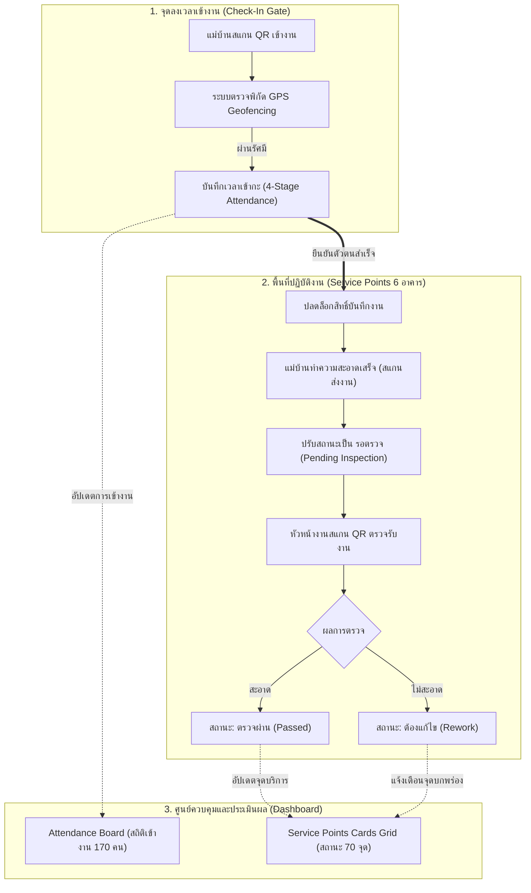
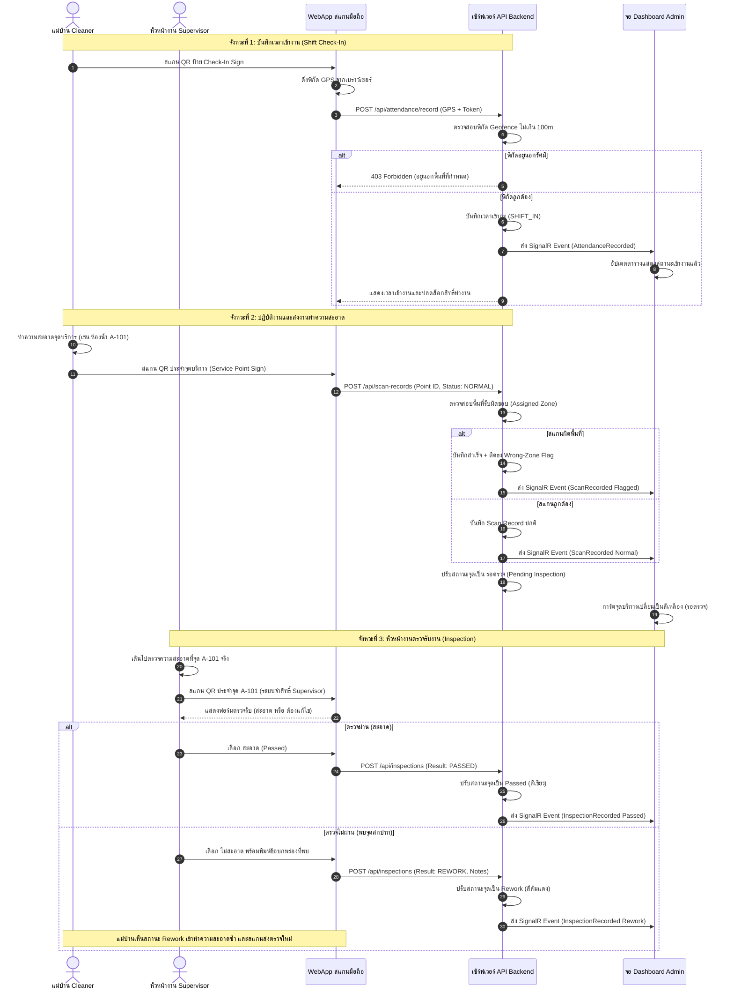
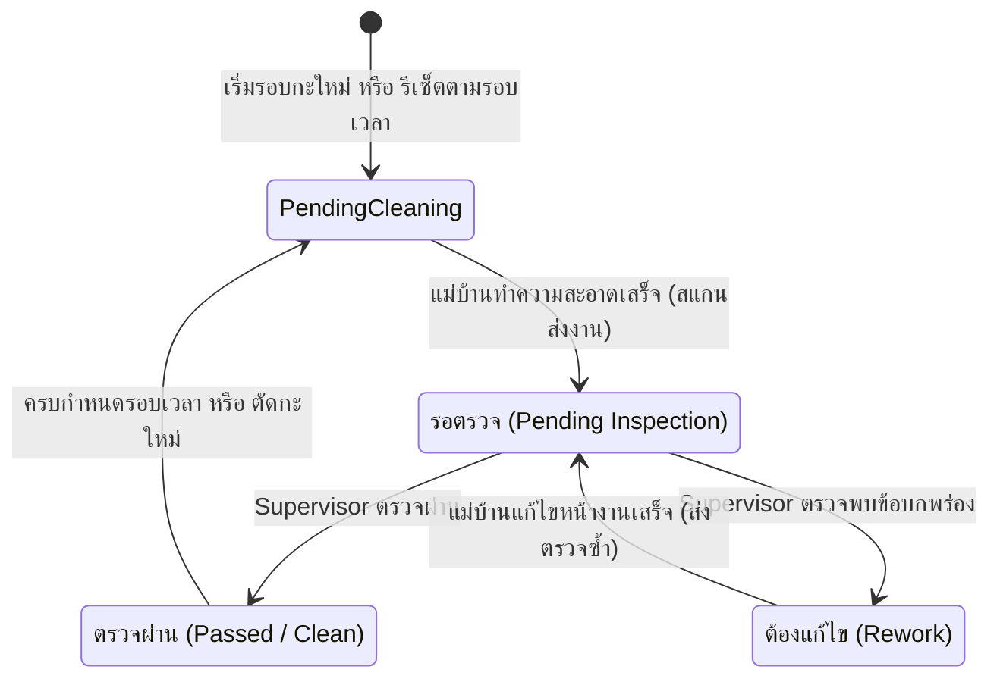
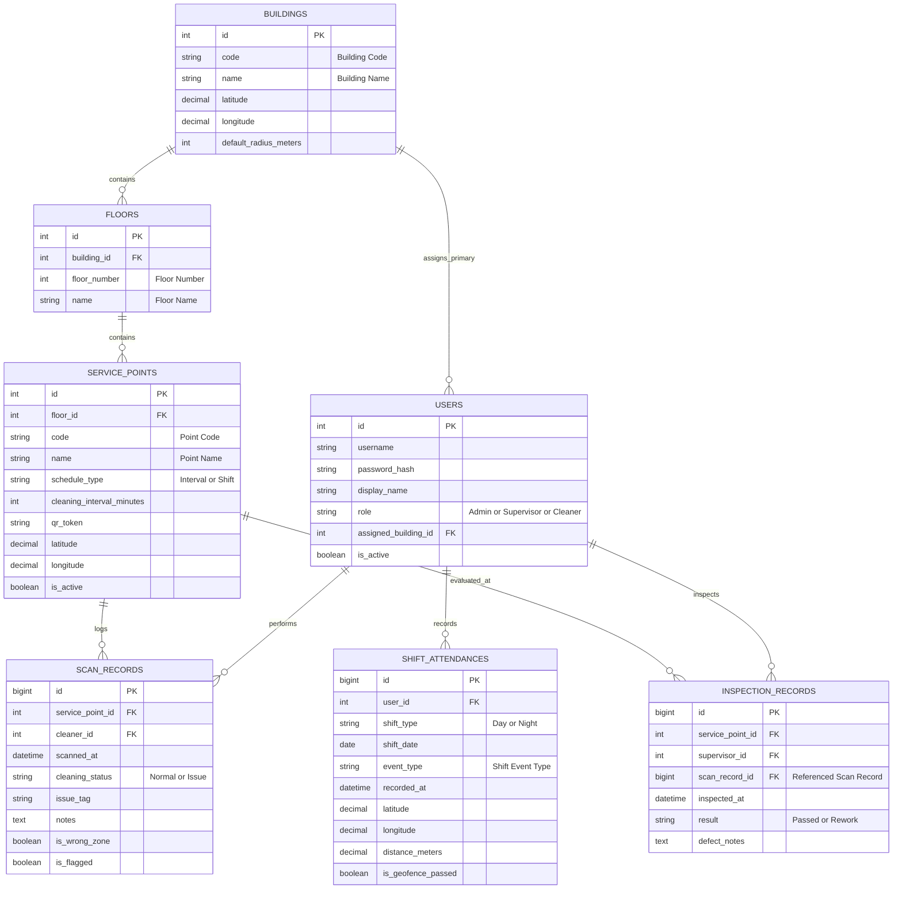

# System Design Spec — Housekeeping Attendance & Inspection Management System

> **ล้าสมัย (2026-10-06):** เอกสารนี้ยังเขียนว่า GPS นอกรัศมีแล้วปฏิเสธ, รัศมี 100 ม., มีตัวเลือก NFC และใช้ตึกเป็นหน่วย ห้ามใช้เป็นข้อกำหนด ให้ยึด ADR facility-0035 ถึง facility-0045 และ `docs/requirements-gathering/2026-10-06-supervisor-answers.md`

เอกสารฉบับนี้กำหนดรายละเอียดการวิเคราะห์และออกแบบระบบ (System Analysis & Design) รวมถึงขั้นตอนกระบวนการทำงานบนเอกสาร (Paper Flow) สำหรับ **ระบบบันทึกเวลาและตรวจสอบการทำความสะอาดแม่บ้าน** เพื่อตอบสนอง 3 วัตถุประสงค์หลัก: ตรวจสอบการเข้างานของพนักงาน, ตรวจสอบสถานะการทำความสะอาดตามพื้นที่, และตรวจสอบการตรวจรับงานของหัวหน้างาน (Supervisor) รองรับแม่บ้าน 170 คน แบ่ง 2 กะ บนพื้นที่ 6 อาคาร

---

## 1. วัตถุประสงค์และกรอบการทำงาน (Core Purpose & Scope)

### 1.1 วัตถุประสงค์หลัก 3 ด้าน (The Three Pillars)
1. **ตรวจสอบพนักงาน (Attendance Verification)**: ติดตามการเข้า-ออกงาน การพักเบรก และอัตรากำลังคนประจำแต่ละอาคาร/กะ แบบเรียลไทม์ ป้องกันการทุจริตนำภาพถ่าย QR Code ไปสแกนจากนอกพื้นที่ด้วยระบบ GPS Geofencing
2. **ตรวจสอบการทำงาน (Task Execution Tracking)**: ติดตามสถานะความสะอาดของพื้นที่ย่อย (Service Points) ทั้งประเภทงานประจำรอบเวลา (Interval-based) และงานประจำกะ (Shift-based)
3. **ตรวจสอบการตรวจงาน (Supervisor Inspection Oversight)**: บันทึกหลักฐานว่าหัวหน้างานได้เข้าตรวจพื้นที่จริงผ่านการสแกน QR ซ้ำ และบันทึกผลการประเมินความสะอาด พร้อมกระบวนการสั่งแก้งาน (Rework Cycle) หากไม่ผ่านมาตรฐาน

### 1.2 ขอบเขตการทดสอบนำร่อง (Pilot Phase 1 Scope — ADR 0033)
เพื่อลดความเสี่ยงหน้างานและสอบทาน Paper Flow ก่อนขยายผลสู่พื้นที่จริงเต็มรูปแบบ 6 อาคาร:
* **พื้นที่นำร่อง**: อาคาร A (Building A) จำนวน 2 ชั้น
* **จุดบริการตัวแทน (12 จุด)**:
  * *Interval-based (4 จุด)*: ห้องน้ำชาย/หญิง ชั้น 1 และ ชั้น 2 (รอบตรวจทุก 120 นาที)
  * *Shift-based (8 จุด)*: โถงทางเดินชั้น 1-2, ทางเข้าล็อบบี้, ห้องประชุมใหญ่, บันไดหนีไฟ (รอบตรวจ 1 ครั้ง/กะ)
* **กลุ่มผู้ใช้งานนำร่อง**: แม่บ้าน 15 คน (หมุนเวียนกะกลางวัน 10 คน, กะกลางคืน 5 คน) และหัวหน้างาน 2 คน
* **จุดลงเวลาเข้างาน**: 1 จุดหลัก บริเวณทางเข้าอาคาร A

---

## 2. ขั้นตอนการปฏิบัติงานบนเอกสารและหน้างาน (Paper Flow & Process Sequence)

---

## 3. ระบบลงเวลาเข้า-ออกงานและป้องกันการทุจริต (Time Attendance & Protection)

### 3.1 วงจรการลงเวลา 4 จังหวะ (Four-Stage Attendance Lifecycle — ADR 0031)
พนักงานแม่บ้าน 170 คน มีการบันทึกการลงเวลา 4 ครั้งต่อวัน รวมทั้งสิ้นประมาณ 680 รายการ/วัน:
1. **Shift-In (เข้ากะ)**: สแกนเมื่อเดินทางมาถึงโรงงาน ปลดล็อกให้สามารถสแกนส่งงานตามจุดบริการได้
2. **Break-Out (ออกพักเบรก)**: สแกนเมื่อออกไปรับประทานอาหารหรือพักผ่อนประจำกะ
3. **Break-In (กลับจากพักเบรก)**: สแกนเมื่อกลับเข้ามาพร้อมเริ่มงานรอบบ่าย/รอบดึก
4. **Shift-Out (เลิกกะ)**: สแกนเมื่อสิ้นสุดการทำงานประจำวัน

### 3.2 การป้องกันภาพถ่าย QR และยืนยันพิกัด (GPS Geofencing — ADR 0028)
* **กลไกหน้าบ้าน (Client-side)**: เมื่อสแกน QR Code หน้าเว็บจะเรียก Browser Geolocation API (`navigator.geolocation.getCurrentPosition`) ดึงค่า Latitude, Longitude และ Accuracy ณ ขณะกดปุ่ม
* **กลไกหลังบ้าน (Server-side Validation)**:
  * จุด Check-In มีพิกัดอ้างอิงและรัศมีที่อนุญาต (`allowed_radius_meters = 100m`)
  * เซิร์ฟเวอร์คำนวณระยะห่างทางภูมิศาสตร์ (Haversine Formula):
    $$d = 2r \arcsin\left(\sqrt{\sin^2\left(\frac{\Delta \phi}{2}\right) + \cos(\phi_1)\cos(\phi_2)\sin^2\left(\frac{\Delta \lambda}{2}\right)}\right)$$
  * หาก $d > \text{allowed\_radius}$ หรืออุปกรณ์ปิดสิทธิ์อ่านพิกัด -> **ระบบปฏิเสธการลงเวลา (403 Forbidden)**
  * ป้องกันช่องโหว่การถ่ายภาพ QR Code ของจุดทางเข้า ไปสแกนจากในห้องพัก หรือสแกนจากตึกอื่น

### 3.3 การตรวจจับความผิดปกติ (Force Data & Anomaly Rules — ADR 0025, 0030)
* **Wrong-Zone Flag**: หากแม่บ้านประจำตึก A ไปสแกนจุดทำความสะอาดในตึก B ระบบบันทึกงานให้ แต่ติดธงสีส้มบน Dashboard เพื่อยืดหยุ่นกรณีช่วยงานแทนกัน
* **Rapid Consecutive Scans**: หากมีการสแกนมากกว่า 1 จุด ในระยะเวลาที่สั้นกว่าเวลาเดินจริง (เช่น สแกนตึก 1 แล้วสแกนตึก 3 ภายใน 30 วินาที) ระบบจะติดธง **Impossible Travel Speed**
* **Shift Handover Gap**: กะกลางวัน (07:00–19:00) และกะกลางคืน (19:00–07:00) มีระบบตัดรอบอัตโนมัติ ห้ามบันทึกข้ามกะโดยไม่มี Shift-In ของกะใหม่

---

## 4. ระบบติดตามงานและตรวจรับความสะอาด (Task Tracking & Inspection)

### 4.1 แผนภาพวงจรสถานะงานทำความสะอาด (State Lifecycle)

### 4.2 กฎการคำนวณสถานะจุดแบบผสม (Hybrid Cleaning Schedule — ADR 0032)

| ประเภทจุดบริการ | ตัวอย่างสถานที่ | กติกาการรีเซ็ตสถานะ | การแจ้งเตือนบน Dashboard |
|---|---|---|---|
| **Interval-based** | ห้องน้ำชาย/หญิง, โรงอาหาร, โซนขยะ | นับเวลาถอยหลังตาม `cleaning_interval` (เช่น 120 นาที) หลังตรวจผ่าน | เมื่อเลยกำหนดเวลา จะเปลี่ยนเป็นสถานะ **Overdue (สีส้ม)** เตือนให้แม่บ้านทำรอบใหม่ |
| **Shift-based** | โถงทางเดิน, ล็อบบี้, สำนักงาน, บันไดหนีไฟ | ทำรอบละ 1 ครั้งต่อกะ รีเซ็ตกลับเป็น **PendingCleaning** เมื่อตัดกะ (07:00 และ 19:00) | แสดงสถานะตามรอบกะ หากใกล้หมดกะ (เหลือน้อยกว่า 2 ชม.) แล้วยังไม่ทำ จะขึ้นเตือน |

---

## 5. โครงสร้างฐานข้อมูล (Database Schema & Entity Relationship)

ออกแบบรองรับการใช้งานพนักงาน 170 คน ปริมาณข้อมูลเข้า-ออก ~680 เรคคอร์ด/วัน และรายการสแกนทำความสะอาด ~1,500 เรคคอร์ด/วัน พร้อมเก็บประวัติย้อนหลังได้ไม่จำกัด

---

## 6. หน้าจอแสดงผลและควบคุม (Dashboard & UI Mockup Mapping)

| หน้าจอ | สิทธิ์การเข้าถึง | วัตถุประสงค์และการแสดงผล | เอกสารต้นแบบ (Mockup) |
|---|---|---|---|
| **Attendance Board** | Admin, Supervisor | แสดงตารางรายชื่อพนักงาน 170 คน สถานะการเข้างาน (Shift-In, Break, Out), เวลาสแกน, สถิติขาด/มา รายอาคารและกะ | [attendance-board-mockup.html](file:///Users/macbookair/Desktop/Facility-Real-time-dashboard/docs/decision-map/facility-poc/mockups/attendance-board-mockup.html) |
| **Service Points Grid** | ทุกคน (Read-only) | แสดงการ์ดสถานะของทุกจุดบริการแบบ Real-time แบ่งกลุ่มตามตึก/ชั้น แสดงสีตามสถานะ (Normal, Overdue, Issue, Pending Inspection) | [dashboard-prototype.html](file:///Users/macbookair/Desktop/Facility-Real-time-dashboard/docs/decision-map/facility-poc/mockups/dashboard-prototype.html) |
| **Flagged Scan Review** | Admin | ตรวจสอบรายการสแกนที่ติดธงผิดปกติ (สแกนข้ามพื้นที่, อยู่นอกระยะ Geofence, สแกนเร็วผิดมนุษย์) พร้อมปุ่มตรวจสอบและปลดธง | [flagged-scan-mockup.html](file:///Users/macbookair/Desktop/Facility-Real-time-dashboard/docs/decision-map/facility-poc/mockups/flagged-scan-mockup.html) |
| **Mobile Check-In Web** | Cleaner, Supervisor | หน้าสแกน QR บันทึกเวลาเข้า-ออก 4 จังหวะ พร้อมอ่านพิกัด GPS อัตโนมัติ | [shift-check-in-prototype.html](file:///Users/macbookair/Desktop/Facility-Real-time-dashboard/docs/decision-map/facility-poc/mockups/shift-check-in-prototype.html) |
| **Mobile Inspection Web** | Supervisor | หน้าจอสำหรับหัวหน้างานเมื่อสแกน QR ที่จุดบริการ แสดงแบบฟอร์มประเมิน สะอาด / ต้องแก้ไข | [scan-flow-prototype.html](file:///Users/macbookair/Desktop/Facility-Real-time-dashboard/docs/decision-map/facility-poc/mockups/scan-flow-prototype.html) |

---

## 7. แผนการทดสอบนำร่อง (Pilot Execution Checklist — อาคาร A)

1. **การจัดเตรียมข้อมูลบนกระดาษ (Paper Flow Preparation)**:
   * ทำทะเบียนรายชื่อแม่บ้านนำร่อง 15 คน และหัวหน้างาน 2 คน กำหนดรหัสและสังกัด อาคาร A
   * กำหนดรหัสและพิกัด GPS ของจุดบริการ 12 จุดในอาคาร A (ชั้น 1 จำนวน 6 จุด, ชั้น 2 จำนวน 6 จุด)
   * จัดพิมพ์ป้าย QR Code: ป้าย Check-In Sign 1 ป้าย และป้าย Service Point Sign 12 ป้าย
2. **การทดสอบความถูกต้องของระบบ (Verification Milestones)**:
   * **Test 1 — Geofence Verification**: สแกน Check-In ที่หน้าอาคาร A ผ่านฉลุย; ทดลองสแกนรูปภาพ QR เดียวกันจากระยะห่าง 500 เมตร ระบบต้องแจ้งเตือนปฏิเสธพิกัด
   * **Test 2 — 4-Stage Lifecycle**: ทดสอบบันทึก Shift-In -> Break-Out -> Break-In -> Shift-Out ยืนยันข้อมูลเข้าตาราง `shift_attendances` ครบถ้วน
   * **Test 3 — Task & Inspection Flow**: แม่บ้านสแกนส่งงาน -> สถานะขึ้นรอตรวจ -> หัวหน้าสแกนเลือก "ต้องแก้ไข" -> แม่บ้านสแกนส่งซ้ำ -> หัวหน้าสแกนตรวจผ่าน
   * **Test 4 — Wrong-Zone Flag**: ให้แม่บ้านกลุ่มนำร่องทดลองสแกนจุดที่ไม่ได้มอบหมาย ยืนยันว่างานบันทึกสำเร็จแต่เกิด Badge ธงส้มบน Dashboard
3. **การประเมินผลและการขยายผล (Scale-out to 6 Buildings)**:
   * สรุปผลการทดสอบร่วมกับหัวหน้างาน ประเมินความสะดวกในการใช้งานของแม่บ้าน
   * ขยายฐานข้อมูลเพิ่มอาคาร B ถึง F และสร้างบัญชีพนักงานครบ 170 คน
