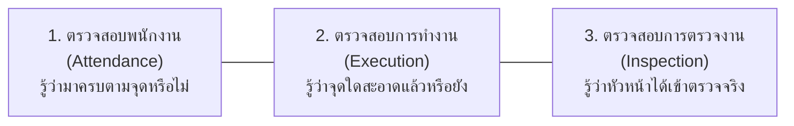
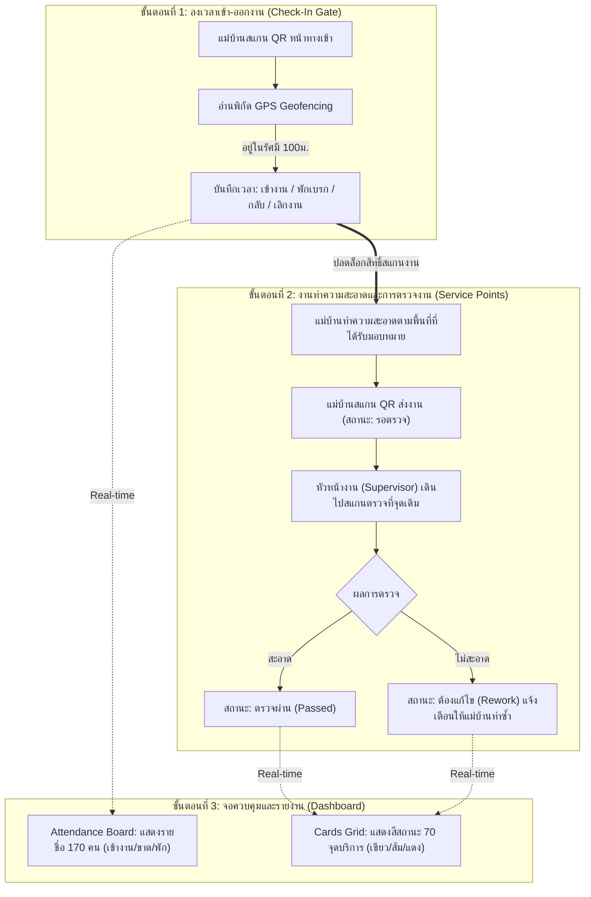

# เอกสารข้อกำหนดความต้องการระบบ และข้อเสนอทางเลือกเพื่อการตัดสินใจ

> **ล้าสมัย (2026-10-06):** เอกสารนี้ยังเขียนว่า GPS นอกรัศมีแล้วปฏิเสธ, รัศมี 100 ม., มีตัวเลือก NFC และใช้ตึกเป็นหน่วย ห้ามใช้เป็นข้อกำหนด ให้ยึด ADR facility-0035 ถึง facility-0045 และ `docs/requirements-gathering/2026-10-06-supervisor-answers.md`

## (System Requirements & Decision Proposal Document)

**โครงการ:** ระบบบันทึกเวลาและตรวจสอบการทำความสะอาดแม่บ้านแบบเรียลไทม์ (Facility Real-time Dashboard)  
**สถานที่ปฏิบัติงาน:** โรงงานขนาด 6 อาคาร  
**กลุ่มเป้าหมาย:** พนักงานแม่บ้านประมาณ 170 คน (แบ่ง 2 กะ: กะกลางวัน 07:00–19:00 / กะกลางคืน 19:00–07:00) และหัวหน้างาน (Supervisor)  
**วันที่จัดทำ:** 3 ตุลาคม 2026  
**สถานะเอกสาร:** รอการพิจารณาตัดสินใจจากหัวหน้างาน / ผู้บริหาร (Pending Management Decision)

---

## 1. บทสรุปสำหรับผู้บริหารและที่มาโครงการ (Executive Summary)

### 1.1 ปัญหาหน้างานปัจจุบัน (Current Pain Points)
1. **การตรวจสอบการเข้างาน (Attendance)**: การแตะบัตรแบบเดิมไม่สามารถยืนยันได้ว่าพนักงานได้เข้าสู่พื้นที่รับผิดชอบจริง และหากเปลี่ยนมาใช้การสแกนป้าย QR Code กระดาษธรรมดา จะเกิดช่องโหว่เรื่องการถ่ายภาพป้าย QR Code ส่งต่อกัน หรือถ่ายรูปเก็บไว้สแกนจากในห้องพัก/นอกพื้นที่
2. **การติดตามความสะอาด (Task Execution)**: ไม่มีระบบที่แสดงผลแบบเรียลไทม์ว่าพื้นที่ใดได้รับการทำความสะอาดแล้ว หรือพื้นที่ใดเลยรอบเวลาทำความสะอาด (Overdue) โดยเฉพาะจุดที่มีคนใช้งานหนาแน่น เช่น ห้องน้ำ และโรงอาหาร
3. **การกำกับดูแลการตรวจงาน (Inspection Oversight)**: ไม่มีหลักฐานยืนยันว่าหัวหน้างาน (Supervisor) ได้เดินตรวจพื้นที่จริง และไม่มีกระบวนการส่งต่องานกรณีพบจุดที่ต้องแก้ไข (Rework) อย่างเป็นระบบ

### 1.2 วัตถุประสงค์หลัก 3 ด้านของระบบ (The Three Pillars)

---

## 2. ข้อเสนอทางเลือกเพื่อการตัดสินใจสำหรับหัวหน้างาน (Key Decisions for Management)

เอกสารส่วนนี้สรุปประเด็นสำคัญ 6 ข้อ ที่ต้องการการตัดสินใจเชิงนโยบายจากหัวหน้างาน โดยแต่ละข้อมีรายละเอียด ข้อดี ข้อจำกัด และคำแนะนำของทีมวิเคราะห์ เพื่อให้ท่านสามารถทำเครื่องหมาย `[X]` เลือกแนวทางที่เหมาะสมที่สุด

---

### ประเด็นที่ 1: การแก้ปัญหาถ่ายรูป QR Code ป้ายเข้างานไปสแกนจากจุดอื่น

**โจทย์:** ป้าย QR Code ที่พิมพ์ติดไว้ที่ทางเข้า มีช่องโหว่คือแม่บ้านอาจถ่ายรูปเก็บไว้ในมือถือ แล้วนำมาเปิดสแกนลงเวลาจากจุดอื่น (เช่น อยู่ตึก 3 หรืออยู่ที่บ้าน)

| ทางเลือก | กลไกการทำงาน | ข้อดี | ข้อจำกัด / ต้นทุน |
|---|---|---|---|
| **ทางเลือก 1.1: GPS Geofencing (ข้อเสนอแนะทีม)** | ใช้ป้าย QR กระดาษเดิม เมื่อสแกน ระบบจะบังคับอ่านพิกัด GPS จากเบราว์เซอร์มือถือ หากระยะห่างเกิน 100 เมตรจากจุดเข้างาน ระบบจะปฏิเสธการลงเวลา | • **ไม่มีค่าใช้จ่ายอุปกรณ์เพิ่ม** • ใช้ป้ายกระดาษเดิมได้ทันที • ป้องกันการสแกนจากที่บ้าน/ตึกอื่นได้ดี | • มือถือต้องเปิดสิทธิ์ Location • ในจุดอับสัญญาณดาวเทียมอาจมีความคลาดเคลื่อน |
| **ทางเลือก 1.2: Dynamic QR บนจอ Tablet** | ติดตั้ง Tablet หรือหน้าจอดิจิทัลที่ป้อม รปภ./ทางเข้า แสดง QR Code ที่เปลี่ยนรหัสอัตโนมัติทุก 15–30 วินาที (แบบ OTP) | • **ป้องกันการถ่ายรูปได้ 100%** • แม่บ้านไม่ต้องเปิด GPS | • ต้องลงทุนซื้อ Tablet 1–2 เครื่อง • ต้องเดินสายไฟและต่อ Wi-Fi ที่จุดติดตั้ง |
| **ทางเลือก 1.3: ป้าย NFC Sign (แตะหลังมือถือ)** | ติดป้ายชิป NFC (NTAG 424 DNA) แม่บ้านนำมือถือแตะที่ป้ายเพื่อรับลิงก์ใช้ครั้งเดียว (One-Time Link) | • ป้องกันการส่งต่อรูปได้ 100% • แตะสะดวกรวดเร็ว ไม่ต้องเล็งกล้อง | • มือถือแม่บ้านทุกคนต้องมี NFC (บางรุ่นไม่มี) • มีค่าจัดซื้อป้ายชิป NFC (~35-50 บาท/จุด) |
| **ทางเลือก 1.4: บังคับถ่ายภาพใบหน้า/หน้างานสด** | สแกน QR แล้วระบบจะบังคับเปิดกล้องถ่ายภาพใบหน้าและบรรยากาศหน้างานสดๆ ห้ามเลือกรูปจากอัลบั้ม | • เห็นภาพถ่ายเป็นหลักฐานชัดเจน | • สิ้นเปลืองพื้นที่เก็บข้อมูล (600-700 รูป/วัน) • หัวหน้าต้องเสียเวลามาเปิดดูรูป |

**การตัดสินใจของหัวหน้างาน (กรุณาทำเครื่องหมายเลือก 1 ข้อ):**
* [ ] **เลือก 1.1: GPS Geofencing** (แนะนำ: ประหยัดงบประมาณ เริ่มได้ทันที)
* [ ] **เลือก 1.2: Dynamic QR บนจอ Tablet** (เน้นความเด็ดขาด 100% พร้อมจัดหาแท็บเล็ต)
* [ ] **เลือก 1.3: ป้าย NFC Sign** (เน้นความสะดวกรวดเร็วในการแตะ)
* [ ] **เลือก 1.4: บังคับถ่ายภาพใบหน้าสด**
* *หมายเหตุเพิ่มเติมจากหัวหน้างาน:* ____________________________________________________

---

### ประเด็นที่ 2: ขั้นตอนเมื่อหัวหน้างาน (Supervisor) ตรวจพบว่า "ไม่สะอาด"

**โจทย์:** เมื่อแม่บ้านสแกนส่งงานแล้ว หัวหน้างานเดินไปตรวจพื้นที่จริง หากตรวจพบข้อบกพร่อง ต้องการให้ระบบมีขั้นตอนการทำงานอย่างไรต่อ

| ทางเลือก | กลไกการทำงาน | ข้อดี | ข้อจำกัด |
|---|---|---|---|
| **ทางเลือก 2.1: ปรับสถานะเป็น "ต้องแก้ไข (Rework)" (ข้อเสนอแนะทีม)** | ระบบเปลี่ยนสถานะการ์ดเป็นสีส้มแดง "ต้องแก้ไข" พร้อมระบุโน้ตข้อบกพร่อง แม่บ้านต้องเข้ามาทำซ้ำและสแกนส่งงานใหม่เพื่อให้หัวหน้าตรวจซ้ำ | • **มีบันทึกประวัติการแก้งานชัดเจน** • กระตุ้นให้แก้ไขงานทันที • รู้ว่าจุดไหนมีปัญหาบ่อย | • ต้องมีการตรวจรอบสอง ทำให้หัวหน้ามีขั้นตอนตรวจเพิ่ม |
| **ทางเลือก 2.2: ดีดกลับเป็น "ยังไม่ได้ทำความสะอาด" ทันที** | ระบบล้างผลการส่งงานเดิม และดีดสถานะกลับเป็นสถานะตั้งต้นเสมือนยังไม่ได้ทำ | • ขั้นตอนไม่ซับซ้อน แม่บ้านเห็นว่างานยังไม่เสร็จ | • ไม่เก็บบันทึกว่าใครเป็นคนตรวจพบข้อบกพร่องเรื่องอะไร |
| **ทางเลือก 2.3: ปิดรอบการสแกนด้วยผล "ไม่สะอาด" (ตัดคะแนน KPI)** | ถือว่าจบงานรอบนั้นด้วยผลไม่สะอาด ไม่เปิดให้แก้งานซ้ำ นำสถิติไปสรุปรายงาน KPI สิ้นวัน | • หัวหน้าตรวจรอบเดียวจบ • วัดผล KPI ตรงไปตรงมา | • พื้นที่จุดนั้นอาจถูกปล่อยทิ้งไว้โดยไม่ได้รับการทำความสะอาดจริงจนกว่าจะถึงรอบถัดไป |

**การตัดสินใจของหัวหน้างาน (กรุณาทำเครื่องหมายเลือก 1 ข้อ):**
* [ ] **เลือก 2.1: สถานะต้องแก้ไข (Rework) และส่งตรวจซ้ำ** (แนะนำ: คุณภาพงานสมบูรณ์ที่สุด)
* [ ] **เลือก 2.2: ดีดสถานะกลับเป็นยังไม่ทำ**
* [ ] **เลือก 2.3: ปิดรอบตัดคะแนน KPI ทันที**
* *หมายเหตุเพิ่มเติมจากหัวหน้างาน:* ____________________________________________________

---

### ประเด็นที่ 3: กรณีแม่บ้านสแกนทำความสะอาดนอกพื้นที่รับผิดชอบ (ผิดตึก/ผิดชั้น)

**โจทย์:** แม่บ้านได้รับการมอบหมายประจำตึก A แต่มีการสแกนทำความสะอาดที่ตึก B หรือผิดชั้น ระบบควรดำเนินการอย่างไร

| ทางเลือก | กลไกการทำงาน | ข้อดี | ข้อจำกัด |
|---|---|---|---|
| **ทางเลือก 3.1: บันทึกสำเร็จแต่ติดธงเตือน (Wrong-Zone Flag) (ข้อเสนอแนะทีม)** | ระบบยอมรับการบันทึกงาน แต่แสดง Badge ธงสีส้มบน Dashboard ของหัวหน้าว่า "สแกนข้ามพื้นที่" | • **ยืดหยุ่นสูงหน้างาน** กรณีแม่บ้านเข้าช่วยงานเพื่อนที่ลา หรือสลับกะกระทันหันงานไม่สะดุด | • หัวหน้าต้องคอยกวาดสายตาดูรายการที่ติดธง |
| **ทางเลือก 3.2: บล็อกทันที (Reject)** | ระบบไม่อนุญาตให้บันทึก และแจ้งเตือนบนจอมือถือว่า "คุณไม่มีสิทธิ์ในจุดบริการนี้" | • ป้องกันการทำงานข้ามหน้าที่ได้ 100% | • ขาดความยืดหยุ่น หากมีกรณีช่วยงานแทนกัน แม่บ้านจะไม่สามารถสแกนส่งงานได้ |
| **ทางเลือก 3.3: บันทึกได้แต่ต้องเลือกเหตุผล** | มีหน้าต่าง Pop-up ให้เลือกสาเหตุ เช่น "ช่วยงานแทนเพื่อนร่วมงาน", "ได้รับมอบหมายพิเศษ" | • ได้ข้อมูลครบถ้วนว่าทำไมถึงข้ามพื้นที่ | • เพิ่มขั้นตอนการกดหน้าจอ แม่บ้านอาจกดเลือกมั่วเพื่อให้ผ่านไปได้ |

**การตัดสินใจของหัวหน้างาน (กรุณาทำเครื่องหมายเลือก 1 ข้อ):**
* [ ] **เลือก 3.1: บันทึกสำเร็จแต่ติดธงแจ้งเตือน Wrong-Zone** (แนะนำ: ยืดหยุ่น เหมาะกับงานจริง)
* [ ] **เลือก 3.2: บล็อกการสแกนทันที**
* [ ] **เลือก 3.3: บังคับเลือกเหตุผลก่อนกดยืนยัน**
* *หมายเหตุเพิ่มเติมจากหัวหน้างาน:* ____________________________________________________

---

### ประเด็นที่ 4: จังหวะการลงเวลาเข้า-ออกงาน (ปริมาณข้อมูล ~680 รายการ/วัน)

**โจทย์:** พนักงาน 170 คน ต้องการบันทึกเวลาเข้า-ออกในจังหวะใดบ้างในแต่ละวัน

| ทางเลือก | รูปแบบการสแกน | ปริมาณข้อมูล | ความเหมาะสม |
|---|---|---|---|
| **ทางเลือก 4.1: วงจร 4 จังหวะ (ข้อเสนอแนะทีม)** | สแกน 4 ครั้ง/คน/วัน: 1. เข้างาน (Shift-In) 2. ออกพักเบรก (Break-Out) 3. กลับจากเบรก (Break-In) 4. เลิกงาน (Shift-Out) | ~680 รายการ/วัน | • **เห็นสถานะพนักงานตลอดทั้งวัน** รู้ว่าใครกำลังทำงาน หรือใครอยู่ในช่วงพักเบรก ช่วยคุมเวลาพักไม่ให้เกิน |
| **ทางเลือก 4.2: สแกนเข้า-ออกทุกครั้งที่ย้ายตึก** | สแกนทุกครั้งที่เดินเข้าหรือออกจากอาคาร (In-Out รายตึก) | 1,000–1,500 รายการ/วัน | • ละเอียดมาก รู้พิกัดตลอดเวลา • แต่แม่บ้านต้องสแกนบ่อยเกินไป สร้างภาระหน้างาน |
| **ทางเลือก 4.3: สแกนวันละ 2 ครั้ง (เช้า-เย็น)** | สแกนเฉพาะตอนเริ่มงาน (Shift-In) และเลิกงาน (Shift-Out) | ~340 รายการ/วัน | • เรียบง่าย ไม่ยุ่งยาก • แต่ไม่สามารถตรวจสอบเวลาพักเบรกกลางกะได้ |

**การตัดสินใจของหัวหน้างาน (กรุณาทำเครื่องหมายเลือก 1 ข้อ):**
* [ ] **เลือก 4.1: ลงเวลา 4 จังหวะ (เข้างาน / ออกพัก / กลับจากพัก / เลิกงาน)** (แนะนำ)
* [ ] **เลือก 4.2: สแกนเข้า-ออกทุกครั้งที่เปลี่ยนตึก**
* [ ] **เลือก 4.3: สแกนเฉพาะเข้างานและเลิกงานวันละ 2 ครั้ง**
* *หมายเหตุเพิ่มเติมจากหัวหน้างาน:* ____________________________________________________

---

### ประเด็นที่ 5: รูปแบบการตัดรอบสถานะจุดทำความสะอาด (Cleaning Reset Schedule)

**โจทย์:** เมื่อพื้นที่ได้รับการตรวจผ่าน (สะอาด) แล้ว จะให้ระบบรีเซ็ตสถานะกลับเป็น "ยังไม่ได้ทำความสะอาด" เพื่อเริ่มรอบใหม่เมื่อใด

| ทางเลือก | กลไกการทำงาน | เหมาะสำหรับ | ผลลัพธ์ |
|---|---|---|---|
| **ทางเลือก 5.1: แบบผสมตามมาตรฐานสากล (Hybrid) (ข้อเสนอแนะทีม)** | • **ห้องน้ำ/โรงอาหาร**: ใช้นับเวลาถอยหลัง (Interval เช่น ทุก 2 ชม.) เกินเวลาจะกลายเป็น Overdue เตือนให้ทำซ้ำ • **ทางเดิน/ออฟฟิศ**: ใช้รอบกะ (รีเซ็ตพร้อมกันตอนตัดกะ 07:00 และ 19:00) | พื้นที่ที่มีการใช้งานหลากหลาย | • **ตรงกับการใช้งานจริงมากที่สุด** ห้องน้ำได้รับการดูแลสม่ำเสมอ ทางเดินไม่ถูกแจ้งเตือนถี่เกินไป |
| **ทางเลือก 5.2: แบบรอบกะล้วน (Shift-based)** | ทุกจุดทั่วโรงงานทำกะละ 1 รอบ และรีเซ็ตสถานะพร้อมกันวันละ 2 ครั้ง ตอนตัดกะ 07:00 และ 19:00 | งานที่มีรอบการตรวจแน่นอนวันละครั้ง | • เข้าใจง่าย ไม่ซับซ้อน • แต่ห้องน้ำอาจสกปรกระหว่างกะโดยไม่มีระบบเตือน |
| **ทางเลือก 5.3: แบบรอบเวลานับถอยหลังล้วน (Interval-based)** | ทุกจุดในโรงงานตั้งเวลานับถอยหลังแยกกัน (เช่น 2 ชม., 4 ชม., 8 ชม.) | โรงพยาบาล หรือ คลีนรูม | • จัดการเวลาละเอียด แต่ทางเดินหรือห้องประชุมอาจเกิด Overdue รบกวนโดยไม่จำเป็น |

**การตัดสินใจของหัวหน้างาน (กรุณาทำเครื่องหมายเลือก 1 ข้อ):**
* [ ] **เลือก 5.1: แบบผสม (Hybrid: ห้องน้ำใช้รอบเวลา + ทางเดินใช้รอบกะ)** (แนะนำตามมาตรฐานสากล)
* [ ] **เลือก 5.2: แบบรอบกะล้วน (รีเซ็ตวันละ 2 รอบ)**
* [ ] **เลือก 5.3: แบบรอบเวลานับถอยหลังล้วนทุกจุด**
* *หมายเหตุเพิ่มเติมจากหัวหน้างาน:* ____________________________________________________

---

### ประเด็นที่ 6: ขอบเขตการทดสอบระยะแรก (Pilot Phase 1 Scope)

**โจทย์:** โรงงานจริงมี 6 อาคาร (แต่ละอาคารมีหลายชั้น เช่น ตึก A มี 2 ชั้น) ควรเริ่มทดสอบระบบและ Paper Flow ในขอบเขตใดก่อนขยายผลเต็มรูปแบบ

| ทางเลือก | ขอบเขตการทดสอบ | จุดเด่น | การควบคุมความเสี่ยง |
|---|---|---|---|
| **ทางเลือก 6.1: อาคาร A (2 ชั้น) พร้อม 12 จุดบริการ (ข้อเสนอแนะทีม)** | • ทดสอบที่ **อาคาร A** ทั้ง 2 ชั้น • จุดบริการตัวแทน 12 จุด (ห้องน้ำ 4 จุด, ทางเดิน/ล็อบบี้ 8 จุด) • แม่บ้านกลุ่มนำร่อง 15 คน (ทั้ง 2 กะ) และหัวหน้างาน 2 คน | • **สะท้อนสภาพงานจริงครบทุกมิติ** (การเดินขึ้นชั้น 2, สัญญาณ GPS ในตึก, ทั้งงานห้องน้ำและทางเดิน) | • ปริมาณคนและจุดกำลังพอดี สามารถดูแลและแก้ไขปัญหาหน้างานได้อย่างใกล้ชิด |
| **ทางเลือก 6.2: ทดสอบจุดเข้างาน 1 จุด + 3–5 จุดในห้องเดียว** | ทดสอบเฉพาะประตูทางเข้า และห้องจำลอง 1 ห้อง | • ใช้ทรัพยากรน้อยที่สุด | • ไม่เห็นมิติการเดินข้ามชั้น และไม่สะท้อนพิกัด Geofence ของตึกจริง |
| **ทางเลือก 6.3: ติดตั้งพร้อมกันทั้ง 6 อาคาร 170 คนทันที** | เริ่มต้นใช้งานเต็มสเกลพร้อมกันทุกตึก | • จบในรอบเดียว | • ความเสี่ยงสูงมาก หากแม่บ้าน 170 คนติดปัญหาการสแกนหรือสับสน จะควบคุมได้ยาก |

**การตัดสินใจของหัวหน้างาน (กรุณาทำเครื่องหมายเลือก 1 ข้อ):**
* [ ] **เลือก 6.1: นำร่องอาคาร A (2 ชั้น, 12 จุด, แม่บ้าน 15 คน)** (แนะนำ: เสี่ยงต่ำ เห็นผลชัดเจน)
* [ ] **เลือก 6.2: ทดสอบในห้องจำลองขนาดเล็ก**
* [ ] **เลือก 6.3: ลงพื้นที่จริงทั้ง 6 อาคารทันที**
* *หมายเหตุเพิ่มเติมจากหัวหน้างาน:* ____________________________________________________

---

## 3. สรุปขั้นตอนกระบวนการทำงานภาพรวม (Paper Flow Overview)

แผนภาพแสดงการเชื่อมโยงของข้อมูลตั้งแต่หน้าประตูโรงงาน จนถึงการสรุปผลบนหน้าจอ Dashboard:

---

## 4. ส่วนลงนามและอนุมัติเพื่อดำเนินการ (Management Sign-Off)

เมื่อหัวหน้างาน / ผู้บริหาร ได้พิจารณาและทำเครื่องหมายเลือกแนวทางในหัวข้อที่ 2 ครบถ้วนแล้ว กรุณาลงนามเพื่อเป็นเอกสารอ้างอิงในการเริ่มจัดทำแผนพัฒนาซอฟต์แวร์ (Implementation Plan) ต่อไป:

**ผู้อนุมัติ (Authorized By):** _____________________________________________  
**ตำแหน่ง (Position):** _____________________________________________  
**วันที่ (Date):** _________ / _________ / 2026  

---
*เอกสารนี้จัดทำขึ้นโดยทีม System Analysis & Architecture เพื่อประกอบการตัดสินใจโครงการ Facility Real-time Dashboard*
